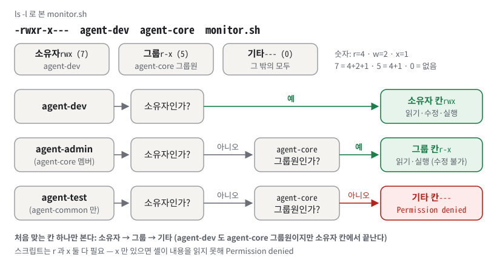
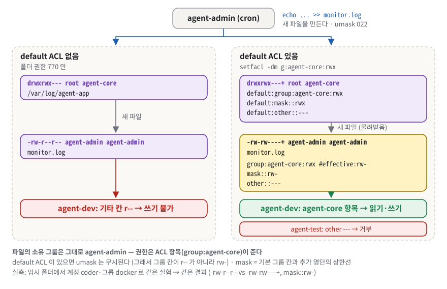
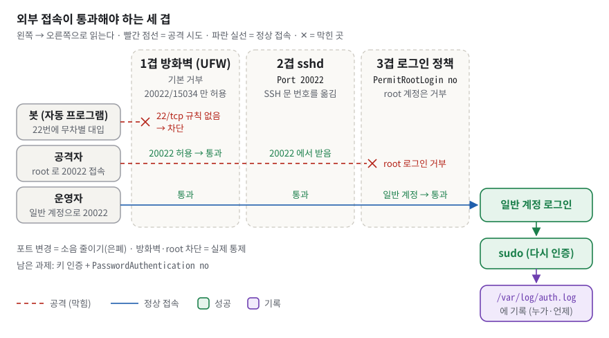
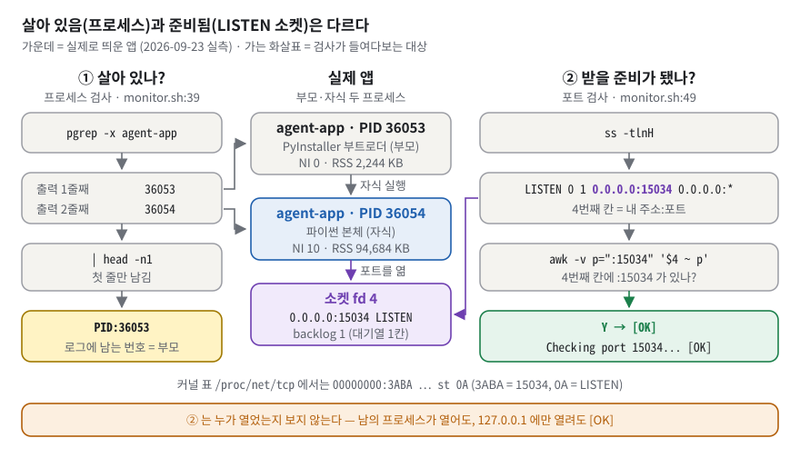
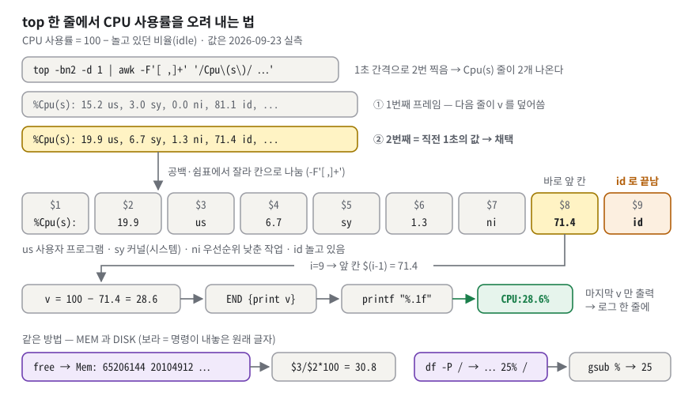
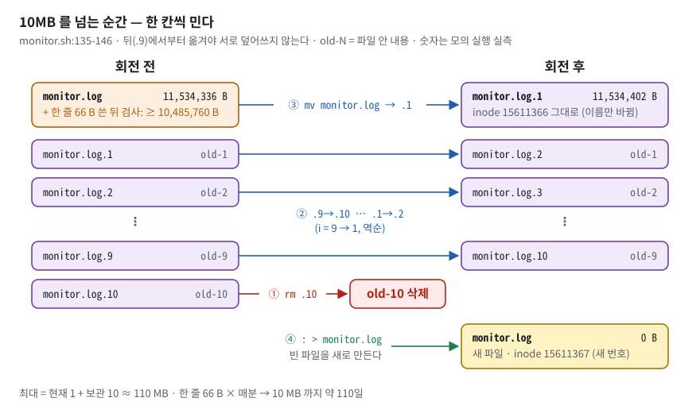
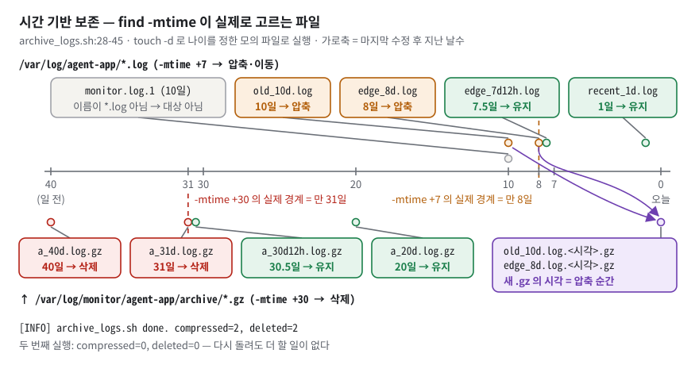

# B1-1 · 컴퓨터가 알아서 자기 상태를 점검하게 만들기 — 구술 평가 대비 학습 문서

> 가게 건물 하나를 맡았다고 해 보자. 출입문은 두 개만 열어 두고(방화벽), 관리자 전용 문의 번호를 바꾸고, 사장 명의 출입증은 아예 받지 않게 한다(SSH). 직원·개발자·검수자에게는 서로 다른 열쇠 꾸러미를 준다(계정·그룹·ACL). 그리고 경비원(cron)이 매분 순찰하며 "가게 문 열렸나, 손님 받을 준비 됐나, 전기·수도는 얼마나 쓰나"를 순찰 일지(monitor.log)에 한 줄씩 적고, 일지가 너무 두꺼워지면 새 권으로 바꾼다(로그 회전).
>
> 정확히 말하면: Ubuntu 서버 한 대에 **SSH 포트 20022 · root 원격 로그인 차단 · UFW 허용 목록(20022/tcp, 15034/tcp)** 을 걸고, 역할별 계정 3개·그룹 2개와 ACL 로 공유 폴더와 보안 폴더를 나눈 뒤, 제공 앱 `agent-app` 을 일반 계정으로 띄운다. 그 위에서 Bash 스크립트 `monitor.sh` 가 매분(cron) 앱의 프로세스·포트·CPU/MEM/DISK 를 점검해 정해진 한 줄 형식으로 `/var/log/agent-app/monitor.log` 에 쌓고, 로그가 10MB 를 넘으면 스스로 회전시킨다. 설치 과정은 `src/01~07` 일곱 개 스크립트로 나뉘어 있다.

**읽는 법.**

① 처음이면 §1 부터 끝까지 정독한다(예상 195분 안팎, §3 개념과 §6 문답이 전체의 3분의 2 가까이 된다). 시간이 모자라면 §3 은 각 절의 비유·"이 과제에서는"·흔한 오해만 먼저 읽고, "한 칸 아래"는 §6 에서 막힐 때 돌아와 읽는다. ② 평가 전날이면 §1 · §5 · §6 · §7 만 다시 본다. ③ 평가 30분 전이면 §8 만 본다. 낯선 용어는 §3 에서 쉬운 것부터 차례로 정의하고, 급하면 부록 A 용어집을 먼저 본다.

§6 의 접이식 문답은 **질문만 보고 먼저 소리 내어 답해 본 뒤** 펼친다. 펼쳐서 읽기만 하면 평가장에서 입이 열리지 않는다.

**이 문서의 숫자가 어디서 왔는지.** 실행 결과에는 출처를 붙였다.

| 표시 | 뜻 |
|---|---|
| **실측** | 2026-09-23 저장소 **복사본**을 임시 폴더에서 직접 돌린 출력. 이 머신은 Ubuntu 26.04 컨테이너이고 일반 계정 `coder` 로 돌렸다. 임시 폴더 경로는 `<W>` 로 줄였다 |
| **증거** | 학습자가 실머신(OrbStack Ubuntu 24.04)에서 남긴 캡처 `docs/md/요구사항_수행_내역서.md`. 일부는 손으로 다듬은 흔적이 있다(§7) |
| **원문** | 과제 PDF 본문 |
| 🔍 | 실머신(root·systemd·cron·ufw·sshd)이 있어야 끝까지 확인되는 것. 코드와 증거로 판정했다 |

**코드 위치 읽는 법.** `src/monitor.sh:39` 는 그 파일의 39번째 줄, `:39-44` 는 39~44번째 줄이다. 파일 이름 없이 `:39` 만 쓰면 바로 앞에 나온 파일의 줄이다. 코드 발췌 오른쪽의 `# :24` 같은 주석은 이 문서가 붙인 원본 줄 번호이고 원본 코드에는 없다. 발췌에서 건너뛴 줄은 `…` 로 표시했다.

이 머신에는 cron 데몬·ufw·sshd 가 없고, 공용 머신의 계정과 방화벽을 바꿀 수 없어서 setup 스크립트 01~07 은 실행하지 않았다. 대신 **제공 앱 `bin/agent-app` 은 실제로 부팅**시켰고, `monitor.sh`·`report.sh`·`archive_logs.sh` 는 임시 폴더를 로그 폴더로 삼아 끝까지 돌렸다. 실측의 CPU·MEM·DISK 값(MEM 30%대, DISK 25%)은 이 공용 머신(64GB)의 값이다. 실머신 증거는 MEM 3.8%, DISK 1% 수준이다.

## 1. 한눈에 보기

### 1.1 이 과제를 한 문장으로

**비유.** 건물 경비 시스템을 직접 설치하는 일이다. 출입문을 줄이고(방화벽), 열쇠를 역할별로 나누고(계정·그룹·권한), 경비원에게 순찰 일지 양식을 정해 준다(`monitor.sh` 와 로그 형식). 경비원은 이상을 **보고**만 하고 고치지는 않는다. `monitor.sh` 에는 복구 기능이 없다는 점이 비유의 한계다.

**정확한 정의.** 과제 원문은 이 미션을 "다중 사용자 환경에서의 권한 관리와 네트워크 보안 설정을 시작으로, 실제 서비스를 배포하고 운영할 때 필수적인 시스템 리소스 관제와 로그 관리를 자동화하는 쉘 스크립트 개발"이라고 부른다. 제출물은 두 가지다. ① 요구사항 수행 내역서(증거 8종) ② `monitor.sh` 소스.


*그림 1. 과제 전체 구조 — 바깥 접속은 방화벽(②)을 지나 두 문(20022, 15034)으로만 들어오고, cron(⑦)이 매분 monitor.sh 로 앱을 점검해 monitor.log 에 한 줄씩 쌓는다. 동그라미 숫자는 그 부분을 만든 src/0N 스크립트다.*

그림 1 에서 봐야 할 것은 세 가지다.

- **왼쪽의 두 화살표.** 파란 화살표(관리자 PC → `:20022`)는 초록 방화벽을 통과하고, 빨간 점선(인터넷 봇 → `:22`)은 방화벽 앞에서 멈춘다. 방화벽에는 허용 규칙 두 줄(`allow 20022/tcp`, `allow 15034/tcp`)만 있다. 이 "두 줄만"을 성립시키는 것이 생각보다 까다롭다(§3.6).
- **동그라미 번호 ①~⑦.** 그림의 부품마다 그것을 만든 설치 스크립트 번호가 붙어 있다. ① sshd 설정은 `src/01_ssh_hardening.sh`, ② 방화벽은 `src/02_firewall_allowlist.sh`, ③ 계정은 `src/03_users_and_groups.sh`, ④ 폴더·권한은 `src/04_directories_and_acl.sh`, ⑤ 환경 변수·키는 `src/05_env_and_keyfile.sh`, ⑥ 배포는 `src/06_deploy_app_and_scripts.sh`, ⑦ cron 은 `src/07_cron_schedule.sh` 다. `src/00_run_all.sh:21-29` 가 이 순서대로 실행한다.
- **오른쪽의 순환.** cron → `monitor.sh` → (앱 점검: `pgrep -x`, `ss -tlnH`) → `>> 한 줄` → `monitor.log`. 이 고리가 과제의 필수 산출물이다. 점선 테두리의 `report.sh`(통계)와 `archive_logs.sh`(7일 지난 `*.log` 압축 · 30일 지난 압축본 삭제)는 보너스다. `archive_logs.sh` 로 들어오는 보라 점선이 "감시 기록 폴더의 7일 지난 로그를 가져간다"는 뜻이다.

### 1.2 평가자는 무엇을 보나

체크리스트(`checklists_md/ssh_security_monitoring.md`)는 4영역 19문항이다. 이 문서는 19문항을 모두 §6 에 옮겨 두었다.

| 영역 | 문항 수 | 평가자가 확인하는 것 | 대비하는 곳 |
|---|---|---|---|
| 1. 기능 동작 검증 | 8 | SSH·방화벽·계정·앱 부팅·exit 1·로그 형식·cron 증가·로그 용량 관리를 **직접 보여 주는가** | §5 시연, [§6.1](#61-기능-동작-검증) |
| 2. 구현 구조 설명 | 4 | `pgrep`/`ss` 선택 이유, CPU/MEM/DISK 파싱, 750 권한 정책, 회전 방식 | §3.2·§3.8·§3.13·§3.14, [§6.2](#62-구현-구조-설명) |
| 3. 핵심 개념 이해 | 4 | 위협 모델, 최소 권한, 경고와 종료의 분리, `>` 와 `>>` | §3.3·§3.7·§3.11·§3.12, [§6.3](#63-핵심-개념-이해) |
| 4. 확장 사고·트러블슈팅 | 3 | Nginx 로 바뀌면, 프로세스는 있는데 포트가 없으면, 디스크가 차면 | §3.5·§3.8·§3.14, [§6.4](#64-확장-사고--트러블슈팅) |

**이 학습자가 다른 과제(데이터베이스)에서 받은 실제 피드백**은 평가자의 성향을 알려 준다. "CHECK 제약(값 검사 규칙)이 실질적으로 어떻게 작동하는지", "인덱스(책의 색인 같은 검색용 구조)가 **왜** 빠른지, 어떻게 저장되고 탐색되는지" 처럼 **기능이 아니라 메커니즘을 한 칸 아래까지** 묻는다. "상황에 따라 어떤 것을 쓸지" 처럼 **대안과 선택 기준**을 묻는다. "주석을 지웠으면 한다" 처럼 **주석 없이 코드를 읽는지** 본다. "자신감 있게 설명했으면" 처럼 **결론부터** 말하기를 원한다.

이 과제로 옮기면 이런 질문이 나온다. "750 이면 agent-admin 은 **왜** 실행할 수 있나요?"(권한 판정 순서) · "`pgrep -f` 대신 `-x` 를 쓴 이유는?"(자기 자신이 잡힌다) · "`>>` 는 커널에서 뭐가 다른가요?"(O_APPEND) · "cron 에서는 왜 환경 변수가 없나요?"(`.bashrc` 첫머리의 가드). 그래서 이 문서의 모든 답은 **첫 문장에 결론 → 근거 숫자 → 코드 위치** 순서다.

### 1.3 30초 자기소개 스크립트

평가가 시작되면 아래를 그대로 말한다. 보통 속도로 40초 안팎이다. 파일 이름과 옵션은 일부러 뺐다. 발음이 꼬이기 쉽고, 평가자가 물으면 그때 §6 의 답으로 들어가면 된다.

> "리눅스 서버 한 대를 잠그고, 그 위의 앱을 스스로 감시하게 만들었습니다. SSH 는 20022 번으로 옮기고 root 로그인을 막았고, 방화벽은 기본 거부에 20022 와 15034 만 허용하도록 했습니다. 계정 셋과 그룹 둘, 그리고 ACL 로 공유 폴더와 보안 폴더를 나눴습니다. 핵심인 `monitor.sh` 는 앱 프로세스·포트·로그 폴더에 문제가 있을 때만 exit 1 로 멈추고, 방화벽 꺼짐과 임계 초과는 경고만 찍은 뒤, cron 으로 매분 한 줄씩 로그를 쌓습니다. 확인은 5월 실머신 캡처와 로컬 재현으로 했습니다. 9월에 보완한 부분은 아직 실머신에서 다시 돌리지 못해서, 그 점을 포함해 실머신에서 다시 봐야 할 약점도 정리해 왔습니다."

## 2. 명세 정독 — 무엇을 요구받았나

### 2.1 요구사항 지도

ID 는 원문에 없고, 저장소 README 의 §0.4~0.5 가 붙인 것을 그대로 쓴다. **주의**: 보너스 ID `B1-1`·`B2-1` 이 과제 ID `B1-1` 과 글자가 같다. 이 문서에서는 반드시 "보너스 1", "보너스 2" 라고 부른다.

상태: ✅ 충족 · ⚠️ 부분 · ❌ 미충족 · 🔍 실머신이 있어야 끝까지 확인됨. "✅🔍" 는 "코드와 저장소 증거로는 충족, 이번에 실머신에서 다시 돌려 보지는 못함"이라는 뜻이다.

표가 넓어지지 않도록 둘로 나눴다. 먼저 **무엇을 요구받았고 지금 어떤 상태인지**를 보고, 이어서 **어디에 구현했고 무엇이 근거인지**를 본다.

**표 A. 요구 지도.**

| ID | 원문 요지 | 쉬운 말 (왜 이런 요구를?) | 상태 |
|---|---|---|---|
| `R1-1` | SSH 접속 포트를 20022로 변경 | 원격 접속 문 번호 22 → 20022 (22번만 두드리는 자동 봇의 소음 감소) | ✅🔍 |
| `R1-2` | Root 원격 로그인을 차단 | root 로는 원격 접속 불가 (이름이 고정된 최고 권한 계정 보호, sudo 기록) | ✅🔍 |
| `R1-3` | UFW 또는 firewalld 중 하나를 선택해 활성화 | 방화벽 켜기 (기본 방어선) | ✅🔍 |
| `R1-4` | 인바운드 허용 포트는 TCP 20022(SSH), TCP 15034(APP)**만** | 밖에서 들어오는(인바운드) 문은 두 개뿐 (필요한 것만 연다, 기본 거부) | ✅🔍 |
| `R2-1` | agent-admin(운영/관리, cron 실행자) · agent-dev(개발/운영, monitor.sh 작성자) · agent-test(QA/테스트) | 역할별 계정 3개 (역할 분리·추적성) | ✅🔍 |
| `R2-2` | agent-common: admin, dev, test / agent-core: admin, dev | 넓은 그룹과 좁은 그룹 (공유 자료와 민감 자료 분리) | ✅🔍 |
| `R2-3` | `$AGENT_HOME`, `upload_files`, `api_keys`, `/var/log/agent-app` | 폴더 4개 (실행 환경 고정) | ✅🔍 |
| `R2-4` | upload_files: group=agent-common, R/W 가능 | 셋 다 읽고 쓰기 (협업 공간) | ⚠️🔍 |
| `R2-5` | api_keys 및 /var/log/agent-app: group=agent-core ONLY, R/W 가능 | admin·dev 만 (최소 권한) | ⚠️🔍 |
| `R3-1` | 환경 변수 5개(AGENT_HOME, AGENT_PORT 15034, AGENT_UPLOAD_DIR, AGENT_KEY_PATH, AGENT_LOG_DIR) | 경로를 코드 밖에서 주입 (실행 환경 고정) | ✅ |
| `R3-2` | `$AGENT_HOME/api_keys/t_secret.key`, 내용 `agent_api_key_test`(1줄) | 키 파일 (앱 부팅 3단계가 검사) | ✅ |
| `R3-3` | 일반 계정으로 실행(루트 실행 금지) | root 금지 (앱 취약점이 곧 시스템 장악이 되지 않게) | ✅ |
| `R3-4` | Boot Sequence 5단계 모두 [OK], 마지막에 "Agent READY" | 부팅 점검 통과 (기동 전 사전 검증) | ✅ |
| `R3-5` | 앱이 0.0.0.0:15034로 LISTEN | 모든 주소에서 손님 대기 (외부에서 닿아야 방화벽을 연 의미가 있다) | ✅ |
| `R4-1` | `$AGENT_HOME/bin/monitor.sh`, 소유자 agent-dev, 그룹 agent-core, 750 | 작성자 소유, 그룹이 실행 (작성자와 실행자 분리) | ✅🔍 |
| `R4-2` | cron 실행 계정 agent-admin(agent-core 에 포함되어 실행 가능해야) | admin 이 그룹 권한으로 실행 (750 의 그룹 칸 r-x) | ✅🔍 |
| `R4-3` | 프로세스 확인, 비정상 시 exit 1 | 앱 살아 있나 (장애 즉시 신호) | ✅ |
| `R4-4` | TCP 15034 LISTEN 확인, 비정상 시 exit 1 | 손님 받을 준비 됐나 (살아 있음 ≠ 준비됨) | ✅ |
| `R4-5` | 방화벽 활성 점검, 비활성이면 [WARNING], 종료하지 않음 | 경고만 (감시를 끊지 않기) | ⚠️🔍 |
| `R4-6` | CPU(%), 메모리(%), 디스크(Root partition, Used %) | 자원 3종 수집 (관측) | ✅ |
| `R4-7` | CPU > 20%, MEM > 10%, DISK_USED > 80% → [WARNING] | 넘으면 경고만 (추세 관찰) | ✅ |
| `R4-8` | `/var/log/agent-app/monitor.log`, 포맷 [YYYY-MM-DD HH:MM:SS] PID:... CPU:..% MEM:..% DISK_USED:..% | 정해진 한 줄 누적 (기계가 읽는 로그) | ✅ |
| `R4-9` | 최대 10MB/10개 파일 유지(logrotate 또는 스크립트) | 로그 크기 상한 (디스크 고갈 방지) | ✅ |
| `R5-1` | agent-admin crontab 으로 monitor.sh 매분 | 매분 자동 실행 (시계열 수집) | ✅🔍 |
| `R5-2` | 등록 후 1~2분 내 새 라인 자동 누적 확인 | 1분 뒤 줄 증가 (cron 함정 검출) | ✅🔍 |

**표 B. 구현 위치와 근거.**

| ID | 내 구현 (파일:줄) | 근거 · 비고 |
|---|---|---|
| `R1-1` | `src/01_ssh_hardening.sh:32-35`, `:37-42` | 증거 `docs/md/요구사항_수행_내역서.md:161-168` |
| `R1-2` | `src/01_ssh_hardening.sh:34` | 같은 증거. root 가 실제로 거부되는 모습의 캡처는 없다(§5.1) |
| `R1-3` | `src/02_firewall_allowlist.sh:36`, `:39` | 증거는 "검증 출력 예" 라벨(§3.6) |
| `R1-4` | 허용 `src/02_firewall_allowlist.sh:26-33`, 잔여 삭제 `:55-67`, 검사 `:69-82` | 2026-09-21 커밋 `9cd2731` 에서 보완. 보완 뒤 실머신 실행 기록은 없다 |
| `R2-1` | `src/03_users_and_groups.sh:27-34` | 증거 `docs/md/요구사항_수행_내역서.md:416-423` |
| `R2-2` | `src/03_users_and_groups.sh:23-25`, `:36-43` | 같은 증거 |
| `R2-3` | `src/04_directories_and_acl.sh:28-33` | 증거 `docs/md/요구사항_수행_내역서.md:623-631` |
| `R2-4` | `src/04_directories_and_acl.sh:36`, `:42`, `:48-49` | 폴더·ACL 은 명세대로. 상위 홈 폴더 `/home/agent-admin` 의 통과 권한은 미검증(§7 약점 4) |
| `R2-5` | `src/04_directories_and_acl.sh:37-38`, `:43-44`, `:52-57` | 폴더·ACL 은 명세대로(증거 getfacl `other::---`). 단 `api_keys` 는 홈 폴더 아래라 agent-dev 도 R2-4 와 같은 통과 문제를 겪을 수 있다(§7 약점 4). `/var/log/agent-app` 은 홈 밖이라 해당 없음 |
| `R3-1` | `.bashrc` `src/05_env_and_keyfile.sh:23-36`, 앱 실행 `verify_orbstack.sh:366-372`, cron `src/07_cron_schedule.sh:25` | 단 `.bashrc` 쪽은 비대화형 셸에서 안 읽힌다(§3.9, §7 약점 1) |
| `R3-2` | `src/05_env_and_keyfile.sh:39`, `:42-43` | 실측 3단계 통과 |
| `R3-3` | `verify_orbstack.sh:366`(`sudo -u agent-admin`) | 실측 uid=1000 으로 1단계 `[OK]` |
| `R3-4` | 검사 `verify_orbstack.sh:392-401` | 실측 5/5 + `Agent READY` |
| `R3-5` | (앱 동작) | 실측 `0.0.0.0:15034` LISTEN |
| `R4-1` | `src/06_deploy_app_and_scripts.sh:48-50` | 증거 `docs/md/요구사항_수행_내역서.md:875`. 검증 스크립트 `verify_orbstack.sh` 는 이 모드를 검사하지 않는다(§4.4) |
| `R4-2` | `src/07_cron_schedule.sh:23-28`, `src/03_users_and_groups.sh:42` | — |
| `R4-3` | `src/monitor.sh:39-44` | 실측 exit 1 |
| `R4-4` | `src/monitor.sh:47-57` | 실측 exit 1. 검사식의 한계는 §7 약점 5 |
| `R4-5` | `src/monitor.sh:64-80` | 경고 경로는 실측(ufw 가 없는 머신). 단 `ufw disable` 로 끄면 ufw.service 가 active 로 남아 `:71` 이 "켜짐"으로 판정하고 경고가 안 뜬다(ufw 0.36.2 패키지 코드로 확인, 실머신 미확인). §7 약점 2 |
| `R4-6` | `src/monitor.sh:85-96` | 실측. 단 수집이 실패하면 0 을 진짜 값처럼 기록한다(§7 약점 9) |
| `R4-7` | `src/monitor.sh:18-20`, `:107-112` | 실측 |
| `R4-8` | `src/monitor.sh:14-15`, `:26`, `:126-127` | 실측 6줄. 단 파일 쓰기가 실패해도 "기록했다"고 한다(§7 약점 9) |
| `R4-9` | `src/monitor.sh:23-24`, `:131-146` | 실측(현재 1 + 보관 10) |
| `R5-1` | `src/07_cron_schedule.sh:25` | — |
| `R5-2` | `verify_orbstack.sh:448-484` | 증거 2 → 4줄, 실측 cron 흉내 3 → 6줄 |

### 2.2 지켜야 할 제약과 그 이유

| 원문(그대로) | 왜 이런 제약인가 | 이 저장소가 지킨 근거 |
|---|---|---|
| "자동화 스크립트는 Bash로만 작성한다(Python 등으로 대체 금지)" | 리눅스 기본 도구(셸·awk·coreutils)의 조합을 익히게 하려는 것. 서버에 파이썬이 없을 수도 있다 | `src/*.sh`·`demo.sh`·`verify_orbstack.sh` 에서 `python` 이 나오는 곳은 `verify_orbstack.sh:199` 의 패키지 설치 목록 한 곳뿐(실측 grep). `tools/*.py` 는 문서 빌드·바이너리 분석용 학습 도구로 과제 기능과 무관. awk 는 셸이 부르는 표준 명령이지 다른 구현 언어가 아니다 |
| "필요한 경우에만 sudo 사용(가능한 일반 계정으로 진행)" | 최소 권한. 항상 root 로 일하면 실수와 침해의 반경이 커진다 | setup 01~07 만 명령 단위로 `sudo`. `monitor.sh`·`report.sh`·`archive_logs.sh` 에는 sudo 호출이 0회다(`src/monitor.sh:65` 는 주석) |
| "제공된 Python 앱은 “실행 대상”이며, 과제의 핵심은 관제/자동화 스크립트 구현이다." | 앱을 고치지 말고 감시하라는 뜻 | 앱은 손대지 않았다. 동작 분석은 읽기 전용(`docs/md/agent-app_리버스엔지니어링.md`) |
| "일반 계정으로 실행(루트 실행 금지)" | 앱에 취약점이 있어도 시스템 전체가 넘어가지 않게 | 앱 부팅 1단계가 uid 0 을 거부한다(`bin/agent-app_extracted/linux_pbl_v2_reconstructed.py:79-82`) |
| "Ubuntu 22.04 LTS 또는 동등 리눅스 환경" | — | **긴장 관계**. 제공 x86 바이너리 안의 파이썬 라이브러리가 glibc 2.38 을 요구해 22.04(glibc 2.35)에서는 돌지 않는다. 저장소는 24.04 를 쓴다(`src/06_deploy_app_and_scripts.sh:61` 주석). 이번 실측은 glibc 2.43 에서 돌았다 |
| "아래는 정답이 아니라 참고 예시다. 실제 문구와 구성은 달라도 된다." | 콘솔 출력은 자유 | 단, 로그 포맷은 요구사항(R4-8)에 따로 지정돼 있어 자유가 아니다 |

### 2.3 출력·형식 규칙

**글자 하나도 바꾸면 안 되는 것.**

- 로그 한 줄: `[YYYY-MM-DD HH:MM:SS] PID:... CPU:..% MEM:..% DISK_USED:..%` — 원문 예 `[2026-02-25 13:58:01] PID:48291 CPU:10.2% MEM:3.2% DISK_USED:23%`
- 경고 표시 `[WARNING]` — 원문 예 `[WARNING] CPU threshold exceeded (25.3% > 20%)`. 코드 `src/monitor.sh:108` 이 같은 모양을 만든다.
- 앱 성공 기준: 5단계 모두 `[OK]` + 마지막에 `Agent READY`
- 경로·이름·수치: `/var/log/agent-app/monitor.log`, `$AGENT_HOME/bin/monitor.sh`, 키 내용 `agent_api_key_test`, 포트 20022·15034, 임계 20/10/80, 보너스 2 아카이브 `/var/log/monitor/agent-app/archive/`(`/var/log/agent-app/archive/` 가 **아니다**)

**원문 예시와 실제 출력이 다른 곳.** 평가자가 원문을 들고 비교할 수 있으니 알아 둔다.

| 항목 | 원문 예시 | 실제(실측·코드) |
|---|---|---|
| 앱 부팅 첫 줄 | `> Starting Agent Boot Sequence...` | `>>> Starting Agent Boot Sequence...` |
| 앱 3단계 상세 | `... Verified key file with correct key string.` | ` ... Verified 'secret.key' with correct key string.` |
| monitor 프로세스 이름 | `Checking process 'agent_app.py'...` | `Checking process 'agent-app'...` (제공 앱 파일명, 원문이 허용) |
| monitor 자원 줄 | `CPU Usage : 25.3%`(콜론 앞 공백 1) | `CPU Usage  : %s%%`(공백 2, `src/monitor.sh:99`) |
| report 최대/최소 시각 | `14:00:05` / `13:58:05` | 로그 예시의 초는 `:01`. 원문 예시끼리 서로 맞지 않는다 |

### 2.4 보너스 과제

| 보너스 | 원문 요지 | 구현 | 상태 |
|---|---|---|---|
| 보너스 1 | monitor.log 를 분석해 CPU/MEM/DISK 평균·최대·최소와 샘플 수를 콘솔로. (선택) 시작/종료 시각 구간만 | `src/report.sh:24-74`(awk 한 덩어리), 구간 `:11-12`, `:34-35` | ✅ 실측 |
| 보너스 2 | `/var/log/agent-app/*.log` 중 7일 이상 경과 → 압축, `/var/log/monitor/agent-app/archive/` 로 이동, archive 의 `*.gz` 중 30일 이상 경과 → 삭제, (권장) 예외 처리 | `src/archive_logs.sh:28-39`(압축·이동), `:41-45`(삭제), `:13-25`(예외), 폴더 준비 `src/04_directories_and_acl.sh:59-75`, cron `src/07_cron_schedule.sh:26` | ✅🔍 로직은 실측(아카이브 경로만 바꾼 사본). 실경로는 04 가 폴더를 만든다는 전제이고, 그 9월 보완 코드는 실머신에서 돈 적이 없다 |

**보너스 1 실측.** 원문 로그 예시 3줄을 넣고 돌린 결과다. 원문 예시는 "10 samples" 인데 줄이 3개라 샘플도 3이다(원문 예시는 참고용).

```text
$ AGENT_LOG_DIR=<W>/replog bash src/report.sh
====== STATISTICS REPORT ======
  [CPU]
    Average : 18.1%
    Maximum : 25.3% at 2026-02-25 14:00:01
    Minimum : 10.2% at 2026-02-25 13:58:01
  [Memory]
    Average : 6.0%
    Maximum : 9.8% at 2026-02-25 14:00:01
    Minimum : 3.2% at 2026-02-25 13:58:01
  [Disk]
    Average : 23.0%
    Maximum : 23% at 2026-02-25 13:58:01
    Minimum : 23% at 2026-02-25 13:58:01
  [Samples]
    Data Points: 3 samples
```

구간 `"2026-02-25 13:59:00" "2026-02-25 13:59:59"` 을 주면 `Data Points: 1 samples`, 해당 줄이 없으면 `[INFO] No samples in the given range.`, 로그 파일이 없으면 `[ERROR] Log file not found: …` 와 exit 1 이다(실측).

**보너스 2 실측.** `touch -d` 로 나이를 정해 둔 파일로 돌렸다. `archive_logs.sh` 는 아카이브 경로가 코드에 고정(`src/archive_logs.sh:11`)이라, 일반 계정으로는 그 줄만 임시 폴더로 바꾼 사본을 썼다.

```text
[INFO] archive_logs.sh done. compressed=2, deleted=2     ← 1회차
[INFO] archive_logs.sh done. compressed=0, deleted=0     ← 같은 상태로 2회차
```

8일·10일 된 `.log` 두 개가 압축됐고(7.5일짜리는 남음), 31일·40일 된 `.gz` 두 개가 지워졌다(30.5일짜리는 남음). 왜 경계가 7일·30일이 아니라 8일·31일인지는 §3.14 에서 설명한다. 원본 스크립트를 로그 폴더가 있는 상태에서 일반 계정으로 돌리면 `/var/log/monitor` 를 만들 권한이 없어 `[ERROR] Cannot create archive directory: /var/log/monitor/agent-app/archive` 와 exit 1 이 난다(실측). 실머신에서는 setup 의 `src/04_directories_and_acl.sh:64-75` 가 이 폴더를 미리 만들어 두므로 이 오류가 나지 않게 설계돼 있다.

## 3. 배경 개념 — 처음부터 차근차근

이 절은 14개 개념을 쉬운 것부터 쌓는다. 앞 개념이 뒤 개념의 재료다.

먼저 두 단어만 약속하자. **커널**(kernel)은 운영체제의 중심 프로그램으로, 파일·메모리·네트워크를 실제로 관리한다. 다른 프로그램이 "이 파일 열어 줘", "이 프로그램 실행해 줘" 하고 부탁하면 커널이 권한을 따져 들어주거나 거절한다. 건물로 치면 관리사무소다. **프로세스**는 지금 실행 중인 프로그램 하나다. 같은 프로그램도 두 번 띄우면 프로세스가 둘이다. 자세한 것은 §3.8 에서 본다.

| 순서 | 개념 | 이 개념이 답하는 체크리스트 문항 |
|---|---|---|
| 3.1 | 계정·그룹 | 1-3 |
| 3.2 | 파일 권한 rwx · 750 | 2-3 |
| 3.3 | 최소 권한 원칙 | 3-2 |
| 3.4 | ACL · default ACL · mask | 2-3, 1-8 |
| 3.5 | 포트 · 소켓 · LISTEN | 1-4, 2-1, 4-2 |
| 3.6 | 방화벽 | 1-2 |
| 3.7 | SSH 와 위협 모델 | 1-1, 3-1 |
| 3.8 | 프로세스와 PID | 1-5, 2-1, 4-2 |
| 3.9 | 환경 변수와 셸 시작 파일 | 1-4, 1-7 |
| 3.10 | cron | 1-7 |
| 3.11 | 종료 코드와 "장애 vs 경고" | 1-5, 3-3 |
| 3.12 | 리다이렉션 `>` `>>` | 3-4, 1-6 |
| 3.13 | 지표 수집과 텍스트 파싱 | 2-2 |
| 3.14 | 로그 수명 관리 | 1-8, 2-4, 4-3 |

### 3.1 계정과 그룹 — 리눅스가 "누구"를 숫자로 기억하는 법

**비유로 먼저.** 회사 사원증(계정)과 부서 출입 태그(그룹)를 떠올리면 된다. 사원증은 한 사람에 한 장이고, 부서 태그는 여러 개를 달 수 있다. 문마다 "영업부 태그가 있어야 열림" 같은 규칙이 붙는다.
*비유의 한계*: 리눅스에서는 사람이 아니라 **실행 중인 프로그램마다** 사원증 사본이 붙어 다닌다. 그래서 태그를 새로 받아도 이미 실행 중인 셸에는 반영되지 않는다.

**정확히 말하면.** 계정은 숫자 **UID**(User ID), 그룹은 숫자 **GID**(Group ID)다. `/etc/passwd` 에 "이름:x:UID:기본 GID:설명:홈 폴더:셸"이, `/etc/group` 에 "그룹 이름:x:GID:추가 멤버"가 한 줄씩 있다. 계정은 **primary 그룹**(기본 소속) 1개와 **보조 그룹**(추가 소속) 여러 개를 가진다. 새로 만든 파일의 그룹은 만든 프로세스의 primary 그룹을 따른다.

**구체적인 숫자로.** 실머신 증거(`docs/md/요구사항_수행_내역서.md:416-423`)를 한 줄씩 읽어 보자.

```text
uid=1000(agent-admin) gid=1002(agent-admin) groups=1002(agent-admin),1000(agent-common),1001(agent-core)
uid=1001(agent-dev) gid=1003(agent-dev) groups=1003(agent-dev),1000(agent-common),1001(agent-core)
uid=1002(agent-test) gid=1004(agent-test) groups=1004(agent-test),1000(agent-common)
```

- `gid=1002(agent-admin)` — primary 그룹이 계정 이름과 같은 **개인 그룹**이다. Ubuntu 의 `/etc/login.defs` 가 `USERGROUPS_ENAB yes` 라서 `useradd` 가 계정마다 같은 이름의 그룹을 만든다(이 머신 192행에서 실측 확인).
- agent-admin·agent-dev 는 `1000(agent-common)` 과 `1001(agent-core)` 둘 다, agent-test 는 `1000(agent-common)` 만 가진다. 원문 "agent-common: admin, dev, test / agent-core: admin, dev" 와 같다.

**이 과제에서는.** 모든 권한 판정의 출발점이다. `src/03_users_and_groups.sh` 가 만든다.

```bash
sudo groupadd -f agent-common                 # :24  -f = 이미 있어도 성공
for u in agent-admin agent-dev agent-test; do  # :27
    if ! id "$u" >/dev/null 2>&1; then         # :28  없을 때만
        sudo useradd -m -s /bin/bash "$u"      # :30  -m 홈 폴더, -s 로그인 셸
    …                                          # :31-34  else · fi · done
sudo usermod -aG agent-core   agent-admin     # :42  -a 가 핵심(추가)
```

`-f` 와 `id` 확인 덕분에 두 번 돌려도 오류 없이 같은 결과가 된다(**멱등성**, 여러 번 실행해도 결과가 같음). `src/03_users_and_groups.sh:14` 의 주석과 `:41` 의 진행 메시지(`step "…(test 제외 = Need-to-Know)"`)가 agent-test 를 agent-core 에서 뺀 이유를 "Need-to-Know"(알 필요가 있는 사람만)로 적어 두었다. 주석은 코드가 아니고, 진행 메시지는 실행할 때 화면에 찍히는 글이라는 점이 다르다.

**한 칸 아래.** 커널은 이름을 모른다. 파일에는 UID/GID 숫자만 저장되고, `ls -l` 이 `/etc/passwd`·`/etc/group` 을 찾아 이름으로 바꿔 보여 줄 뿐이다. 로그인할 때 `initgroups()` 가 `/etc/group` 을 읽어 그 프로세스의 보조 그룹 목록을 만들고, 자식 프로세스는 그 목록을 그대로 물려받는다. 그래서 `usermod` 로 그룹을 추가해도 **새로 로그인한 뒤**부터 적용된다. cron 은 작업을 실행할 때마다 그 사용자의 자격을 새로 만들므로 다음 실행부터 반영되는 것이 일반적이다(🔍 실머신 미확인).

> [!WARNING]
> **흔한 오해.** "`usermod -G agent-core agent-admin` 으로 그룹을 추가한다" → `-a` 가 없으면 보조 그룹 목록을 **통째로 교체**해 기존 그룹이 조용히 빠진다. 올바른 형태는 `usermod -aG`.
> "그룹에 넣었으니 지금 셸에서 바로 된다" → 이미 열린 셸의 그룹 목록은 로그인 때 정해졌다. 재로그인(또는 `newgrp`)이 필요하다.

### 3.2 파일 권한 rwx 와 750 — 커널은 처음 맞는 칸 하나만 본다

**비유로 먼저.** 방마다 출입표가 붙어 있고 칸이 셋이다. [주인] [같은 부서] [외부인]. 경비는 방문객이 **어느 칸에 먼저 해당하는지** 보고 그 칸만 읽는다. 주인이면 주인 칸만 보고, 같은 부서 칸은 보지 않는다.
*비유의 한계*: 실제로는 칸을 셋보다 더 늘릴 수 있다(ACL, §3.4).

**정확히 말하면.** 권한은 세 글자 묶음 세 개다. **r**(읽기)=4, **w**(쓰기)=2, **x**(실행)=1 을 더한 숫자로 줄여 쓴다. `750` 은 소유자 7(`rwx`), 그룹 5(`r-x`), 기타 0(`---`)이다.

| 대상 | r | w | x |
|---|---|---|---|
| 파일 | 내용 읽기 | 내용 고치기 | 프로그램으로 실행 |
| 디렉터리 | 안의 이름 **목록** 보기 | 안에 파일 만들기·지우기 | 안으로 **통과**하기(이름을 알면 그 파일에 닿기) |

판정 규칙: 요청한 프로세스가 **소유자면 소유자 칸만**, 소유자가 아니고 **그룹원이면 그룹 칸만**, 둘 다 아니면 **기타 칸**을 본다. root 는 이 검사를 건너뛴다(단, 일반 파일을 실행하려면 root 도 세 칸 중 어딘가에 `x` 가 하나는 있어야 한다).


*그림 2. 권한 판정 순서 — 커널은 소유자·그룹·기타 중 처음 맞는 칸 하나만 본다. agent-admin 은 소유자가 아니지만 agent-core 그룹원이라 그룹 칸(r-x)으로 monitor.sh 를 실행할 수 있다.*

그림 2 의 세 줄을 따라가 보자. agent-dev 는 첫 질문 "소유자인가?"에서 **예**라서 초록 소유자 칸 `rwx` 로 끝난다. agent-admin 은 첫 질문에서 아니오, 두 번째 "agent-core 그룹원인가?"에서 예라서 그룹 칸 `r-x`(읽기·실행, 수정 불가)를 받는다. agent-test 는 두 질문 모두 아니오라서 빨간 기타 칸 `---`, 곧 `Permission denied` 다. 그림 아래 두 줄이 이 절의 요점이다.

**구체적인 숫자로.** 실측(임시 폴더, 소유자 `coder`, 그룹 `docker`, `coder` 는 docker 그룹원이기도 함).

| 실험 | 결과 | 배운 것 |
|---|---|---|
| 스크립트 `chmod 750` → 실행 | 실행됨 | 소유자 칸 `rwx` |
| `chmod 070`(`----rwx---`) → 소유자가 실행 | `Permission denied`, 종료 코드 126 | 그룹원이어도 **소유자면 소유자 칸(`---`)만** 본다 |
| `chmod 100`(`--x`) → 실행 | `/bin/sh: 0: cannot open ./s.sh: Permission denied`, 종료 코드 2 | 스크립트는 x 만으로 부족, **r 도 필요** |
| `chmod 500`(`r-x`) → 실행 | 실행됨 | r + x 면 충분 |
| 디렉터리 `600`(x 없음) → `cat d/f` | `Permission denied` | 디렉터리 x = 통과 권한 |
| 디렉터리 `100`(x 만) → `cat d/f` / `ls d` | 읽힘 / `Permission denied` | 이름을 알면 통과는 되지만 목록은 못 본다 |

**이 과제에서는.** R4-1 "소유자 agent-dev, 그룹 agent-core, 750" 이 이 체계 그대로다. `src/06_deploy_app_and_scripts.sh:48-50` 이 복사와 동시에 소유자·그룹·모드를 한 번에 지정한다.

```bash
sudo install -m 0750 -o agent-dev -g agent-core \
    "${SOURCE_DIR}/monitor.sh"      "${AGENT_HOME}/bin/monitor.sh"
```

`install` 은 `cp` → `chown` → `chmod` 세 단계를 한 번에 한다. 결과는 증거 `docs/md/요구사항_수행_내역서.md:875` 의 `-rwxr-x--- 1 agent-dev agent-core 7407 May 13 21:32 …/monitor.sh` 다(7407 바이트는 옛 버전 크기, 지금 파일은 8345 바이트). 폴더 모드는 `src/04_directories_and_acl.sh:41-45` 에서 `$AGENT_HOME` 750, `upload_files`·`api_keys`·`/var/log/agent-app` 770, `bin` 750 으로, 키 파일은 `src/05_env_and_keyfile.sh:43` 에서 640 으로 정한다.

**한 칸 아래.** 파일마다 **inode**(파일의 실체를 기록한 칸)에 16비트 모드가 저장된다. 파일 종류 4비트 + 특수 비트 3비트 + rwx 9비트다. 커널은 `open()`·`execve()` 때 이 비트와 프로세스의 UID/GID/보조 그룹을 비교한다. 스크립트는 **두 번** 검사된다. `execve` 가 x 를 보고 `#!` 줄의 인터프리터(bash)를 띄우면, bash 가 스크립트를 읽으려고 `open()` 할 때 r 을 본다. 그래서 그룹 칸이 `r-x` 여야 agent-admin 이 실행할 수 있다. 또 경로의 **모든 상위 디렉터리**에 x 가 있어야 파일에 닿는다. `0750` 의 맨 앞 `0` 은 특수 비트(setuid 4, setgid 2, sticky 1) 자리이고, 0 이면 아무것도 켜지 않는다.

> [!WARNING]
> **흔한 오해.** "소유자가 그룹원이기도 하면 그룹 칸도 같이 본다" → 아니다. 처음 맞는 칸 하나만 본다(실측 070 → 126).
> "스크립트는 x 만 있으면 실행된다" → r 도 필요하다(실측 100 → `cannot open`). 컴파일된 실행 파일은 x 만으로 되지만 스크립트는 인터프리터가 읽어야 한다.
> "파일 권한만 맞으면 된다" → 상위 폴더에 x 가 없으면 닿지 못한다(§7 의 홈 폴더 750 문제).

### 3.3 최소 권한 원칙 — 필요한 만큼만 주면 사고의 반경이 줄어든다

**비유로 먼저.** 호텔 마스터키는 지배인만 갖고, 청소 직원은 담당 층 키만 갖는다. 청소 직원이 키를 잃어버려도 금고는 안전하다.
*비유의 한계*: 호텔은 사람에게 키를 주지만, 이 과제는 **역할(그룹)** 에 키를 주고 사람을 역할에 넣는다. 한 단계 더 추상적이다.

**정확히 말하면.** **최소 권한 원칙**(least privilege)은 각 주체가 자기 일에 필요한 만큼만 권한을 갖게 하는 설계 원칙이다. 권한을 사람에게 직접 주지 않고 역할에 주는 방식을 **RBAC**(Role-Based Access Control, 역할 기반 접근 제어)라고 한다. 쓰는 사람(agent-dev)·돌리는 사람(agent-admin)·검사하는 사람(agent-test)을 나누는 것은 **직무 분리**다.

**구체적인 숫자로.** 자원 5개 × 계정 3개 표다. 칸은 `src/04_directories_and_acl.sh`·`src/05_env_and_keyfile.sh`·`src/06_deploy_app_and_scripts.sh` 의 설정에서 계산한 값이다.

| 자원 | 소유자:그룹 · 모드 | agent-admin | agent-dev | agent-test |
|---|---|---|---|---|
| `upload_files/` | agent-admin:agent-common · 770 | 읽기·쓰기 | 읽기·쓰기 | 읽기·쓰기 |
| `api_keys/` | agent-admin:agent-core · 770 | 읽기·쓰기 | 읽기·쓰기 | 거부 |
| `api_keys/t_secret.key` | agent-admin:agent-core · 640 | 읽기·쓰기 | 읽기만 | 거부 |
| `/var/log/agent-app/` | root:agent-core · 770 | 읽기·쓰기 | 읽기·쓰기 | 거부 |
| `bin/monitor.sh` | agent-dev:agent-core · 750 | 읽기·실행 | 읽기·쓰기·실행 | 거부 |

이 표는 **그 자원 자체**의 권한이다. 실제로 닿으려면 상위 폴더(`/home/agent-admin` 포함)의 통과 권한도 필요한데, 이 부분은 검증되지 않았다(§7 약점 4).

agent-dev 가 퇴사하고 agent-dev2 가 들어오면, 그룹으로 준 권한(upload_files·api_keys·로그 폴더·monitor.sh 실행)은 `usermod -aG agent-common,agent-core agent-dev2` 한 줄이면 넘어간다. 이것이 역할에 권한을 주는 이점이다. 단 **사용자**에게 준 것은 따로 넘겨야 한다. monitor.sh 의 소유자는 그룹이 아니라 사용자 agent-dev 이고(`src/06_deploy_app_and_scripts.sh:49`, 명세 R4-1), 그룹 칸은 `r-x` 라 수정할 수 없다. agent-dev2 가 스크립트를 고치려면 `chown agent-dev2 …/monitor.sh` 도 필요하다.

**이 과제에서는.** 원문이 그룹을 둘로 나눈 이유 자체다. `src/03_users_and_groups.sh:11-14` 주석이 "agent-common → 공용 자료 (upload_files), agent-core → 민감 자원 (api_keys, /var/log/agent-app), agent-test 는 일부러 제외 = Need-to-Know" 라고 적는다. 구현은 그룹 분리 + 모드 770(기타 `---`) + ACL(`src/04_directories_and_acl.sh:47-57`)이다.

**한 칸 아래.** 보안에서는 **폭발 반경**(blast radius, 계정 하나가 털렸을 때 피해가 닿는 범위)으로 생각한다. agent-test 가 털리면 닿는 것은 `upload_files` 뿐이다. API 키가 새면 남이 내 이름으로 외부 서비스를 쓴다. 로그는 경로·PID·자원 패턴이 담긴 **정찰 자료**이고, 누구나 쓸 수 있으면 공격 흔적을 지우는 **변조** 대상이 된다. 그래서 로그도 키만큼 좁게 묶었다. 단, 파일 권한은 root 를 막지 못한다(root 는 읽기·쓰기 검사를 건너뜀). 그래서 root 원격 로그인 차단(§3.7)과 sudo 기록이 함께 필요하다.

> [!WARNING]
> **흔한 오해.** "최소 권한 = 일을 불편하게 만드는 것" → 아니다. 사고가 났을 때 번지는 범위를 줄이는 설계다.
> "파일 권한을 잘 걸면 root 도 막을 수 있다" → 못 막는다. root 로 들어오는 길 자체를 막아야 한다.

### 3.4 ACL · default ACL · mask — 앞으로 생길 파일에도 규칙을 물려준다

**비유로 먼저.** 기본 출입표 3칸에 **추가 명단**을 붙이는 것이 ACL 이다. "default" 는 "이 방에 **새로 들이는 가구**에도 같은 명단을 자동으로 붙이라"는 규칙이다. **mask** 는 주인과 외부인을 뺀 나머지 전원(기본 그룹 칸 + 추가 명단)이 받을 수 있는 상한선이다. 명단에 rwx 라고 적혀 있어도 mask 가 rw- 면 rw- 까지만 된다.

**정확히 말하면.** **ACL**(Access Control List, 접근 제어 목록)은 소유자·그룹·기타 3칸 밖에 "이 그룹은 rwx" 같은 항목을 더 붙이는 기능이다.

- `setfacl -m g:agent-core:rwx 폴더` — **지금** 이 폴더에 항목을 붙인다.
- `setfacl -dm g:agent-core:rwx 폴더` — 이 폴더 안에 **앞으로 생길** 파일·폴더가 물려받을 기본값(**default ACL**)을 정한다.
- ACL 이 붙은 파일은 `ls -l` 끝에 `+` 가 붙고, 가운데 그룹 칸은 소유 그룹 권한이 아니라 **mask** 를 보여 준다.
- 새 파일을 만들 때 폴더에 default ACL 이 있으면 **umask**(새 파일에서 기본으로 빼 버릴 권한, 보통 022 = 그룹·기타의 쓰기 제거)는 무시되고, default ACL 과 생성 모드(일반 파일은 0666)의 교집합이 적용된다.


*그림 3. default ACL 의 효과 — 같은 umask 022 에서 agent-admin 이 새 로그를 만들어도, 폴더에 default ACL 이 있으면 새 파일에 group:agent-core 항목이 자동으로 붙어 agent-dev 가 읽고 쓸 수 있다.*

그림 3 의 두 칸을 비교한다. 위에서 내려오는 화살표는 같다. agent-admin 이 cron 에서 `echo ... >> monitor.log` 로 **파일을 새로 만든다**. 왼쪽 폴더는 모드 770 만 있고, 새 파일은 umask 022 가 적용돼 `-rw-r--r-- agent-admin agent-admin` 이 된다. 소유 그룹이 agent-admin 의 **개인 그룹**이라 agent-dev 는 기타 칸 `r--` 을 받아 쓸 수 없다. 오른쪽 폴더는 `default:group:agent-core:rwx` 가 있어서 새 파일에 `group:agent-core:rwx #effective:rw-` 항목이 자동으로 붙는다. 노란 상자의 소유 그룹은 **여전히 agent-admin** 이다. 권한을 주는 것은 소유 그룹이 아니라 ACL 항목이다.

**구체적인 숫자로.** 실측(임시 폴더, umask 0022, 소유자 `coder`, ACL 대상 그룹 `docker`, `setfacl` 은 패키지에서 풀어 실행).

```text
default ACL 없는 770 폴더에서 >> 로 만든 파일:  -rw-r--r--  1 coder coder
default ACL 있는 폴더에서 >> 로 만든 파일:      -rw-rw----+ 1 coder coder
  getfacl →  group::rwx          #effective:rw-
             group:docker:rwx    #effective:rw-
             mask::rw-
             other::---
같은 폴더의 파일에 chmod 640 →  -rw-r-----+  mask::r--  group:docker:rwx #effective:r--
```

세 번째 줄이 중요하다. ACL 이 있는 파일에 `chmod` 하면 가운데 자리 숫자가 **mask 를 바꾼다**. 그래서 키 파일(640)은 agent-core 가 **읽기만** 한다.

**이 과제에서는.** `monitor.sh` 는 매분 로그를 쓰고, 회전할 때마다 `monitor.log` 를 **새로 만든다**. 새 파일에도 "agent-core 만 읽고 쓰기" 정책이 유지돼야 한다. `src/04_directories_and_acl.sh:47-57` 은 폴더마다 `-m` 과 `-dm` 을 **한 쌍**으로 건다.

```bash
sudo setfacl -m  g:agent-core:rwx "${LOG_DIR}"    # :56  지금 폴더
sudo setfacl -dm g:agent-core:rwx "${LOG_DIR}"    # :57  앞으로 생길 파일
```

보너스 2 아카이브 폴더에도 같은 쌍이 있다(`src/04_directories_and_acl.sh:73-75`). 실머신 증거 getfacl(`docs/md/요구사항_수행_내역서.md:663-676`)에 `group:agent-core:rwx`, `other::---`, `default:group:agent-core:rwx`, `default:other::---` 가 찍혀 있다.

**한 칸 아래.** ACL 은 inode 의 **확장 속성**(`system.posix_acl_access`, `system.posix_acl_default`)에 저장된다. 판정 순서는 소유자 → 이름 있는 사용자 항목 → 소유 그룹·이름 있는 그룹 항목 → 기타다. 이 중 소유자와 기타를 뺀 나머지(이름 있는 사용자 항목과 모든 그룹 항목)는 mask 로 제한된다(acl(5) 의 ACCESS CHECK ALGORITHM). 대안으로 폴더에 **setgid** 비트(`chmod g+s`)를 걸면 새 파일의 **소유 그룹**이 폴더 그룹(agent-core)으로 바뀐다. 하지만 권한 비트는 여전히 umask 를 따르므로 umask 022 면 그룹 쓰기가 빠진다. default ACL 은 umask 와 무관하게 그룹 쓰기까지 강제하므로 이 저장소는 이쪽을 택했다.

> [!WARNING]
> **흔한 오해.** "`setfacl -m` 만 하면 새 파일에도 적용된다" → 아니다. `-dm` 이 있어야 물려준다.
> "`ls -l` 의 가운데 칸 = 소유 그룹의 권한" → ACL 이 있으면 mask 다.
> "default ACL 이 새 파일의 그룹을 agent-core 로 바꾼다" → 바꾸지 않는다. 소유 그룹은 만든 사람의 primary 그룹이고, 권한은 ACL 항목이 준다.

### 3.5 포트 · 소켓 · LISTEN — "살아 있음"과 "손님 받을 준비됨"은 다르다

**비유로 먼저.** IP 주소는 건물 주소, **포트**는 호실 번호, **LISTEN** 은 그 호실에 직원이 앉아 손님을 기다리는 상태다. `0.0.0.0` 에서 기다리면 건물의 **모든 출입구**로 온 손님을 받고, `127.0.0.1` 에서 기다리면 **건물 안 사람만** 받는다.
*비유의 한계*: 한 호실에서 여러 창구(연결)가 동시에 열릴 수 있다.

**정확히 말하면.** 서버 프로그램은 **소켓**(네트워크 통신 창구)을 만들고 `socket()` → `bind(주소, 포트)` → `listen(backlog)` → `accept()` 순서로 손님을 받는다. **backlog** 는 아직 받지 않은 연결의 대기열 크기다. **TCP** 는 연결을 먼저 맺고 순서와 도착을 보장하며 주고받는 통신 방식이고, 포트는 그 TCP 안의 문 번호다. `ss -tlnH` 는 LISTEN 중인 TCP 소켓 목록을 보여 준다. `-t` TCP, `-l` LISTEN 만, `-n` 이름 대신 숫자, `-H` 머리글 없음이다. 한 줄은 `상태 Recv-Q Send-Q 내주소:포트 상대주소:포트` 순서이고, 4번째 칸이 "내 주소:포트"다. LISTEN 소켓에서 Send-Q 는 backlog 최대, Recv-Q 는 지금 대기 중인 연결 수다. 1024 미만 포트는 **특권 포트**라 root 가 필요하고, 15034·20022 는 일반 계정도 연다.

**구체적인 숫자로.** 실측으로 앱을 띄운 뒤의 한 줄이다.

```text
LISTEN 0 1 0.0.0.0:15034 0.0.0.0:* users:(("agent-app",pid=36054,fd=4))
```

`0` 은 대기 중 연결 없음, `1` 은 backlog 1 이다. 끝의 `fd=4` 는 이 프로세스가 연 파일·소켓의 번호표(파일 디스크립터, §3.12)가 4번이라는 뜻이다. 앱 코드가 `listen(1)` 을 부르기 때문이다(`bin/agent-app_extracted/linux_pbl_v2_reconstructed.py:251`). `0.0.0.0:15034` 가 4번째 칸이다. 커널의 소켓 표 `/proc/net/tcp` 에서는 포트가 16진수로 보인다. 15034 = `0x3ABA`, 20022 = `0x4E36`, 상태 `0A` = LISTEN 이다.

**이 과제에서는.** 원문 R3-5 "0.0.0.0:15034 로 LISTEN"과 R4-4 "TCP 15034 LISTEN 확인"이 이 개념이다. `src/monitor.sh:47-58` 이 검사한다.

```bash
if command -v ss >/dev/null 2>&1; then                       # :48  ss 가 있으면
    PORT_OK=$(ss -tlnH 2>/dev/null | awk -v p=":${APP_PORT}" '$4 ~ p {print "Y"; exit}')
else                                                          # :50  없으면 netstat
    PORT_OK=$(netstat -tln 2>/dev/null | awk -v p=":${APP_PORT}" '$4 ~ p {print "Y"; exit}')
fi
```

awk 가 줄마다 4번째 칸에 `:15034` 가 들어 있는지 보고, 있으면 `Y` 를 찍고 바로 끝난다. 앱 쪽에서도 부팅 4단계가 `127.0.0.1:15034` 에 **연결을 시도**해 보고, 성공하면 "이미 누가 쓰고 있다"며 실패한다(`bin/agent-app_extracted/linux_pbl_v2_reconstructed.py:165-170`).

**한 칸 아래.** `ss` 는 커널에 **netlink**(커널과 프로그램이 대화하는 통로)로 소켓 표를 직접 요청한다. `netstat` 은 `/proc/net/tcp` 텍스트를 읽어 해석한다. 둘 다 같은 커널 표를 본다. 앱이 `127.0.0.1` 에만 바인딩했다면 외부 패킷이 방화벽을 통과해도 받을 소켓이 없다. 방화벽에 15034 를 연 의미가 사라진다. 그래서 원문이 굳이 `0.0.0.0` 을 적었다.

또 하나. 이 앱은 LISTEN 만 하고 손님을 **받지**(`accept`) 않는다. 앱 바이트코드 `bin/agent-app_extracted/linux_pbl_v2.pyc` 에 `accept`·`recv` 라는 이름이 한 번도 없고(`grep -c -a` 결과 0, `listen` 은 2), 재구성본의 `open_socket`(`bin/agent-app_extracted/linux_pbl_v2_reconstructed.py:246-252`)도 bind 와 `listen(1)` 뿐이다. 누가 15034 에 붙으면 커널이 대기열(backlog 1)에 연결을 잡아 둘 뿐, 앱은 아무것도 읽지 않는다. 그래서 이 앱에서 LISTEN 검사는 "앱이 부팅을 마쳤다"는 신호일 뿐, 서비스가 응답한다는 확인은 아니다. 앱이 실제로 하는 일은 부하 발생이다. 부팅 뒤 `ResourceStressor` 가 메모리를 256MB 상한까지, CPU 부하를 레벨 10 까지 올렸다 내리기를 반복한다(재구성본 `bin/agent-app_extracted/linux_pbl_v2_reconstructed.py:219-236`, `:288-316`). 실측: 앱을 띄운 뒤 `127.0.0.1:15034` 에 접속해 6바이트(`hello` 와 줄바꿈)를 보내고 `ss -tn` 을 보면, LISTEN 줄의 Recv-Q 가 `1`(받지 않은 연결 1개), 서버 쪽 `ESTAB 6 0 127.0.0.1:15034 …` 의 Recv-Q 가 `6`(읽지 않은 6바이트)으로 남는다. 커널이 연결을 잡아 둘 뿐 앱은 받지도 읽지도 않는다.

> [!WARNING]
> **흔한 오해.** "포트가 LISTEN 이면 서비스가 정상이다" → 아니다. 기다리는 것과 제대로 응답하는 것은 다르다.
> "`ss` 에 15034 가 보이면 우리 앱이다" → 아니다. 실측으로 다른 프로그램(python3)이 연 포트도 `monitor.sh` 는 `[OK]` 로 본다(§7).
> "`:15034` 가 보이면 밖에서 접속된다" → `127.0.0.1:15034` 면 안 된다.

### 3.6 방화벽 — 기본 거부 + 허용 목록, 그리고 "만"을 성립시키는 법

**비유로 먼저.** 건물 1층 경비실이다. "명단에 없는 방문객은 전부 돌려보냄(기본 거부), 명단 = 20022호·15034호 손님." 나가는 사람은 막지 않는다.
*비유의 한계*: 경비는 **이미 대화 중인 상대의 답장**은 알아보고 들여보낸다(상태 추적).

**정확히 말하면.** 리눅스의 실제 필터는 커널 안의 **netfilter** 다. **UFW**(Uncomplicated Firewall)는 사람이 읽기 쉬운 명령(`ufw allow 20022/tcp`)을 netfilter 규칙으로 바꿔 넣는 **앞단 도구**다. **허용 목록**(allowlist)은 "모르는 것은 막는다", **차단 목록**(blocklist)은 "아는 것만 막는다"이다. 방화벽 정책은 허용 목록이 기본이다.

**구체적인 숫자로.** 실머신에서 기대하는 모습의 발췌다(증거 `docs/md/요구사항_수행_내역서.md:297-307`, 단 이 블록에는 "검증 출력 예"라는 라벨이 붙어 있다).

```text
Status: active
Default: deny (incoming), allow (outgoing), deny (routed)
20022/tcp                  ALLOW IN    Anywhere                   # SSH
15034/tcp                  ALLOW IN    Anywhere                   # AGENT APP
20022/tcp (v6)             ALLOW IN    Anywhere (v6)              # SSH
15034/tcp (v6)             ALLOW IN    Anywhere (v6)              # AGENT APP
```

규칙이 4줄인 이유는 UFW 가 IPv4 와 IPv6 규칙을 같이 만들기 때문이다.

**이 과제에서는.** `src/02_firewall_allowlist.sh` 가 세 단계로 한다.

1. 기본 정책 `deny incoming`, `allow outgoing`(`:26-28`), 허용 두 줄(`:30-33`), 활성화 `ufw --force enable`(`:36`), 부팅 때도 켜지게 `systemctl enable --now ufw`(`:39`). **systemd** 는 서비스를 켜고 끄는 관리자 프로그램이고, `systemctl` 은 그 명령, 관리 대상 하나(ufw, cron, ssh 등)를 **유닛**이라 부른다.
2. **남은 허용 규칙 지우기**(`:55-67`). `allow` 두 줄은 규칙을 **더할** 뿐이다. 이전 실습이 열어 둔 `22/tcp` 나 `OpenSSH` 프로파일이 남아 있으면 "20022/15034 **만**"이 아니다. 주석(`:44`)이 이렇게 적는다. "규칙을 더하는 것으로는 배타성이 생기지 않는다. 남은 것을 지워야 생긴다."
3. 검사(`:69-82`). 남은 예외가 있으면 `[ERROR] R1-4 위반` 과 함께 exit 1.

```bash
extra_nums="$(sudo ufw status numbered 2>/dev/null \
    | sed -nE 's/^\[[[:space:]]*([0-9]+)\][[:space:]]+(.*)$/\1 \2/p' \
    | awk '$0 ~ / (ALLOW|LIMIT) IN / && $2 != "20022/tcp" && $2 != "15034/tcp" {print $1}' \
    | sort -rn)"
```

주석 없이 읽어 보자. `ufw status numbered` 는 `[ 3] 22/tcp  ALLOW IN  Anywhere` 모양으로 번호를 붙여 준다. sed 가 대괄호를 벗겨 `3 22/tcp ALLOW IN Anywhere` 로 만든다. awk 는 `ALLOW IN` 이나 `LIMIT IN` 이 있고 2번째 칸이 두 허용 포트가 아닌 줄의 번호만 뽑는다. `sort -rn` 이 번호를 **큰 것부터** 정렬한다. 실측으로 22/tcp·OpenSSH·`LIMIT IN` 22/tcp(v6 포함)가 섞인 모의 출력 10줄을 넣었더니 지울 번호가 `10 9 8 5 4 3` 으로 나왔다.

**한 칸 아래.**
- **왜 큰 번호부터?** ufw 는 한 줄을 지우면 뒤 번호를 당긴다. 3번을 먼저 지우면 옛 4번이 3번이 되어, 미리 뽑아 둔 "4번"을 지울 때 엉뚱한 규칙이 사라진다. 뒤에서부터 지우면 앞 번호는 바뀌지 않는다(`src/02_firewall_allowlist.sh:50-51` 주석). 작은 예로 보자. 모의 `ufw status numbered` 다섯 줄을 `:56-59` 파이프라인에 넣으면 `4 3` 이 나온다(실측).

  | 번호 | 처음 | 작은 번호부터 `delete 3` 한 뒤 |
  |---|---|---|
  | 1 | 20022/tcp | 20022/tcp |
  | 2 | 15034/tcp | 15034/tcp |
  | 3 | 22/tcp ← 지울 것 | OpenSSH |
  | 4 | OpenSSH ← 지울 것 | **20022/tcp (v6)** |
  | 5 | 20022/tcp (v6) | — |

  오른쪽 칸 상태에서 미리 뽑아 둔 `delete 4` 를 하면 OpenSSH 가 아니라 **SSH 의 IPv6 허용 규칙**이 지워진다. 큰 번호부터(`4` → `3`) 지우면 3번은 4번을 지울 때 움직이지 않는다.
- **규칙은 어디에 저장되고, 패킷은 어떻게 판정되나.** `ufw allow` 는 규칙을 `/etc/ufw/user.rules` 에 줄로 쓰고(ufw 0.36.2 패키지의 파이썬 코드 backend_iptables.py 41행과 common.py 27행 `config_dir = "/etc"`), 그 줄이 netfilter 의 `ufw-user-input` 체인에 올라간다. 커널은 규칙을 위에서부터 보고 **처음 맞는 규칙**을 적용하고, 끝까지 맞는 것이 없으면 기본 정책(deny)을 쓴다(man ufw: "the first match wins"). 사용자 규칙 **앞에는** `before.rules` 가 있어서 lo(자기 자신과의 통신), 이미 맺은 연결, ping(ICMP echo-request), DHCP 응답(udp 68), mDNS(udp 5353), SSDP(udp 1900)를 먼저 허용한다(패키지의 `before.rules` 21·25·37·46·68·72행). 이 규칙들은 `ufw status` 에 **보이지 않고** `sudo ufw show raw` 로 봐야 한다. 그래서 "정말 두 포트만 들어오나요?"의 정직한 답은 "TCP 사용자 규칙은 두 개뿐이고, ping 같은 ufw 기본 규칙은 따로 있다"이다. firewalld 를 골랐다면 기본 영역 public 에 `ssh`·`dhcpv6-client` 서비스가 이미 들어 있어(firewalld 2.3.1 `public.xml`) 이것도 지워야 "만"이 된다.
- **왜 LIMIT 도?** `ufw limit 22/tcp` 는 "같은 IP 가 30초 안에 새 연결을 6번 이상 시도하면 거부"하는 속도 제한이지만, 그 아래에서는 22 번을 **허용**한다. 이것을 빼먹으면 22 번이 열린 채 검사를 통과한다(`:53-54` 주석, 2026-09-21 검수 때 실제로 찾은 결함).
- **상태 추적.** netfilter 는 **conntrack** 으로 연결을 기억해, 내가 먼저 연 연결의 응답(`ESTABLISHED,RELATED`)은 들여보낸다. 그래서 들어오는 것을 다 막아도 `apt-get` 응답은 들어온다. "기본 거부"는 **새로 들어오는** 연결에 대한 정책이다.
- **자기 잠금 방지.** `src/00_run_all.sh` 순서상 01(sshd → 20022)이 먼저 돌고, 02 안에서도 20022 허용(`:31`)이 22 삭제보다 먼저다(`:46-48` 주석). 02 만 단독으로 돌리면 22 로 붙은 세션이 끊길 수 있다.

> [!WARNING]
> **흔한 오해.** "`allow` 두 줄을 넣었으니 두 포트만 열렸다" → 이전 규칙이 남아 있으면 아니다. 지워야 "만"이 된다.
> "방화벽이 LISTEN 을 막는다" → 방화벽은 **패킷**을 거르고, LISTEN 은 **소켓 상태**다. 별개다. 로컬 `ss` 에 보이면 방화벽과 상관없이 LISTEN 중이다.
> "`systemctl is-active ufw` 가 참이면 방화벽이 켜져 있다" → 아니다. ufw.service 는 oneshot 유닛이라 `ufw disable` 뒤에도 active 로 남는다(패키지 코드 기준, §7 약점 2).

### 3.7 SSH 와 위협 모델 — 포트 변경은 소음을, root 차단은 피해를 줄인다

**비유로 먼저.** 대문 번호를 바꾸면(20022) 전단지 돌리는 사람(자동 봇)은 못 찾아오지만, 작정한 도둑은 동네 문을 다 두드려 본다. "사장님 명의 카드는 대문에서 안 받는다"(root 차단)고 하면 도둑은 직원 이름부터 알아내야 하고, 들어와도 금고(sudo) 앞에서 한 번 더 막힌다.
*비유의 한계*: 번호를 바꾼 것은 문을 **숨긴** 것이지 **잠근** 것이 아니다.

**정확히 말하면.** **SSH**(Secure Shell)는 암호화된 원격 접속 규약이고, 서버 쪽 프로그램이 **sshd** 다. sshd 는 `/etc/ssh/sshd_config` 를 읽는다. **위협 모델**은 "누가(자동 봇·표적 공격자) 무엇을(root 권한) 어떻게(22번 **무차별 대입**, 곧 비밀번호를 닥치는 대로 계속 넣어 보기) 노리는가"를 먼저 정하고 대책을 맞추는 사고법이다. 이 과제의 세 대책은 역할이 다르다.

| 대책 | 막는 위협 | 성격 |
|---|---|---|
| 방화벽 허용 목록 | 열 필요 없는 포트로 들어오는 모든 시도 | 노출 면 축소(실제 통제) |
| 포트 22 → 20022 | 22 번만 훑는 자동 봇의 무차별 대입 | **은폐**(security through obscurity) — 소음 감소 |
| `PermitRootLogin no` | 모든 서버에 이름이 같은 root 계정의 추측·탈취 | 공격 단계 추가 + 추적성(실제 통제) |


*그림 4. 방어 층 — 22번을 두드리는 봇은 방화벽에서, root 로 들어오려는 시도는 로그인 정책에서 멈춘다. 운영자는 일반 계정으로 들어와 sudo 로 권한을 올리고, 그 흔적이 auth.log 에 남는다.*

그림 4 에서 빨간 점선 두 줄이 **어디서** 멈추는지 보자. 맨 위 봇은 1겹 방화벽 앞에서 멈춘다. 22/tcp 규칙이 없기 때문이다. 가운데 공격자는 20022 를 알아내 1겹·2겹을 통과했지만 3겹에서 root 로그인이 거부된다. 파란 실선의 운영자만 세 겹을 지나 일반 계정으로 로그인하고, sudo 로 권한을 올린 기록이 `/var/log/auth.log` 에 남는다. 그림 아래 문장처럼 포트 변경은 소음 줄이기이고, 실제 통제는 방화벽과 root 차단이다. 남은 과제는 키 인증과 `PasswordAuthentication no` 다.

**구체적인 숫자로.** 실측. Ubuntu 26.04 의 openssh-server 10.2p1 패키지에서 추출한 기본 `sshd_config` 의 복사본에 저장소와 같은 sed 를 적용했다. 아래 줄 번호(24·35·54행)는 이 버전의 것이고, 학습자의 실머신(24.04)에서는 다를 수 있다. 확인은 `grep -n '^Include\|^#\?Port\|^#\?PermitRootLogin' /etc/ssh/sshd_config` 로 한다.

```text
적용 전: 24:Include /etc/ssh/sshd_config.d/*.conf   35:#Port 22   54:#PermitRootLogin prohibit-password
적용 후: 35:Port 20022   54:PermitRootLogin no          (두 번 적용해도 파일이 같다 = 멱등)
sshd -T (최종 적용값): port 20022 / permitrootlogin no / passwordauthentication yes
드롭인에 PermitRootLogin yes 추가 → sshd -T: permitrootlogin yes    (드롭인이 이긴다)
드롭인에 Port 22 추가           → sshd -T: port 22 + port 20022     (Port 는 누적, 설정 출력만 확인)
```

**이 과제에서는.** `src/01_ssh_hardening.sh` 가 한다. 백업(`:28-29`) → 치환(`:32-35`) → 소켓 끄기(`:37-38`) → 서비스 켜고 재시작(`:40-42`) → 검증(`:47-48`).

```bash
sudo sed -i -E \
    -e 's/^#?Port .*/Port 20022/' \
    -e 's/^#?PermitRootLogin .*/PermitRootLogin no/' \
    /etc/ssh/sshd_config
```

`^#?` 는 "줄 맨 앞에 `#` 이 있어도 되고 없어도 된다"는 뜻이다. 기본 파일은 `#Port 22` 처럼 주석 처리돼 있으므로 주석 줄까지 잡아 바꾼다. `-i` 는 파일을 직접 고친다.

Ubuntu 24.04 는 SSH 를 **소켓 활성화**(`ssh.socket`)로 띄울 수 있다. systemd 가 22 번 소켓을 대신 열어 두고 접속이 오면 sshd 를 깨우는 방식이다. 이때 포트는 소켓 유닛이 정하므로 `ssh.service` 재시작만으로 새 포트가 먹지 않을 수 있다. 그래서 `:38` 에서 소켓을 끄고 `:41-42` 에서 전통적인 서비스 방식으로 켠다.

**한 칸 아래.**
- **설정을 읽는 순서.** sshd 는 설정을 위에서 아래로 읽고 대부분의 옵션에서 **처음 읽은 값**을 쓴다. 파일 앞부분의 `Include` 줄(26.04 기준 24행) 때문에 드롭인(`/etc/ssh/sshd_config.d/*.conf`, 본 설정 파일에 끼워 읽히는 조각)이 본문의 `Port`·`PermitRootLogin` 줄보다 먼저 읽힌다. 그래서 드롭인의 값이 이긴다.
- **Port 는 예외.** `Port` 는 여러 번 쓸 수 있는 옵션이라 누적된다. 최종값은 `grep` 이 아니라 `sudo sshd -T | grep -E '^(port|permitrootlogin) '` 로 확인한다. 실제로 열린 소켓은 `ss -tlnp` 로 따로 본다(`sshd -T` 는 설정을 계산해 보여 줄 뿐이다).
- **키 인증.** 서버는 **공개키**(자물쇠에 해당, 남에게 보여 줘도 되는 쪽)만 `~/.ssh/authorized_keys` 에 갖고, 접속자는 **개인키**(나만 가진 열쇠)로 **서명**해 소유를 증명한다. 개인키는 네트워크로 나가지 않으므로 추측·도청할 대상이 없다.
- **prohibit-password 와 no.** `PermitRootLogin` 의 기본값 `prohibit-password` 는 root 의 **비밀번호** 로그인만 막고 키 로그인은 허용한다. `no` 는 방식과 관계없이 전부 막는다.

> [!WARNING]
> **흔한 오해.** "포트를 바꿨으니 안전하다" → 은폐일 뿐이다. 포트 스캔 한 번이면 드러난다. 층으로서 의미가 있을 뿐 단독 방어가 아니다.
> "`grep PermitRootLogin` 결과 = 실제 적용값" → 드롭인이 있으면 다르다. `sshd -T` 로 본다.
> "root 로그인을 막으면 관리 작업을 못 한다" → 일반 계정으로 들어와 `sudo` 로 한다. 오히려 누가 무엇을 했는지 남는다.

### 3.8 프로세스와 PID — pgrep -x 는 명찰을, -f 는 지시서 전문을 본다

**비유로 먼저.** 실행 중인 프로그램은 사원번호(**PID**)를 단 작업자다. 작업자 가슴에는 짧은 명찰(**comm**, 최대 15자)이 있고, 손에는 작업 지시서 전문(**cmdline**, 실행 명령 전체)이 들려 있다. `pgrep -x` 는 명찰로 찾고, `pgrep -f` 는 지시서 전문에서 글자를 찾는다.
*비유의 한계*: 한 프로그램이 작업자를 여러 명(부모·자식) 둘 수 있다.

**정확히 말하면.** **프로세스**는 실행 중인 프로그램이고, 번호가 PID, 부모의 번호가 **PPID** 다. 커널은 `/proc/<PID>/comm`(실행 파일 이름, 15자에서 잘림)과 `/proc/<PID>/cmdline`(명령줄 전체)을 보여 준다. `pgrep -x NAME` 은 comm 이 NAME 과 **정확히 같은** 것, `pgrep -f PAT` 는 cmdline 에 PAT 가 **어디든 들어간** 것을 찾는다. 제공 앱은 **PyInstaller**(파이썬 프로그램을 실행 파일 하나로 묶는 도구)로 만든 단일 파일이다. 실행하면 **부트로더**(부모)가 내장 파이썬과 라이브러리를 임시 폴더에 풀고 **파이썬 본체**(자식)를 띄운다.


*그림 5. 프로세스와 소켓 — pgrep 은 이름이 agent-app 인 부모·자식을 모두 찾고 head 가 부모(36053)를 고른다. 실제로 15034 를 LISTEN 하는 것은 자식(36054)이고, ss 검사는 포트가 열렸는지만 본다.*

그림 5 는 `monitor.sh` 의 두 검사가 **서로 다른 것**을 본다는 그림이다. 왼쪽 검사 ①(`pgrep -x agent-app`)의 가는 화살표는 가운데 두 프로세스 **모두**를 가리키고, `head -n1` 이 그중 노란 상자의 36053(부모)을 고른다. 이 값이 로그의 `PID:` 칸에 들어간다. 오른쪽 검사 ②(`ss -tlnH`)의 화살표는 프로세스가 아니라 보라색 **소켓**을 가리킨다. 소켓의 주인은 자식 36054 인데, 검사 ②는 주인이 누구인지 보지 않는다. 아래 주황 문장처럼 남의 프로세스가 연 포트나 `127.0.0.1` 소켓도 `[OK]` 가 된다.

**구체적인 숫자로.** 실측(앱을 일반 계정으로 띄운 상태).

```text
$ pgrep -a -x agent-app
36053 ./agent-app
36054 ./agent-app
$ ps -o pid,ppid,ni,stat,rss,comm -C agent-app      (요지)
36053  PPID 1      NI 0   Ss   RSS 2244     ← PPID 1 은 앱을 터미널과 분리해 띄운 실측의 부산물
36054  PPID 36053  NI 10  SN   RSS 94684
```

**RSS**(실제 메모리에 올라가 있는 크기, KB)로 보면 부모는 2MB 남짓, 자식은 92MB 남짓이다. 부모의 `PPID 1` 은 실측 때 앱을 터미널에서 떼어 띄웠기 때문이다. 평가장 터미널에서 `./agent-app` 을 직접 띄우면 부모의 PPID 는 그 셸의 PID 로 나온다. 자식의 `NI 10` 은 앱이 스스로 우선순위를 낮췄기 때문이다(앱 로그 `[SafetyGuard] Process priority lowered (nice=10).`). **nice** 는 프로세스가 CPU 를 양보하는 정도로, 클수록 덜 급하다.

`-f` 가 왜 위험한지도 실측했다. 앱이 **없는** 상태에서, cron 이 띄우는 모양(`/bin/sh -c "AGENT_HOME=<W>/agent-app …"`)으로 작은 시연 스크립트를 돌렸다.

```text
pgrep -x agent-app => []
pgrep -f agent-app => [55098 55101 55103 55104]
  55101: /bin/sh -c AGENT_HOME=<W>/agent-app <W>/agent-app/bin/pgrep_demo.sh   ← cron 의 sh 모양
  55103: bash <W>/agent-app/bin/pgrep_demo.sh                                    ← 스크립트 자신
```

앱이 죽어 있는데 `-f` 는 "살아 있다"고 답한다. 경로 `/home/agent-admin/agent-app/bin/monitor.sh` 와 crontab 의 `AGENT_HOME=/home/agent-admin/agent-app` 에 "agent-app" 이라는 글자가 들어 있기 때문이다.

**이 과제에서는.** `src/monitor.sh:36-45` 가 프로세스를 찾는다.

```bash
APP_PID="$(pgrep -x "${APP_NAME}" | head -n1 || true)"   # :39
if [[ -z "${APP_PID}" ]]; then                          # :40  비었으면
    echo "Checking process '${APP_NAME}'... [FAIL]"
    echo "[ERROR] Application process not running."
    exit 1                                              # :43
fi
```

`head -n1` 은 여러 PID 중 첫 줄만 남긴다. `|| true` 는 "실패해도 성공으로 치라"는 뜻인데, **파이프**(`|`, 앞 명령의 출력을 뒤 명령의 입력으로 넘기는 연결)의 종료 코드는 마지막 명령(`head`, 항상 0)의 것이고 `set -e` 도 없어서 지금은 방어적 습관에 가깝다. `-x` 를 고른 이유는 주석 `src/monitor.sh:36-38` 이 적었다. `-f` 는 "monitor.sh 자신을 매칭해버리는 자기참조 문제"가 있다는 것이다.

**한 칸 아래.** `pgrep` 은 `/proc` 아래 숫자 폴더를 차례로 읽어 comm 이나 cmdline 을 비교한다. 보통 번호가 작은 것이 먼저 나오므로 `head -n1` 은 대개 부모를 고른다. comm 은 **15자에서 잘린다**. 실측으로 이름이 `agent-app-long-name-x`(21자)인 프로세스의 comm 은 `agent-app-long-` 이었고, `pgrep -x agent-app-long-name-x` 는 결과 없이 `pattern that searches for process name longer than 15 characters will result in zero matches` 경고를 냈다. 터미널에서 Ctrl+C 를 누르면 터미널이 **전면 프로세스 그룹 전체**에 **SIGINT**("멈춰"라는 뜻의 짧은 통지, **신호**라고 부른다)를 보낸다. 부모·자식이 함께 받아, 앱 로그에 `=== Agent Shutdown. Releasing resources. ===` 와 `User interrupted process. Shutting down gracefully...` 가 찍혔다(실측).

> [!WARNING]
> **흔한 오해.** "PID 하나 = 앱 하나" → 이 앱은 둘이다. 로그의 PID 는 부모다.
> "`ps aux | grep agent-app` 이면 충분하다" → grep 자기 자신과 경로에 글자가 든 프로세스가 같이 잡혀 `grep -v grep` 같은 땜질이 필요하다.
> "`-f` 가 더 많이 찾으니 더 정확하다" → 많이 찾는 것이 문제다. 오탐이다.

### 3.9 환경 변수와 셸 시작 파일 — 대화형이 아니면 .bashrc 는 첫머리에서 돌아간다

**비유로 먼저.** 환경 변수는 작업자에게 쥐여 주는 **메모지**다(`AGENT_HOME=/home/agent-admin/agent-app`). 부모가 `export` 로 써 준 메모만 자식이 받는다. `~/.bashrc` 는 "출근해서 **대화하러 온 사람**에게만 나눠 주는 메모 묶음"인데, 묶음 맨 위에 "대화 안 할 사람이면 여기서 돌아가라"는 문구가 붙어 있다.
*비유의 한계*: 메모는 복사본이라 자식이 고쳐도 부모 것은 안 바뀐다.

**정확히 말하면.** **환경 변수**는 프로세스마다 가진 `이름=값` 목록이다. 새 프로그램을 실행할 때(`execve`) 자식에게 **복사**되고, `export` 표시한 변수만 전달된다. **로그인 셸**은 `~/.profile` 을 읽고, Ubuntu 의 `~/.profile` 은 다시 `~/.bashrc` 를 부른다. Ubuntu 기본 `~/.bashrc` 첫머리(이 머신 `/etc/skel/.bashrc` 6~9행에서 확인)는 이렇다.

```bash
# If not running interactively, don't do anything
case $- in
    *i*) ;;
      *) return;;
esac
```

`$-` 는 현재 셸의 옵션 글자 모음이고, 사람이 타이핑하는 **대화형 셸**이면 `i` 가 들어 있다. `i` 가 없으면 `return` 으로 즉시 돌아간다. 그 아래에 붙인 `export` 는 실행되지 않는다.


*그림 6. 셸 종류와 환경 변수 — Ubuntu 의 .bashrc 는 대화형이 아니면 첫머리에서 돌아가므로, 끝에 붙인 export 는 bash -lc 나 cron 에서 읽히지 않는다. 그래서 cron 줄은 변수를 명령 앞에 직접 적고, monitor.sh 도 기본값을 가진다.*

그림 6 의 세 줄을 비교한다. 첫 줄은 사람이 `sudo -iu agent-admin` 으로 들어가 직접 타이핑하는 경우다. 가드에서 `i` 가 있어 통과하고 초록 export 5줄까지 간다. 둘째 줄 `bash -lc '명령'` 은 로그인 셸이지만 대화형이 아니라서 가드에서 빨간 `return` 으로 빠지고, 점선 상자 export 5줄에 **도달하지 못한다**. 셋째 줄 cron 은 `.bashrc` 를 아예 읽지 않고 가드 열을 건너뛴다. 대신 명령줄 앞에 `AGENT_HOME=... AGENT_PORT=15034 AGENT_LOG_DIR=...` 를 직접 적어 전달한다. 마지막 초록 상자는 `monitor.sh` 자체의 기본값이다. 변수가 비어도 이것이 2차 안전망이 된다.

**구체적인 숫자로.** 실측. Ubuntu 기본 `.bashrc`·`.profile` 복사본 끝에 `src/05_env_and_keyfile.sh` 가 넣는 것과 같은 export 줄을 붙이고 세 방식으로 확인했다.

| 실행 방식 | `env \| grep ^AGENT_` 결과 |
|---|---|
| `bash -lc '…'` (비대화형 로그인) | 출력 없음, grep 종료 코드 1 |
| `bash -ic '…'` (대화형) | AGENT_* 출력됨 |
| `bash -lic '…'` (대화형 로그인) | AGENT_* 출력됨 |
| cron 흉내(`env -i … /bin/sh -c`) | `AGENT_HOME=[]` (빈 값) |

**이 과제에서는.** 원문 R3-1 은 변수 5개(`AGENT_HOME`, `AGENT_PORT`, `AGENT_UPLOAD_DIR`, `AGENT_KEY_PATH`, `AGENT_LOG_DIR`)를 요구한다. 이 저장소는 **세 겹**으로 넣는다.

1. 사람용: `src/05_env_and_keyfile.sh:23-36` 이 agent-admin 의 `~/.bashrc` 에 export 5줄을 **없을 때만** 붙인다(`:23` 의 grep 확인 → 두 번 돌려도 한 번만). `sudo -iu agent-admin` 으로 들어가 `./agent-app` 을 칠 때 쓰인다.
2. 자동용: 앱 자동 실행은 `verify_orbstack.sh:366-372` 가 `sudo -u agent-admin env AGENT_HOME=… bash -c '…'` 로, cron 은 `src/07_cron_schedule.sh:25` 가 명령줄 앞에 변수를 **직접** 넣는다. 주석 `src/07_cron_schedule.sh:9` 가 "cron 은 .bashrc 를 읽지 않으므로" 라고 적었다.
3. 안전망: `src/monitor.sh:12-14` 의 기본값.

```bash
APP_NAME="${APP_NAME:-agent-app}"                 # :12
APP_PORT="${AGENT_PORT:-15034}"                   # :13
LOG_DIR="${AGENT_LOG_DIR:-/var/log/agent-app}"    # :14
```

`${변수:-기본값}` 은 "변수가 없거나 비었으면 기본값을 쓰라"는 뜻이다. monitor.sh 가 실제로 읽는 변수는 `APP_NAME`·`AGENT_PORT`·`AGENT_LOG_DIR` 셋이다. cron 줄의 `AGENT_HOME` 은 monitor.sh 가 쓰지 않는다(주석 `src/monitor.sh:3`·`:37` 에만 나온다). 앱을 띄울 때와 같은 값을 맞춰 둔 것이다.

환경 변수로 경로를 주는 이유는 **코드를 고치지 않고** 실행 환경을 바꾸기 위해서다. 같은 바이너리를 개발 머신과 운영 머신에서 다른 경로로 돌릴 수 있다. 앱은 부팅 2단계에서 이 값들을 검사한다. `AGENT_PORT` 가 15034 가 아니면 `Port mismatch (Expected 15034, Got 15035)` 로 멈추고(실측), `AGENT_UPLOAD_DIR`·`AGENT_KEY_PATH` 는 `AGENT_HOME` 기준 경로와 같은지 비교한다(`bin/agent-app_extracted/linux_pbl_v2_reconstructed.py:88-133`).

**한 칸 아래.**
- **05 의 숨은 함정.** `src/05_env_and_keyfile.sh:49` 의 자체 검증 `sudo -u agent-admin bash -lc 'env | grep ^AGENT_'` 는 비대화형이다. 위 표대로라면 grep 이 아무것도 못 찾아 종료 코드 1 을 내고, 스크립트가 `set -eu`(`:17`)라서 **05 가 여기서 말없이 멈춘다**. 그러면 `src/00_run_all.sh` 도 06·07 전에 멈춘다. 이 검증 줄은 5월 11일 초기 커밋의 `setup_commands.sh`(`set -eu`) 때부터 있었고, 5월 18일에 05 로 옮겨졌다(`git log -S"env | grep ^AGENT_"`). 실머신 증거 어디에도 이 줄의 출력은 없다(🔍, §7 약점 1).
- **비밀 키를 경로로 주는 이유.** 비밀 키를 변수 **값**이 아니라 **파일 경로**(`AGENT_KEY_PATH`)로 준다. 환경 변수는 `/proc/PID/environ`·`ps e`·자식 프로세스로 새기 쉽지만, 파일은 권한(640 + ACL)으로 통제된다.
- **실행 중인 프로세스가 받은 값 보기.** 셸에서 `env` 를 치면 **그 셸**의 값이 보일 뿐이다. 이미 떠 있는 앱이 실제로 받은 값은 `sudo cat /proc/<PID>/environ | tr '\0' '\n' | grep ^AGENT_` 로 본다(값 사이가 NUL 문자라 `tr` 로 줄바꿈으로 바꾼다).

> [!WARNING]
> **흔한 오해.** "`bash -l` 은 로그인 셸이니 `.bashrc` 환경 변수를 로드한다" → Ubuntu 기본 `.bashrc` 는 비대화형이면 첫머리에서 돌아간다. 증거 문서 `docs/md/요구사항_수행_내역서.md:929` 의 설명도 이 점에서 틀렸다.
> "`export` 하면 다른 터미널에서도 보인다" → 자기 자식에게만 복사된다.

### 3.10 cron — 메모지 없이 매분 일하는 대리 근무자

**비유로 먼저.** 알람시계를 단 대리 근무자다. 매분 정각에 표에 적힌 명령을 실행하는데, 내 책상의 메모지(환경 변수·`.bashrc`)는 보지 않는다.
*비유의 한계*: 대리인은 앞 작업이 끝났는지 신경 쓰지 않는다. 오래 걸리면 겹쳐 실행된다.

**정확히 말하면.** **cron** 은 정해진 시각에 명령을 실행하는 시스템이고, **crontab** 은 사용자별 일정표다(`crontab -l` 보기, `crontab -` 앞 명령이 파이프로 넘겨준 글, 곧 **표준 입력**으로 통째로 교체). 한 줄은 `분 시 일 월 요일 명령` 이다. `* * * * *` 은 매분, `10 3 * * *` 은 매일 03:10 이다. cron **데몬**(뒤에서 늘 켜져 기다리며 일하는 프로그램)은 매분 표를 보고 **그 사용자의 권한**으로 `/bin/sh -c "명령"` 을 실행한다. 환경은 최소다. `SHELL=/bin/sh`, `PATH=/usr/bin:/bin`, `HOME`, `LOGNAME` 정도이고, 현재 폴더는 홈이다. 출력을 리다이렉트하지 않으면 메일로 보내려 하는데, 보통은 그대로 사라진다.

**구체적인 숫자로.** 이 머신에는 cron 데몬이 없어서 **cron 환경을 흉내** 냈다(실측). 매분 00초에 `env -i SHELL=/bin/sh PATH=/usr/bin:/bin HOME=<W> LOGNAME=coder /bin/sh -c "<src/07_cron_schedule.sh:25 의 명령, 경로만 임시 폴더로 바꿈>"` 을 세 번 실행했다.

```text
before: 3 lines at 09:46:47
tick 1 at 09:47:02 rc=0 lines=4
tick 2 at 09:48:01 rc=0 lines=5
tick 3 at 09:49:02 rc=0 lines=6
```

늘어난 세 줄의 시각은 `09:47:00`·`09:48:00`·`09:49:00` 이다. 실머신 증거(`docs/md/요구사항_수행_내역서.md:1006-1015`)는 `wc -l` 이 2 → (sleep 70) → 4 이고, 마지막 세 줄이 `21:35:01`·`21:36:01`·`21:37:01` 로 정확히 1분 간격이다.

**이 과제에서는.** `src/07_cron_schedule.sh:23-28` 이 agent-admin 의 crontab 에 두 줄을 넣는다.

```bash
sudo -u agent-admin bash -c '
( crontab -l 2>/dev/null | grep -v "monitor.sh" | grep -v "archive_logs.sh" ;
  echo "* * * * * AGENT_HOME=/home/agent-admin/agent-app AGENT_PORT=15034 AGENT_LOG_DIR=/var/log/agent-app /home/agent-admin/agent-app/bin/monitor.sh >> /home/agent-admin/monitor.cron.log 2>&1"
  echo "10 3 * * * /home/agent-admin/agent-app/bin/archive_logs.sh >> /home/agent-admin/archive.cron.log 2>&1"
) | crontab -
'
```

읽는 법. 괄호 안에서 ① 기존 표를 꺼내 `monitor.sh`·`archive_logs.sh` 가 들어간 줄을 **뺀 뒤** ② 새 두 줄을 붙이고 ③ 그 결과로 표를 **통째로 교체**한다. 그래서 몇 번을 돌려도 두 줄씩만 남는다(멱등). 매분 줄에는 cron 대비 세 가지가 들어 있다. 변수를 명령 앞에 직접 적고(`AGENT_HOME=… monitor.sh`), 모든 경로가 절대 경로이고, `>> … 2>&1` 로 출력과 오류를 파일에 남긴다.

**한 칸 아래.**
- **sh 인데 왜 bash 문법이 도나(셔뱅).** cron 의 `/bin/sh` 는 crontab 의 **명령줄만** 해석한다. 그 명령이 `monitor.sh` 파일을 실행하면, 커널이 파일 첫 줄 `#!/usr/bin/env bash`(**셔뱅**, 이 파일을 어떤 프로그램으로 돌릴지 적은 줄, `src/monitor.sh:1`)를 보고 bash 로 띄운다. 그래서 `[[ ]]`·`for ((…))` 같은 bash 문법이 동작한다. 반대로 `sh monitor.sh` 로 부르면 셔뱅이 무시되고 dash(이 머신의 `/bin/sh`)가 읽는다. 실측으로 앱도 포트도 없는 조건(`APP_NAME=no-such-app AGENT_PORT=15999`)에서 `[[: not found` 가 뜨고 조건이 거짓이 되어 `Checking process 'no-such-app'... [OK] (PID: )`, `Checking port 15999... [OK]` 가 나왔고, 로그에 `PID:` 가 빈 줄이 쌓였다(exit 2). 같은 조건을 bash 로 돌리면 exit 1 이다. crontab 줄은 파일을 직접 실행하므로(`src/07_cron_schedule.sh:25`) 이 함정에 걸리지 않는다. 막으려면 첫 줄 다음에 `[ -n "${BASH_VERSION:-}" ] || { echo "[ERROR] run with bash" >&2; exit 1; }` 한 줄을 둔다.
- **cron 에서 ufw 가 안 보이는 이유(PATH).** cron 의 `PATH=/usr/bin:/bin` 에는 `/usr/sbin` 이 없다. `ufw` 패키지는 실행 파일을 `/usr/sbin/ufw` 에 두므로 cron 에서는 `ufw` 라는 이름으로 찾지 못한다. `monitor.sh` 가 방화벽을 `ufw status` 가 아니라 `systemctl`(`/usr/bin`)과 설정 파일 `/etc/ufw/ufw.conf` 로 판정하는 이유다(일반 계정은 `ufw status` 를 sudo 없이 돌릴 수도 없다). 다만 두 판정의 **순서**에 함정이 있다(§7 약점 2).
- **crontab 은 어디에 저장되나.** `/var/spool/cron/crontabs/agent-admin` 이다. `crontab -` 이 이 파일을 쓰고 스풀 폴더의 수정 시각을 바꾼다. cron 은 매분 그 시각을 보고 바뀐 표만 다시 읽으므로 재시작이 필요 없다(man cron(8)). 파일을 직접 고치지 말고 `crontab` 명령을 쓰라는 이유다(man crontab(1): "not intended to be edited directly").
- **겹침과 flock.** `monitor.sh` 한 번은 약 1.28초 걸린다(실측 `real 0m1.279s`). 1분보다 훨씬 짧아 지금은 겹치지 않지만, 막으려면 `flock -n /run/lock/monitor.lock monitor.sh` 처럼 잠금을 건다.
- **대안: systemd timer.** 로그가 journal 에 남고 겹침을 기본으로 막는다.

> [!WARNING]
> **흔한 오해.** "cron 은 내 셸 환경 그대로 실행한다" → 최소 환경이다. 터미널에서 되는데 cron 에서 안 되는 문제의 대부분이 이것이다.
> "cron 이 실패하면 어딘가에 에러가 보인다" → `>> … 2>&1` 이 없으면 아무 데도 안 남는다.
> "`* * * * *` 은 정확히 60초마다" → 매분 정각 기준이고 몇 초 늦게 시작할 수 있다(실측 tick 이 00초~02초).

### 3.11 종료 코드와 "장애 vs 경고" — 멈출 일과 적어 둘 일을 나눈다

**비유로 먼저.** 경비원의 보고는 두 종류다. "가게에 불이 났다, 즉시 출동"(exit 1)과 "전기 사용량이 좀 높다, 일지에 적어 둠"(`[WARNING]`). 모든 것을 "불이야"로 보고하면 소방서가 더는 오지 않는다.

**정확히 말하면.** 프로세스는 끝날 때 0~255 의 **종료 코드**(exit code)를 남긴다. 0 은 성공, 나머지는 실패다. 셸에서는 `$?` 로 보고, `&&`(앞이 성공하면)와 `||`(앞이 실패하면)가 이 값으로 갈라진다. 126 은 "찾았지만 실행 권한 없음", 127 은 "명령 없음"이다. `set -u` 는 정의되지 않은 변수를 쓰면 스크립트를 멈추게 한다(`src/monitor.sh:7`).

**구체적인 숫자로.** 실측. 앱 없음 → exit 1. 가짜 앱(이름만 같고 포트 안 엶) + `AGENT_PORT=15099` → exit 1. 앱 정상 + 방화벽 없음 + CPU·MEM 초과 → 경고 3줄과 함께 exit 0. 실행 권한 없는 스크립트 → 126.

파일 쓰기가 실패할 때도 쟀다(실측, 이름이 `agent-app` 인 작은 리스너를 `127.0.0.1:15096` 에 띄우고 `AGENT_PORT=15096`).

```text
monitor.log 를 chmod 444 (읽기 전용)
  → …/monitor.sh: line 127: …/monitor.log: Permission denied
  → [INFO] Log appended: …/monitor.log          exit=0   줄 수 2 → 2 (안 늘어남)
monitor.log 를 /dev/full 로 연결 (쓰면 항상 "디스크 가득" 오류를 내는 특수 파일)
  → …/monitor.sh: line 127: echo: write error: No space left on device
  → [INFO] Log appended: …/monitor.log          exit=0
```

기록에 실패했는데 "기록했다"고 말하고 성공(0)으로 끝난다. 체크리스트 4-3 이 묻는 "디스크가 가득 찰 때"가 바로 이 경우다.

**이 과제에서는.** `monitor.sh` 의 판정 기준은 하나다. **"지금 서비스가 안 되는가, 또는 로그 폴더가 없거나 쓸 수 없는가."** 코드가 검사하는 것은 **폴더**뿐이라는 점에 주의한다. 파일 쓰기 자체가 실패하는 경우는 아래 표의 마지막 줄처럼 조용히 넘어간다.

| 상황 | 코드 위치 | 결과 |
|---|---|---|
| 프로세스 없음 | `src/monitor.sh:39-44` | `[FAIL]` + `[ERROR]` + exit 1 |
| 포트 LISTEN 아님 | `src/monitor.sh:53-57` | `[FAIL]` + `[ERROR]` + exit 1 |
| 로그 폴더 없음·쓰기 불가 | `src/monitor.sh:117-124` | `[ERROR]`(stderr) + exit 1 |
| 방화벽 비활성 | `src/monitor.sh:78-80` | `[WARNING]` 후 계속 |
| CPU>20 · MEM>10 · DISK>80 | `src/monitor.sh:107-112` | `[WARNING]` 후 계속 |
| 전부 통과 | `src/monitor.sh:148` | exit 0 |
| 폴더는 멀쩡한데 **파일 쓰기** 실패(디스크 가득, 파일 권한) | `src/monitor.sh:127` | 오류 한 줄(stderr) 뒤에 `[INFO] Log appended` + exit 0 — **조용한 실패**(§7 약점 9) |

경고 판정은 awk 의 종료 코드를 조건으로 쓴다.

```bash
awk -v v="${CPU_USAGE}" -v t="${CPU_THRESHOLD}" 'BEGIN {exit !(v+0 > t+0)}' \
    && echo "[WARNING] CPU threshold exceeded (${CPU_USAGE}% > ${CPU_THRESHOLD}%)"
```

`v+0 > t+0` 이 참(1)이면 `!` 로 뒤집혀 `exit 0`(성공), 거짓이면 `exit 1` 이다. 성공일 때만 `&&` 뒤의 echo 가 실행된다. `+0` 은 문자열을 숫자로 바꿔 비교하게 하는 awk 관용구다.

**한 칸 아래.** `monitor.sh` 에는 `set -e`(명령 하나라도 실패하면 즉시 종료)가 없다. 실패를 **직접** 분기(exit 1 이냐 경고냐)하는 스크립트라서 자동 종료에 맡기지 않고 흐름을 명시적으로 썼다. `set -e` 는 `&&` 목록의 앞 명령이나 if 조건의 실패에는 반응하지 않는 등 예외가 많아, 켜 두었다고 모든 실패를 잡아 주지도 않는다(Q6.5-14). 반대로 setup 스크립트 01~07 은 `set -eu` 로 첫 실패에서 멈추고, `verify_orbstack.sh` 는 `set -euo pipefail` 까지 건다(`verify_orbstack.sh:18`). 그래서 05 의 검증 줄 하나가 실패하면 전체 설치가 멈춘다(§3.9).

> [!WARNING]
> **흔한 오해.** "경고도 exit 1 로 알려야 확실하다" → 경고에서 멈추면 그 순간의 CPU/MEM/DISK 가 로그에 안 남는다. 원인 분석에 가장 필요한 데이터를 스스로 버리는 셈이다. 게다가 모든 것을 exit 1 로 알리면 경보가 너무 잦아 사람이 무뎌지는 **알림 피로**(alert fatigue)가 생긴다.
> "cron 이 exit 1 을 보고 다시 실행해 준다" → cron 은 종료 코드로 아무것도 하지 않는다. 종료 코드는 사람(`echo $?`)이나 상위 감시 도구가 읽는 신호다.

### 3.12 리다이렉션 `>` 와 `>>` — 찢고 새로 쓰기와 마지막 쪽에 이어 쓰기

**비유로 먼저.** `>` 는 공책을 **찢어 버리고** 첫 쪽부터 새로 쓰는 것, `>>` 는 공책의 **마지막 쪽 다음**에 이어 쓰는 것이다. `2>&1` 은 "불만 접수함(오류 출력)을 일반 우편함(표준 출력)과 같은 곳으로 보내라"는 뜻이다.

**정확히 말하면.** 모든 프로세스는 세 통로를 갖고 태어난다. 0번 stdin(입력), 1번 stdout(일반 출력), 2번 stderr(오류 출력). 이 번호를 **파일 디스크립터**(FD, 열린 파일의 번호표)라고 한다.

| 기호 | 커널에 요청하는 것 | 결과 |
|---|---|---|
| `> f` | `open(f, O_WRONLY\|O_CREAT\|O_TRUNC)` | 있으면 0 바이트로 비우고 처음부터, 없으면 새로 |
| `>> f` | `open(f, O_WRONLY\|O_CREAT\|O_APPEND)` | 매번 파일 끝에 붙임, 없으면 새로 |
| `2>&1` | stderr(2)를 지금 stdout(1)이 가는 곳으로 복제 | 오류도 같은 파일로 |

리다이렉션은 **왼쪽부터** 처리된다.

**구체적인 숫자로.** 실측.

```text
$ for i in 1 2 3; do echo "line $i" > over.log; echo "line $i" >> app.log; done
$ wc -l over.log app.log
 1 over.log      ← 내용은 "line 3" 뿐
 3 app.log
```

**이 과제에서는.** cron 이 `monitor.sh` 를 매분 **새 프로세스로** 띄운다. `>` 였다면 매번 파일이 비워져 로그는 늘 한 줄이다. "1분 후 로그 증가" 증거도, 추세 분석도, 보너스 1 통계도 불가능하다. 그래서 두 곳 모두 `>>` 다.

- `src/monitor.sh:127` `echo "${LOG_LINE}" >> "${LOG_FILE}"` — 로그 한 줄 이어 쓰기
- `src/07_cron_schedule.sh:25` `>> /home/agent-admin/monitor.cron.log 2>&1` — 콘솔 출력과 오류를 cron 기록에 이어 쓰기

예외가 하나 있다. `src/monitor.sh:144` 의 `: > "${LOG_FILE}"` 는 회전 직후 **일부러 빈 새 파일**을 만드는 곳이라 `>` 가 맞다. `:` 는 아무것도 하지 않고 성공하는 명령이라, 리다이렉션만 일어난다.

**한 칸 아래.** `O_APPEND` 로 연 파일은 커널이 **write 할 때마다** 쓰기 위치를 파일 끝으로 옮긴 뒤 쓴다. 이 "끝으로 이동 + 쓰기"가 한 번의 write 안에서 일어나므로, 두 프로세스가 동시에 `>>` 해도 로컬 파일 시스템에서는 서로의 줄을 **덮어쓰지 않는다**(한 줄을 한 번의 write 로 쓸 때). `PIPE_BUF`(4096 바이트) 이야기는 **파이프**의 규칙이라 여기와 다르다. 또 `>> file 2>&1` 과 `2>&1 >> file` 은 다르다. 앞의 것은 stdout 을 파일로 보낸 **뒤** stderr 를 "지금 stdout 이 가는 곳(파일)"으로 보내 둘 다 파일로 간다. 뒤의 것은 stderr 를 먼저 "원래 stdout(터미널)"에 묶고 stdout 만 파일로 보내, 오류가 파일에 남지 않는다. 실측으로 보면 이렇다.

```text
$ ls /nope >> a.log 2>&1        ← 화면에 아무것도 안 나옴
$ ls /nope 2>&1 >> b.log        ← ls: cannot access '/nope': No such file or directory (화면)
$ wc -c a.log b.log
53 a.log                        ← 오류 문장이 파일에 들어감
 0 b.log                        ← 비어 있음
```

> [!WARNING]
> **흔한 오해.** "`2>&1 > f` 도 같은 뜻이다" → 순서가 다르면 오류는 터미널로 간다.
> "`>>` 를 두 프로세스가 동시에 쓰면 줄이 섞여 깨진다" → 한 줄을 한 번에 쓰면 깨지지 않는다.
> "`: >` 는 항상 같은 파일(inode)을 비운다" → 파일이 있을 때만이다. 회전에서는 바로 앞 `mv` 로 이름이 비었으므로 **새 파일**이 생긴다(§3.14).

### 3.13 지표 수집과 텍스트 파싱 — 계기판 사진에서 숫자만 오려 내기

**비유로 먼저.** `top`·`free`·`df` 는 계기판이고, 그 출력은 계기판 사진(텍스트)이다. `awk` 는 사진에서 필요한 숫자만 오려 내는 가위다.
*비유의 한계*: 계기판 모양이 바뀌면(프로그램 버전, 언어 설정) 가위질 위치도 바뀐다.

**정확히 말하면.** **awk** 는 줄을 **필드**(칸)로 잘라 `$1`, `$2`, … 로 부르는 도구다. `-F'[ ,]+'` 는 "공백이나 쉼표가 하나 이상 이어진 것"을 칸 구분자로 쓴다는 뜻이다. `NR` 은 줄 번호, `NF` 는 칸 수, `END { }` 는 입력이 다 끝난 뒤 한 번 실행하는 블록이다. Bash 의 산술은 **정수만** 다루므로 소수 비교는 awk 로 한다.


*그림 7. CPU 값 추출 — awk 가 공백·쉼표로 줄을 칸으로 자르고, 'id' 로 끝나는 칸의 바로 앞(유휴 %)을 100 에서 뺀다. 두 프레임 중 마지막 값만 남으므로 직전 1초의 사용률이 기록된다.*

그림 7 을 위에서 아래로 따라간다. `top -bn2 -d 1` 은 1초 간격으로 화면을 두 번 찍는다. `%Cpu(s)` 줄이 두 개 나오고, awk 는 두 줄 모두 처리하지만 변수 `v` 를 **덮어쓰므로** 마지막(노란) 줄의 값만 남는다. 가운데 아홉 칸이 두 번째 줄을 자른 결과다. 주황 테두리 `$9` 가 `id` 로 끝나는 칸이고, 그 바로 앞 노란 `$8`(71.4)이 CPU 가 **놀고 있던** 비율(idle)이다. 100 − 71.4 = 28.6 이 사용률이다. 맨 아래 줄은 MEM·DISK 도 같은 가위질이라는 뜻이다. `free` 의 3번째 칸 ÷ 2번째 칸 × 100 = 30.8, `df` 의 5번째 칸 `25%` 에서 `%` 를 떼면 25 다.

**구체적인 숫자로.** 실측.

```text
$ top -bn2 -d 1 | grep 'Cpu(s)'
%Cpu(s): 15.2 us,  3.0 sy,  0.0 ni, 81.1 id, ...     ← 1번째, 덮어쓰임
%Cpu(s): 19.9 us,  6.7 sy,  1.3 ni, 71.4 id, ...     ← 2번째, 채택
두 번째 줄 → $1=[%Cpu(s):] $2=[19.9] $3=[us] … $8=[71.4] $9=[id] → i=9, v=100-71.4=28.6

$ free          → Mem: 65206144 20104912 5214400 157872 41011708 45101232
                  $3/$2*100 = 20104912/65206144*100 = 30.8
$ df -P /       → overlay 411725224 96019240 294718080 25% /
                  2번째 줄 5번째 칸 "25%" 에서 % 제거 → 25
```

**이 과제에서는.** `src/monitor.sh:85-96` 이 세 값을 뽑는다.

```bash
CPU_USAGE="$(top -bn2 -d 1 | awk -F'[ ,]+' '/Cpu\(s\)/ {for(i=1;i<=NF;i++) if ($i ~ /id$/) {v=100-$(i-1); break}} END {print v}')"   # :86
MEM_USAGE="$(free | awk '/^Mem:/ {printf "%.1f", $3/$2*100}')"          # :91  used / total
DISK_USED="$(df -P / | awk 'NR==2 {gsub("%","",$5); print $5}')"        # :95  루트 파티션 Use%
```

CPU 줄을 주석 없이 읽으면 이렇다. "`Cpu(s)` 가 들어간 줄마다, 칸을 앞에서부터 보며 `id` 로 끝나는 칸을 찾으면 그 앞 칸을 100 에서 뺀 값을 `v` 에 넣고 멈춘다. 입력이 끝나면 `v` 를 찍는다." `-b` 는 화면 제어 없는 배치 모드, `-n2` 는 두 번, `-d 1` 은 1초 간격이다. 칸 번호를 `$8` 로 박지 않고 `id` 를 **찾는** 이유는 버전마다 칸 위치가 다를 수 있기 때문이다. 값이 비면 `0.0` 을 넣고(`:87`), `printf "%.1f"` 로 소수 한 자리로 맞춘다(`:88`). 이 "비면 0" 은 **조용한 실패**다. `top`·`free`·`df` 가 아무것도 내지 않게 만든 실측에서 로그에 `CPU:0.0% MEM:0.0% DISK_USED:0%` 가 진짜 측정값처럼 쌓였고, 경고도 exit 코드도 없었다(§7 약점 9). `df -P` 의 `-P` 는 장치 이름이 길어도 한 줄로 찍게 하는 옵션이다(줄이 둘로 쪼개지면 `NR==2` 가 틀어진다).

**로그 포맷을 왜 고정하나.** ① 기계가 읽는다. `src/report.sh:29-41` 이 **정규식**(글자 모양의 규칙으로 문자열을 찾는 표기, 예: `CPU:[0-9.]+%` 는 "CPU: 뒤에 숫자나 점이 이어지고 % 로 끝남")으로 시각과 값을 뽑는다. 포맷은 두 스크립트 사이의 **계약**이다. ② `YYYY-MM-DD HH:MM:SS` 는 고정 폭이고 큰 단위가 앞이라 **문자열 비교 = 시간 비교**다. 그래서 `src/report.sh:34-35` 가 `ts < ts_start` 같은 문자열 비교로 구간을 거른다. ③ 한 줄 = 한 시점이라 `tail`·`wc -l`·`grep` 이 그대로 통한다. ④ 원문이 형식을 지정했다.

**한 칸 아래.**
- **CPU 사용률의 원천.** 커널의 `/proc/stat` 첫 줄에 부팅 이후 CPU 가 각 상태(user·nice·system·idle·iowait…)에서 보낸 누적 **틱**(시간 단위)이 있다. 두 시점을 읽어 **차이**로 비율을 내야 "지금"이 된다. 실측으로 부팅 후 누적 바쁨은 4.2%, 1초 차분은 11.5% 였다. `100 − idle` 은 디스크를 기다린 시간(iowait)까지 "바쁨"으로 센다.
- **첫 프레임을 버리는 이유.** 주석 `src/monitor.sh:85` 는 "1회 샘플은 부팅 이후 누적 평균에 가깝다"고 적었다. **이 머신(procps-ng 4.0.4)에서는 재현되지 않았다.** `top -bn1` 은 약 0.21초 걸렸고 값이 매번 달랐다(idle 89.7/95.2/95.2). CPU 8개를 바쁘게 만든 순간 `top -bn1` 은 바쁨 57.9%, 부팅 누적은 4.2% 였다. 즉 첫 프레임도 **아주 짧은(약 0.2초) 구간 값**이다. 정확한 설명은 "두 번째 프레임은 측정 구간이 **정확히 1초로 명시된** 값이라 안정적이다"이다. 옛 버전 top 에서 첫 프레임이 부팅 누적이었다는 설명이 흔하지만, 적어도 이 버전에서는 아니다(Ubuntu 24.04 의 procps 버전 동작은 🔍).
- **MEM.** `free` 의 used 는 procps-ng 4.0.4 에서 total − available 이다. 실측으로 `(65206144−45101232)/65206144` 도 30.8% 로 같았다. `free` 칸(완전히 노는 메모리)을 쓰지 않는 이유는 파일 캐시(buff/cache)를 뺀 값이라 지나치게 작게 나오기 때문이다. 캐시는 필요하면 즉시 돌려받는다.
- **DISK.** `df` 의 Use% 는 used ÷ (used + avail) 를 **올림**한 값이다. 96019240 ÷ 390737320 = 24.57% → 25%. used ÷ size 는 23.32% 로 다르다. 파일 시스템이 root 용으로 예약해 둔 블록 때문이다.
- **소수 비교.** 실측. `[[ 25.3 -gt 20 ]]` → `arithmetic syntax error: invalid arithmetic operator (error token is ".3")`, `[ 25.3 -gt 20 ]` → `integer expected`(종료 코드 2). `[[ "9.5" > "10" ]]` 은 **참**이다(사전식 문자열 비교). awk 는 `25.3 > 20` 참, `10.0 > 10` 거짓으로 정확하다. 원문이 "초과(>)"라서 10.0% 는 경고하지 않는다.

> [!WARNING]
> **흔한 오해.** "`[[ 25.3 > 20 ]]` 로 비교하면 된다" → 문자열 비교라 `9.5 > 10` 이 참이 된다.
> "MEM% 는 앱이 쓰는 메모리다" → **서버 전체**다. 실측으로 앱 본체 RSS 가 약 92MB 에서 275MB 까지 오르내리는 동안(앱이 메모리를 256MB 상한까지 올렸다 내리는 부하 발생기라서, §3.5) MEM% 는 30.7~32.0% 로 거의 움직이지 않았다(64GB 머신). 앱 전용 값은 `ps -o rss= -p PID` 가 필요하다.
> "top 의 첫 줄이 '지금'이다" → 측정 구간이 불분명하다. 구간을 명시한 두 번째 프레임을 쓴다.

### 3.14 로그 수명 관리 — 크기로 회전하고, 나이로 압축·삭제한다

**비유로 먼저.** 순찰 일지가 10MB 가 되면 새 권으로 바꾸고, 옛 권들은 번호를 하나씩 올려 책장에 꽂는다. 11권째는 폐기한다(크기 기반 회전). 이와 별도로 "일주일 넘게 안 펼친 일지는 압축 상자에, 한 달 넘은 상자는 파쇄"한다(시간 기반 보존).
*비유의 한계*: 책장에서 뺐어도 누군가 펼쳐 읽고 있으면(열린 파일) 종이(디스크 공간)는 버려지지 않는다.

**정확히 말하면.** 로그 관리는 두 축이다. **크기 기반 회전**(size + count)은 "몇 MB 까지, 몇 개까지", **시간 기반 보존**(age)은 "며칠 지나면 압축, 며칠 지나면 삭제"다. 원문은 앞의 것을 필수(R4-9), 뒤의 것을 보너스 2 로 따로 요구한다. 두 개념을 이해하려면 파일의 구조를 알아야 한다. 파일은 **inode**(내용·권한·크기가 기록된 실체)와 **이름**(그 inode 를 가리키는 표지판)으로 나뉜다. `mv` 는 표지판만 바꾸고 inode 는 그대로다. `rm` 은 표지판만 뗀다. 표지판도 없고 연 프로세스도 없을 때 비로소 공간이 돌아온다.


*그림 8. 크기 기반 회전 — monitor.log 가 10MB 를 넘으면 가장 오래된 .10 을 지우고, 뒤에서부터 한 칸씩 번호를 올린 뒤 현재 파일을 .1 로 바꾸고 빈 파일을 새로 만든다.*

그림 8 의 번호 화살표 순서가 곧 코드 순서다. ① 빨간 화살표가 가장 오래된 `.10`(old-10)을 지운다. ② 파란 화살표들이 `.9→.10`, `.8→.9`, …, `.1→.2` 를 **뒤에서부터** 옮긴다. 앞에서부터 옮기면 `.1→.2` 가 기존 `.2` 를 덮어써 한 칸씩 사라진다. ③ 현재 `monitor.log` 를 `.1` 로 바꾼다. inode 번호가 그대로(15611366)인 것이 "이름만 바뀐다"는 증거다. ④ 초록 화살표가 빈 `monitor.log` 를 새로 만든다. 새 inode(15611367)다.

**구체적인 숫자로.** 실측. `.1~.10` 에 `old-1`~`old-10` 을 넣고 `monitor.log` 를 11MB 로 부풀린 뒤, 앱이 떠 있는 상태에서 `monitor.sh` 를 한 번 돌렸다.

```text
회전 전: monitor.log 11534336 바이트   .1 = old-1  …  .10 = old-10
회전 후: monitor.log 0                 .1 = 11534402 바이트(원래 파일 + 방금 쓴 한 줄 66 B)
         .2 = old-1   .3 = old-2   …   .10 = old-9          old-10 은 사라짐      exit=0
inode:   회전 전 monitor.log 15611366 → 회전 후 .1 도 15611366 / 새 monitor.log 15611367
```

한 줄이 66 바이트이고 매분 쌓이므로, 10,485,760 ÷ 66 ≈ 158,875 분 ≈ **110일**에 한 번 회전한다. 보관 10개면 약 3년치다. 66 바이트는 이 실측 한 줄의 길이일 뿐 고정값이 아니다. PID 자릿수와 CPU 값 자릿수에 따라 달라지고, 실머신 증거 줄(`[2026-05-13 21:33:40] PID:4445 CPU:0.0% MEM:3.8% DISK_USED:1%`)은 줄바꿈까지 62 바이트다. 그 기준이면 약 117일이다. 상한은 현재 1개 + 보관 10개 = 11개, 약 110MB 다.

**이 과제에서는.** logrotate 가 아니라 **스크립트 안에** 구현했다(`src/monitor.sh:23-24`, `:135-146`).

```bash
MAX_LOG_SIZE=$((10 * 1024 * 1024))   # :23  10,485,760 바이트
MAX_LOG_FILES=10                     # :24
…                                    # :25-135  (중간 생략)
    SIZE="$(stat -c %s "${LOG_FILE}" 2>/dev/null || wc -c < "${LOG_FILE}")"  # :136
    if [[ "${SIZE}" -ge "${MAX_LOG_SIZE}" ]]; then                          # :137
        rm -f "${LOG_FILE}.${MAX_LOG_FILES}"                                # :139  ①
        for ((i=MAX_LOG_FILES-1; i>=1; i--)); do                            # :140  ② 9 → 1
            [[ -f "${LOG_FILE}.${i}" ]] && mv "${LOG_FILE}.${i}" "${LOG_FILE}.$((i+1))"
        done
        mv "${LOG_FILE}" "${LOG_FILE}.1"                                    # :143  ③
        : > "${LOG_FILE}"                                                   # :144  ④
    …                                                                       # :145-146  fi · fi
```

`stat -c %s` 는 크기를 바이트로 준다. 실패하면 `wc -c` 로 센다. 회전은 **한 줄을 쓴 뒤** 크기를 보므로 `.1` 은 10MB 보다 한 줄만큼 클 수 있다. 새로 만든 빈 `monitor.log` 도 폴더의 default ACL 덕분에 `group:agent-core` 항목을 받는다(§3.4).


*그림 9. 시간 기반 보존 — find -mtime +7 은 '만 8일 이상', +30 은 '만 31일 이상'을 고른다. 7일 12시간 된 로그는 남고 8일 된 로그부터 압축되며, 압축된 .gz 의 나이는 압축한 순간부터 다시 센다.*

그림 9 에서 볼 것은 세로 점선의 **위치**다. `-mtime +7` 의 점선은 7일이 아니라 **8일**에, `-mtime +30` 의 점선은 **31일**에 있다. `find -mtime +N` 은 파일 나이를 24시간 단위로 **버림**한 값이 N **초과**인 것을 고르기 때문이다. 7일 12시간은 버림하면 7이라 `+7` 에 안 걸린다. 윗줄 왼쪽의 회색 `monitor.log.1` 은 10일이 지났지만 이름이 `*.log` 로 끝나지 않아 **대상이 아니다**. 보라 곡선 화살표는 압축된 파일이 아랫줄 **0일** 위치로 간다는 뜻이다. 새 `.gz` 의 수정 시각은 압축한 순간이라, 30일 시계는 압축 때부터 다시 돈다.

**이 과제에서는 (보너스 2).** `src/archive_logs.sh` 가 한다.

```bash
while IFS= read -r -d '' f; do                                  # :29
    base="$(basename "${f}")"
    ts="$(date '+%Y%m%d_%H%M%S')"
    target="${ARCHIVE_DIR}/${base}.${ts}.gz"                    # :32  이름.log.YYYYMMDD_HHMMSS.gz
    if gzip -c "${f}" > "${target}" 2>/dev/null; then           # :33  압축에 성공해야
        rm -f "${f}"                                            # :34  원본을 지운다
    ...
done < <(find "${SRC_DIR}" -maxdepth 1 -type f -name '*.log' -mtime +7 -print0 2>/dev/null)     # :39
...
done < <(find "${ARCHIVE_DIR}" -maxdepth 1 -type f -name '*.gz' -mtime +30 -print0 2>/dev/null)  # :45
```

`-print0` 과 `read -r -d ''`(`:29`, `:43`)는 파일 이름을 줄바꿈 대신 NUL 문자로 구분해 공백·특수 문자가 든 이름도 안전하게 넘긴다. 압축이 **성공해야** 원본을 지운다. 사전 점검(`:13-25`)은 원본 폴더가 없으면 `[WARNING]` + exit 0, 아카이브 폴더를 만들 수 없거나 쓸 수 없으면 `[ERROR]` + exit 1 이다. 실측 결과는 §2.4 와 같다(compressed=2, deleted=2 → 다시 돌리면 0, 0). 압축된 파일 이름은 실측에서 `edge_8d.log.20260923_102828.gz` 처럼 원래 이름 + 압축 시각이었다.

**한 칸 아래.**
- **열린 파일을 rm 하면.** 실측으로 한 프로세스가 연 5MB 파일을 `rm` 했더니 `/proc/PID/fd/3 -> big.log (deleted)` 로 남고 크기 5,242,880 바이트, 링크 수 0 이었다. 공간은 그 프로세스가 파일을 닫을 때 돌아온다. `monitor.sh` 는 매번 `>>` 로 열고 닫으므로 이 문제가 없지만, 앱의 `agent_app.log` 처럼 계속 열어 두는 로그는 해당된다.
- **logrotate 와의 차이.** logrotate 로 `mv` 회전을 하면 파일을 계속 열어 둔 프로그램은 옛 inode(`.1`)에 계속 쓴다. 그래서 logrotate 에는 복사 후 원본을 0 으로 자르는 `copytruncate` 나 재시작 신호(`postrotate`)가 있다. 앱은 자기 로그 `agent_app.log` 를 파이썬 `RotatingFileHandler(maxBytes=1048576, backupCount=3)` 로 스스로 회전한다(`bin/agent-app_extracted/linux_pbl_v2_reconstructed.py:333-351`).
- **보너스 2 가 평소 하는 일.** 매분 쓰이는 `monitor.log` 는 수정 시각이 늘 최근이라 7일 조건에 걸리지 않는다. 평상시에는 아무것도 압축하지 않고, 멈춘 로그만 처리한다. 회전된 `monitor.log.1`~`.10` 은 이름 패턴 때문에 대상이 아니다.

> [!WARNING]
> **흔한 오해.** "`find -mtime +7` = 7일 이상" → 만 **8일** 이상이다(실측 7.5일 유지, 8일 압축).
> "`rm` 하면 즉시 공간이 확보된다" → 누가 열고 있으면 아니다.
> "크기 회전과 시간 보존은 둘 중 하나만 있으면 된다" → 원문이 따로 요구한다. 크기 회전은 폭주를 막고, 시간 보존은 오래된 기록을 정리한다.

## 4. 내 코드 투어

### 4.1 폴더·파일 지도

`src/` 의 11개 스크립트는 합쳐 800줄이다(실측 `wc -l`). 설치(01~07)와 운영(monitor·report·archive)으로 나뉜다.

| 파일 | 줄 | 책임 한 줄 | 누가 실행하나 |
|---|---|---|---|
| `src/00_run_all.sh` | 54 | 01~07 을 순서대로 실행(`set -eu`, 하나라도 실패하면 중단) | sudo 가능한 관리자 |
| `src/01_ssh_hardening.sh` | 50 | 백업 → Port/PermitRootLogin 치환 → ssh.socket 끄기 → 재시작 → 검증 | 관리자(sudo) |
| `src/02_firewall_allowlist.sh` | 84 | UFW 기본 정책 → 허용 2개 → 활성화 → 나머지 허용 규칙 삭제 → 배타성 검사 | 관리자(sudo) |
| `src/03_users_and_groups.sh` | 52 | 그룹 2 · 계정 3 · 멤버십 | 관리자(sudo) |
| `src/04_directories_and_acl.sh` | 103 | 폴더 4(+bin) · 소유 · 모드 · ACL · 보너스 2 아카이브 폴더 · agent-admin 쓰기 검증 | 관리자(sudo) |
| `src/05_env_and_keyfile.sh` | 55 | agent-admin `.bashrc` 에 export 5줄 · 키 파일(640) | 관리자(sudo) |
| `src/06_deploy_app_and_scripts.sh` | 90 | 앱 바이너리와 스크립트 3개를 `install` 로 배포(소유·모드 지정) | 관리자(sudo) |
| `src/07_cron_schedule.sh` | 42 | cron 설치 · agent-admin crontab 2줄 | 관리자(sudo) |
| `src/monitor.sh` | 148 | **필수 산출물.** 프로세스 → 포트 → 방화벽 경고 → 자원 → 임계 경고 → 로그 → 회전 | agent-admin(cron 매분) |
| `src/report.sh` | 74 | 보너스 1. monitor.log 통계(awk 한 덩어리) | agent-admin / agent-dev |
| `src/archive_logs.sh` | 48 | 보너스 2. 7일 압축·이동, 30일 삭제 | agent-admin(cron 03:10) |
| `verify_orbstack.sh` | 564 | macOS 에서 OrbStack 머신을 띄워 src 01~07 을 **그대로 실행**하고 단언·증거 수집 | macOS 호스트 |
| `demo.sh` | 201 | 시연용 래퍼(macOS 전용, 설명 상자를 띄우며 verify 실행) | macOS 호스트 |
| `bin/agent-app` | 7,926,296 B | 제공 앱(PyInstaller 단일 파일, x86_64) | agent-admin |
| `bin/agent-app_extracted/linux_pbl_v2_reconstructed.py` | 382 | 앱 동작 재구성본(문자열은 정확, 흐름은 추정) | 읽기용 |
| `tools/*.py` | 5개 | 문서 빌드·바이너리 정적 분석(학습용, 과제 기능과 무관) | — |
| `docs/md/*.md` | 4편 | 수행 내역서(제출용)·문제 설명·스크립트 설명·리버스 엔지니어링 | — |

`monitor.sh` 안의 좌표는 이렇다. 설정 `:12-15` · 임계 `:18-20` · 회전 상수 `:23-24` · 시각 `:26` · 프로세스 `:39-45` · 포트 `:47-58` · 방화벽 `:64-80` · CPU `:85-88` · MEM `:91-92` · DISK `:95-96` · 화면 출력 `:98-102` · 임계 비교 `:107-112` · 로그 폴더 검사 `:117-124` · 기록 `:126-129` · 회전 `:135-146` · 종료 `:148`.

### 4.2 핵심 시나리오 따라가기


*그림 10. monitor.sh 한 번의 실행 — 앱이 없거나 포트가 닫혔거나 로그 폴더에 문제가 있을 때만 exit 1 로 멈추고, 방화벽 비활성과 임계 초과는 경고만 찍은 뒤 끝까지 가서 로그 한 줄을 남긴다.*

그림 10 의 오른쪽 가지 색을 먼저 본다. **빨강**은 세 곳뿐이다(`:39` 프로세스, `:48-52` 포트, `:117-124` 로그 폴더). **주황**은 두 곳이고, 경고를 찍은 뒤 화살표가 본선으로 **되돌아온다**. 이것이 체크리스트 3-3 "경고는 출력하되 종료하지 않는 항목"의 모양이다. 빨강 가지마다 "로그 안 남음"이라고 적혀 있는 점도 기억해 두자(§7 약점 6). 세 번째 빨강(`:117-124`)은 **폴더**만 본다. 폴더가 멀쩡한데 파일 쓰기가 실패하면(디스크 가득) 본선을 그대로 따라 exit 0 까지 간다(§3.11 실측).

**시나리오 1 — 정상: cron 한 번이 로그 한 줄이 되기까지** (실측 cron 흉내 1회차)

1. cron 이 `src/07_cron_schedule.sh:25` 의 줄을 `/bin/sh -c` 로 실행한다. 변수 세 개가 명령 앞에 붙어 `monitor.sh` 에 전달된다.
2. `src/monitor.sh:12-15` 가 경로를 정하고, `:26` 이 시각을 먼저 찍는다. `TS=2026-09-23 09:47:00`. CPU 는 이 뒤 약 1초 동안 재므로 로그의 시각은 **스크립트 시작 시각**이다.
3. `:39` `pgrep -x agent-app | head -n1` → `36053` → `:45` `Checking process 'agent-app'... [OK] (PID: 36053)`.
4. `:49` `ss -tlnH | awk …` → `0.0.0.0:15034` 줄에서 `Y` → `:58` `Checking port 15034... [OK]`.
5. `:71`·`:73`·`:75` 세 판정이 모두 거짓(이 머신엔 ufw 가 없음) → `:79` `[WARNING] Firewall is not active.`
6. `:86` CPU 45.5 · `:91` MEM 32.0 · `:95` DISK 25 → `:98-101` 화면 출력.
7. `:107-110` → `[WARNING] CPU threshold exceeded (45.5% > 20%)`, `[WARNING] MEM threshold exceeded (32.0% > 10%)`. DISK 25 ≤ 80 이라 경고 없음.
8. `:117-124` 폴더 있음·쓰기 가능 → `:126-127` 이 `[2026-09-23 09:47:00] PID:36053 CPU:45.5% MEM:32.0% DISK_USED:25%` 를 `>>` 로 붙이고 → `:129` `[INFO] Log appended: …`.
9. `:135-137` 크기 < 10MB → 회전 없음 → `:148` exit 0. 화면 출력 전부는 crontab 의 `>> monitor.cron.log 2>&1` 로 간다.

**시나리오 2 — 장애: 앱이 죽어 있을 때** (실측)
1~2 는 같다 → 3. `:39` 결과가 빈 값 → `:41-43` `[FAIL]`, `[ERROR] Application process not running.`, exit 1 → 4~9 는 실행되지 않는다. **monitor.log 는 변하지 않는다**(파일이 없었다면 생기지도 않는다).

**시나리오 3 — 로그가 10MB 를 넘은 순간** (실측)
1~8 은 같다(한 줄이 붙어 11,534,402 바이트) → `:136` `stat -c %s` → `:137` 10,485,760 이상 → `:139` `.10` 삭제 → `:140-142` `i=9..1` 로 한 칸씩 이동 → `:143` `monitor.log → .1` → `:144` `: >` 로 새 파일 → `:148` exit 0.

**시나리오 4 — 보너스 1 리포트** (실측)
`src/report.sh:14` 파일 확인 → awk 가 줄마다 `:29-31` 시각을 뽑고 → `:34-35` 문자열 비교로 구간을 거르고 → `:39-41` `CPU:[0-9.]+%` 같은 정규식으로 값을 뽑고 → `:44-51` 합·최대·최소와 그 시각을 갱신 → `END`(`:53-73`)가 평균을 계산해 출력한다.

### 4.3 설계 결정과 이유

| 결정 | 대안 | 왜 이걸 골랐나 | 대가(트레이드오프) |
|---|---|---|---|
| 방화벽 UFW | firewalld, iptables/nftables 직접 | Ubuntu 기본, 문법이 쉽고 v4/v6 규칙을 같이 만들며 재부팅 후에도 유지, 규칙에 `comment` | firewalld 의 zone 개념은 안 씀. `systemctl is-active ufw` 판정의 함정(§7) |
| 프로세스 `pgrep -x` | `pgrep -f`, `ps aux \| grep`, `systemctl is-active` | 자기 자신·cron 의 sh 를 잡는 오탐을 피함(실측) | comm 15자 제한, 로그 PID 가 부모(부트로더) |
| 포트 `ss -tlnH` + `netstat` 폴백 | `netstat` 만, `lsof -i`, `/proc/net/tcp` 직접 | iproute2 는 기본 설치, 커널에 직접 묻고, `-H` 로 머리글 제거 | 정규식에 끝 고정이 없음, 주소·PID 구분 없음(§7) |
| CPU `top -bn2 -d 1` 의 두 번째 값 | `top -bn1`, `/proc/stat` 두 번 읽기, `mpstat`(sysstat 필요) | 측정 구간이 1초로 명시됨 | 실행당 약 1초 추가(전체 1.28초) |
| MEM `free` 의 used/total | available 기반 직접 계산, 앱 RSS | 원문 "메모리 사용률(%)" 은 시스템 지표 | 앱 자체의 메모리 변화는 못 봄 |
| 소수 비교 awk | `bc`, 정수로 잘라 비교 | 추가 패키지 없이 정확 | 한 줄이 길어 읽기 어렵다 |
| 로그 회전을 스크립트에 내장 | logrotate | 쓴 직후 바로 검사(즉시성), `/etc/logrotate.d/` 에 root 설정 불필요, 배포가 파일 하나 | 압축 없음, 동시 실행 잠금 없음, 파일 11개 |
| 환경 변수 3겹(`.bashrc` + 명령줄 + 기본값) | `/etc/environment`, `~/.profile`, systemd `Environment=` | 사람이 쓸 때와 자동 실행을 분리 | `.bashrc` 는 비대화형에서 안 읽힘 → 05 의 검증 줄 위험(§7) |
| 새 파일 권한을 default ACL 로 | setgid(2770) + umask 002 | umask 와 무관하게 그룹 쓰기까지 강제 | ACL·mask 개념을 알아야 함 |
| 아카이브 폴더를 setup(04)이 만든다 | 스크립트가 sudo 로 만들기, 경로를 `/var/log/agent-app/archive` 로 바꾸기 | 원문 경로 유지 + cron 은 쓰기만(권한 경계) | setup 을 다시 돌려야 반영 |
| 검증 하네스가 src 를 그대로 실행 | 하네스 안에 명령 사본 | 사본은 산출물을 검증하지 못한다(과거 실제로 그랬다) | 새 하네스로 실머신 전체를 돌린 기록은 아직 없음 |

마지막 줄은 이 저장소가 겪은 실제 사건이다. 2026-09-21 코드 품질 가이드가 "검증 하네스가 산출물이 아니라 **손으로 베낀 사본**을 실행한다. `src/01~07` 을 통째로 지워도 `ALL CHECKS PASSED` 가 찍힌다"고 지적했다. 지금은 `verify_orbstack.sh:144-147` 의 `run_src()` 가 `src/NN_*.sh` 를 머신 안에서 그대로 `bash` 로 돌리고, `:121-133` 목록의 파일이 하나라도 없으면 머신을 띄우기 전에 멈춘다(`:150-160`).

### 4.4 어떻게 검증했나

**자동화된 단위 테스트는 0개다.** 저장소에 테스트 파일이 없다. 대신 네 겹으로 확인한다.

**① 문법 검사.** 실측 `bash -n` 13개(`src/*.sh` 11 + `demo.sh` + `verify_orbstack.sh`) 전부 통과.

**② 검증 하네스 `verify_orbstack.sh`**(실머신 필요). **하네스**는 설치부터 검사까지 자동으로 돌리는 시험 장치다. 단계마다 `sN_*()` 가 src 스크립트를 실행하고 `vN_*()` 가 단언한다. 예를 들어 `v2_ufw()`(`verify_orbstack.sh:237-255`)는 `Status: active`, `Default: deny (incoming)`, 두 규칙 존재, **그 밖의 ALLOW/LIMIT IN 0건**을 검사하고, `v7_cron_wait()`(`verify_orbstack.sh:448-484`)는 줄 수를 기록하고 70초 기다린 뒤 늘었는지 본다. 마지막 `collect_evidence()`(`verify_orbstack.sh:491-516`)가 `ss`·`ufw`·`id`·`getfacl`·`crontab`·`tail` 출력을 `evidence.txt` 한 파일로 모은다. 이 머신에는 OrbStack 이 없어 실측 결과는 다음과 같다.

```text
▸ Preflight
  ✓ 11 source artifacts exist
  ✗ orb CLI not found. Install OrbStack first.
exit=1
```

산출물 검사가 orb 검사보다 **먼저**라서 파일 누락이 "orb 없음" 뒤에 숨지 않는다(`verify_orbstack.sh:152-157`). `src/01_ssh_hardening.sh` 를 지운 사본에서는 `✗ missing artifact: …/src/01_ssh_hardening.sh` 로 멈췄다(리서치 단계 실측).

**하네스가 단언하는 것과 하지 않는 것.** "규칙은 검사에 있어야 한다"를 말하려면 검사의 빈칸도 알아야 한다. `verify_orbstack.sh` 의 v 함수가 단언(**assert**, "이 값이어야 한다"를 자동으로 검사하고 아니면 멈추는 것)하는 것은 아래가 전부다.

| 단계 | 단언하는 것 (틀리면 `die` 로 멈춤) | 위치 |
|---|---|---|
| §1 SSH | `sshd_config` 에 `Port 20022`·`PermitRootLogin no` 두 줄, 20022 LISTEN | `verify_orbstack.sh:215-223` |
| §2 UFW | `Status: active`, `Default: deny (incoming)`, 두 규칙 존재, 그 밖의 ALLOW/LIMIT IN 0건 | `verify_orbstack.sh:237-255` |
| §3 계정 | admin·dev 는 common·core 둘 다, test 는 common 만 | `verify_orbstack.sh:271-285` |
| §4 폴더 | default ACL 4곳(upload_files·api_keys·로그·아카이브), 아카이브에 agent-admin 쓰기 가능 | `verify_orbstack.sh:302-328` |
| §5 앱 | 부팅 5/5 `[OK]`, `Agent READY`, 15034 LISTEN | `verify_orbstack.sh:392-401` |
| §6 monitor | 프로세스·포트 `[OK]`, 로그 마지막 줄의 형식 | `verify_orbstack.sh:420-429` |
| §7 cron | 70초 뒤 줄 수 증가 | `verify_orbstack.sh:448-484` |

단언하지 **않는** 것은 R4-1 의 monitor.sh 소유자·그룹·750, exit 1 경로(앱을 죽이거나 포트를 닫아 보는 실험), 방화벽 `[WARNING]`, 임계 경고, 10MB 회전, agent-test 의 api_keys 거부, root 로그인의 실제 거부다. 그런데 하네스의 마지막 안내문(`verify_orbstack.sh:548-549`)은 "로그 로테이션 (10MB × 10개) 정책 내장 … 이 모든 단계가 ✓ 로 검증되었고" 라고 말한다. 회전은 안내문에만 있고 검사는 없다. 또 `s6_monitor` 는 `| tee … || true`(`verify_orbstack.sh:417-418`)라 monitor.sh 의 종료 코드를 버리고, 뒤의 `v6_monitor` 가 출력 글자를 grep 해서만 잡는다. 이 빈칸들은 ③ 로컬 재현으로만 확인했다(§7 약점 10).

**③ 로컬 재현**(이번 실측). 저장소 복사본에서 앱을 일반 계정으로 부팅하고, `monitor.sh` 를 앱 없음·앱 있음·가짜 앱·10MB 회전·cron 흉내로 돌리고, `report.sh`·`archive_logs.sh`(아카이브 경로만 바꾼 사본)를 돌렸다. 주요 결과는 §5 에 그대로 실었다.

**④ 증거 문서.** 실머신 캡처 `docs/md/요구사항_수행_내역서.md` — sshd `:161-168`, ufw `:294-308`(예시 라벨), `id` `:416-423`, `ls`/`getfacl` `:623-676`, 앱 부팅 `:833-840`(축약본), monitor.sh 권한 `:875`, monitor 콘솔 `:934-947`, 로그 줄 `:964-965`, cron 증가 `:1006-1015`.

하네스가 만드는 `.verify-artifacts/`(evidence.txt, agent.out, monitor.out, run.log)는 저장소에 커밋돼 있지 않다. 새 하네스로 실머신 전체를 완주한 기록도 아직 없다(README 0.10 "미실행 항목"). 평가에서 이 점을 물으면 숨기지 말고 §7 의 답을 쓴다.

## 5. 시연 리허설 — 평가장에서 그대로

두 갈래로 준비한다.

- **(가) 실머신**(OrbStack Ubuntu 24.04, `src/00_run_all.sh` 완료). 칠 명령과 **기대 출력**을 적었다. 기대 출력의 출처는 증거 문서다.
- **(나) 저장소만으로 어디서나.** x86_64 리눅스, glibc 2.38 이상, 일반 계정이면 앱 부팅부터 회전까지 재현된다. 아래 출력은 **실측**이다. PID 는 실행할 때마다 바뀐다.

평가장에 실머신이 없으면 (나) + 증거 문서로 간다. 이때 "실머신 캡처는 수행 내역서에 있고, 지금은 같은 스크립트를 임시 폴더에서 돌려 보이겠습니다"라고 먼저 말한다.

### 5.0 준비

(나) 로컬 재현 준비. 원본을 건드리지 않도록 복사본을 쓴다. 시작 전에 `ss -tlnp | grep 15034` 로 포트가 비었는지 확인한다(다른 프로그램이 잡고 있으면 앱 부팅 4단계가 실패한다).

**저장소 폴더 안에서** 친다(`git rev-parse --show-toplevel` 이 저장소 맨 위 폴더를 찾아 준다). 첫 줄의 변수 세 개는 셸 변수라 다른 터미널에는 없다. 두 번째 터미널을 열면 **첫 줄만** 다시 친다. 경로를 고정(`/tmp/b11demo`)해 둔 것은 그래서다.

```bash
R=/tmp/b11demo; W="$R/work"; H="$W/agent-app"      # 터미널 2 에서는 이 줄만 다시
rm -rf "$R"; mkdir -p "$R"; cp -r "$(git rev-parse --show-toplevel)" "$R/repo"
mkdir -p "$H"/{upload_files,api_keys,bin} "$W/log"
echo "agent_api_key_test" > "$H/api_keys/t_secret.key"
install -m 0750 "$R/repo/bin/agent-app" "$H/agent-app"
install -m 0750 "$R/repo/src/monitor.sh" "$H/bin/monitor.sh"
```

### 5.1 SSH 포트와 root 차단 (체크리스트 1-1)

(가) 실머신.

```bash
sudo grep -E '^(Port|PermitRootLogin)\b' /etc/ssh/sshd_config
sudo ss -tulnp | grep -E ':20022'
sudo sshd -T | grep -E '^(port|permitrootlogin) '     # 최종 적용값(권장 추가)
ss -tlnH | grep -E ':22\b' || echo '22 LISTEN 없음'     # 22 번이 닫혔는지(권장 추가) 🔍
ssh -p 20022 -o PreferredAuthentications=password root@127.0.0.1   # 실제 거부(권장 추가) 🔍
```

기대 출력(증거 `docs/md/요구사항_수행_내역서.md:161-168`): `Port 20022` / `PermitRootLogin no` / `0.0.0.0:20022` 와 `[::]:20022` 에서 sshd LISTEN. 세 번째 명령은 증거에 없지만, 드롭인까지 합친 최종값을 보여 주므로 치는 것이 좋다. 네 번째·다섯 번째는 증거에도 없고 이번에 실행하지도 못했다(🔍). 기대는 `22 LISTEN 없음` 과, 비밀번호를 무엇으로 넣든 `Permission denied` 다. 평가 전에 한 번 쳐 보고 결과를 알고 들어간다.

(나) 로컬. `src/01_ssh_hardening.sh:32-35` 를 보여 주고, 실측 결과를 말한다. Ubuntu 26.04 패키지의 기본 설정 복사본에 같은 sed 를 적용하면 `35:#Port 22` → `35:Port 20022`, `54:#PermitRootLogin prohibit-password` → `54:PermitRootLogin no` 가 되고, `sshd -T` 가 `port 20022`, `permitrootlogin no` 를 낸다.

**말할 문장.** "`^#?` 라서 주석 처리된 기본 줄도 바뀝니다. 다만 sshd 는 드롭인을 먼저 읽고 첫 값을 쓰기 때문에, 설정값은 `sshd -T` 로, 실제 리슨 포트는 `ss` 로, 실제 거부는 root 로 접속해 보는 것으로, 세 가지를 따로 확인합니다."

### 5.2 방화벽 (체크리스트 1-2)

(가) 실머신.

```bash
sudo ufw status verbose
sudo ufw status numbered
```

기대 출력: `Status: active`, `Default: deny (incoming), allow (outgoing), deny (routed)`, 규칙은 `20022/tcp`·`15034/tcp` 와 그 `(v6)` 4줄뿐(증거 `docs/md/요구사항_수행_내역서.md:297-307`, "예" 라벨). `sudo bash src/02_firewall_allowlist.sh` 를 다시 돌리면 끝에 `OK: 허용된 인바운드는 20022/tcp, 15034/tcp 뿐` 이 찍힌다(`src/02_firewall_allowlist.sh:82`).

(나) 로컬. `src/02_firewall_allowlist.sh:55-67` 의 파이프라인을 보여 주고 실측을 말한다. 22/tcp·OpenSSH·`LIMIT IN` 22/tcp 가 섞인 모의 `ufw status numbered` 10줄을 넣으면 지울 번호가 `10 9 8 5 4 3` 으로 나오고, 모의 `status verbose` 에 `22/tcp LIMIT IN` 한 줄을 남기면 `:75-76` 검사가 그 줄을 잡는다.

**말할 문장.** "'만 허용'은 규칙을 더해서가 아니라 남은 것을 지워서 성립합니다. 번호가 당겨지므로 큰 번호부터 지우고, `limit` 도 허용이라 같이 봅니다."

> [!CAUTION]
> 실머신에서 "방화벽을 꺼 보세요"라는 요청을 받으면 `sudo ufw disable` 을 바로 치지 않는다. ufw 패키지 코드상 `ufw disable` 뒤에도 ufw.service 는 active 로 남아서 `monitor.sh` 가 `[WARNING]` 을 **내지 않을** 가능성이 높다(§7 약점 2). 먼저 이 약점을 말하고, 그래도 원하면 시연한 뒤 결과를 그대로 인정한다.

### 5.3 계정과 그룹 (체크리스트 1-3)

(가) 실머신.

```bash
id agent-admin; id agent-dev; id agent-test
getent group agent-common agent-core
```

기대 출력(증거 `docs/md/요구사항_수행_내역서.md:416-423`)은 §3.1 의 세 줄이다. agent-test 에만 `1001(agent-core)` 가 없다.

**권장 추가 시연**(지금 증거에는 없음). 권한이 실제로 막히는지 보여 준다.

```bash
sudo -u agent-test cat /home/agent-admin/agent-app/api_keys/t_secret.key     # 거부되어야 한다
sudo -u agent-test touch /home/agent-admin/agent-app/upload_files/t           # 성공해야 한다
```

두 번째가 실패하면 상위 홈 폴더(`/home/agent-admin`)의 통과 권한 문제다(§7 약점 4). 평가 전에 한 번 쳐 보고 결과를 알고 들어간다.

**말할 문장.** "agent-test 는 일부러 agent-core 에서 뺐습니다. 하네스의 `v3_users()` 가 'agent-test 가 agent-core 에 없음'까지 단언합니다(`verify_orbstack.sh:279-283`)."

### 5.4 앱 Boot Sequence (체크리스트 1-4)

(나) 로컬 실측. 앱은 이 터미널(터미널 1)을 붙잡고 Ctrl+C 를 누를 때까지 돌아간다. 그래서 §5.5 이후의 명령은 **터미널 2** 에서 친다. 터미널 2 에서는 먼저 §5.0 의 첫 줄(`R=/tmp/b11demo; W=…; H=…`)을 다시 친다.

```bash
cd "$H" && AGENT_HOME="$H" AGENT_PORT=15034 AGENT_UPLOAD_DIR="$H/upload_files" \
  AGENT_KEY_PATH="$H/api_keys/t_secret.key" AGENT_LOG_DIR="$W/log" ./agent-app
```

```text
>>> Starting Agent Boot Sequence...
[1/5] Checking User Account               [OK]
 ... Running as service user 'coder' (uid=1000)
[2/5] Verifying Environment Variables     [OK]
 ... All required Envs correct
[3/5] Checking Required Files             [OK]
 ... Verified 'secret.key' with correct key string.
[4/5] Checking Port Availability          [OK]
 ... Port 15034 is available.
[5/5] Verifying Log Permission            [OK]
 ... Log directory is writable: <W>/log
------------------------------------------------------------
All Boot Checks Passed!
Agent READY
2026-09-23 09:44:26,679 [INFO] [SafetyGuard] Process priority lowered (nice=10).
2026-09-23 09:44:26,679 [INFO] Agent listening at port 15034
2026-09-23 09:44:26,679 [INFO] === Agent Started. Beginning resource cycle. ===
```

터미널 2 에서 `ss -tlnp | grep 15034` → `LISTEN 0 1 0.0.0.0:15034 0.0.0.0:* users:(("agent-app",pid=36054,fd=4))`.

실패도 하나 보여 주면 부팅 검사가 진짜라는 것이 드러난다. `AGENT_PORT=15035` 로 실행한 실측이다.

```text
>>> Starting Agent Boot Sequence...
[1/5] Checking User Account               [OK]
 ... Running as service user 'coder' (uid=1000)
[2/5] Verifying Environment Variables     [FAIL]
 >>> Port mismatch (Expected 15034, Got 15035)
[3/5] Checking Required Files             [FAIL]
 >>> Skipped due to previous critical failure.
[4/5] Checking Port Availability          [FAIL]
 >>> Skipped due to previous critical failure.
[5/5] Verifying Log Permission            [FAIL]
 >>> Skipped due to previous critical failure.
--------------------------------------------------
System Boot Failed. Process Terminated.
exit=1
```

다른 실패 셋도 실측했다. 환경 변수 없음 → `[2/5] … Critical Env 'AGENT_HOME' is missing.`, 로그 폴더 555 → `[5/5] … Permission Denied: User 'coder' cannot write to <W>/ro_log`, 키 내용 `wrong_key` → `[3/5] … Key file content mismatch`. 모두 exit 1 이다. 종료는 Ctrl+C 이고, 앱 로그에 `=== Agent Shutdown. Releasing resources. ===` 가 남는다.

(가) 실머신: `sudo -iu agent-admin` 으로 들어가 `cd "$AGENT_HOME" && ./agent-app`. 대화형 로그인이라 `.bashrc` 의 변수가 적용된다(§3.9). 증거 `docs/md/요구사항_수행_내역서.md:833-840` 은 상세 줄이 빠진 **축약본**이다(§7).

**말할 문장.** "다섯 단계는 root 가 아닌지, 환경 변수 값이 맞는지, 키 파일 내용이 맞는지, 포트가 비었는지, 로그 폴더에 쓸 수 있는지를 봅니다. 하나라도 실패하면 뒤는 건너뛰고 종료 코드 1 로 끝납니다."

### 5.5 monitor.sh 의 exit 1 (체크리스트 1-5)

(나) 로컬 실측. 앱이 **없어야** 하므로 §5.4 보다 먼저 치거나, 터미널 1 의 앱을 Ctrl+C 로 끈 뒤 터미널 2 에서 친다. 끝나면 터미널 1 에서 §5.4 명령으로 앱을 다시 띄운다.

```text
$ AGENT_LOG_DIR="$W/log" bash "$H/bin/monitor.sh"; echo "exit=$?"
====== SYSTEM MONITOR RESULT ======

[HEALTH CHECK]
Checking process 'agent-app'... [FAIL]
[ERROR] Application process not running.
exit=1
$ ls -A "$W/log"          ← 비어 있다. 장애 때는 로그 줄이 남지 않는다
```

위 `ls` 결과는 §5.4 보다 **먼저** 쳤을 때다. §5.4 뒤라면 앱이 자기 로그 `agent_app.log` 를 같은 폴더에 써 두었으므로(재구성본 `bin/agent-app_extracted/linux_pbl_v2_reconstructed.py:333-351`) 그 파일은 보이지만, `monitor.log` 는 생기지 않는다.

포트만 없는 경우(이름만 `agent-app` 인 가짜 프로그램 + `AGENT_PORT=15099`) 실측: `Checking process 'agent-app'... [OK] (PID: 53313)` / `Checking port 15099... [FAIL]` / `[ERROR] Port 15099 is not in LISTEN state.` / `exit=1`.

**말할 문장.** "서비스가 안 되는 상황, 곧 프로세스 없음·포트 닫힘, 그리고 로그 폴더 문제만 1 로 끝냅니다. 나머지는 경고입니다. 단 폴더만 검사해서, 디스크가 가득 차 파일 쓰기가 실패하는 경우는 놓칩니다."

### 5.6 로그 포맷과 누적 (체크리스트 1-6)

(나) 로컬 실측. 터미널 1 에 앱이 다시 떠 있는 상태에서, 터미널 2 에서 친다.

```text
$ AGENT_LOG_DIR="$W/log" bash "$H/bin/monitor.sh"; echo "exit=$?"
====== SYSTEM MONITOR RESULT ======

[HEALTH CHECK]
Checking process 'agent-app'... [OK] (PID: 36053)
Checking port 15034... [OK]

[WARNING] Firewall is not active.
[RESOURCE MONITORING]
CPU Usage  : 4.1%
MEM Usage  : 30.7%
DISK Used  : 25%

[WARNING] MEM threshold exceeded (30.7% > 10%)

[INFO] Log appended: <W>/log/monitor.log
exit=0
$ cat "$W/log/monitor.log"
[2026-09-23 09:44:38] PID:36053 CPU:4.1% MEM:30.7% DISK_USED:25%
```

이 머신에는 방화벽이 없어 `[WARNING] Firewall is not active.` 가 뜨는데도 exit 0 이다. 체크리스트 3-3 의 실물 증거로 쓰면 된다. 여러 번 돌린 뒤의 누적(실측 6줄, 앞 3줄은 손으로, 뒤 3줄은 cron 흉내로 실행):

```text
[2026-09-23 09:44:38] PID:36053 CPU:4.1% MEM:30.7% DISK_USED:25%
[2026-09-23 09:46:14] PID:36053 CPU:6.7% MEM:31.1% DISK_USED:25%
[2026-09-23 09:46:19] PID:36053 CPU:16.6% MEM:31.3% DISK_USED:25%
[2026-09-23 09:47:00] PID:36053 CPU:45.5% MEM:32.0% DISK_USED:25%
[2026-09-23 09:48:00] PID:36053 CPU:21.8% MEM:31.0% DISK_USED:25%
[2026-09-23 09:49:00] PID:36053 CPU:10.2% MEM:30.9% DISK_USED:25%
```

(가) 실머신: `sudo -iu agent-admin /home/agent-admin/agent-app/bin/monitor.sh` → 증거 `docs/md/요구사항_수행_내역서.md:934-947`(콘솔, MEM 3.8%·DISK 1% 라 경고 없음), `sudo tail -n 5 /var/log/agent-app/monitor.log` → `:964-965`.

**말할 문장.** "시각·PID·CPU·MEM·DISK 순서의 한 줄을 `>>` 로 붙입니다. 이 모양은 `report.sh` 가 정규식으로 읽는 계약이라 한 글자도 바꾸지 않았습니다."

### 5.7 cron 매분 실행 (체크리스트 1-7)

(가) 실머신.

```bash
sudo -u agent-admin crontab -l
sudo wc -l /var/log/agent-app/monitor.log; sleep 70; sudo wc -l /var/log/agent-app/monitor.log
sudo tail -n 3 /var/log/agent-app/monitor.log
```

기대 출력: crontab 에 `src/07_cron_schedule.sh:25-26` 의 두 줄. 증거 `docs/md/요구사항_수행_내역서.md:1006-1015` 는 `2` → `4` 줄, 마지막 세 줄 `21:35:01`·`21:36:01`·`21:37:01`.

(나) 로컬: cron 데몬 대신 매분 00초에 `env -i SHELL=/bin/sh PATH=/usr/bin:/bin HOME=… LOGNAME=… /bin/sh -c "<crontab 명령>"` 을 실행하는 작은 반복문으로 흉내 낸다. 실측 결과는 `before: 3 lines at 09:46:47` → `tick 1 at 09:47:02 rc=0 lines=4` → `tick 2 at 09:48:01 rc=0 lines=5` → `tick 3 at 09:49:02 rc=0 lines=6` 이다(§3.10).

**말할 문장.** "cron 은 `.bashrc` 를 읽지 않아서 환경 변수를 crontab 명령줄에 직접 넣었고, 스크립트에도 기본값이 있습니다. 출력과 오류는 `>> monitor.cron.log 2>&1` 로 남깁니다."

### 5.8 로그 회전 10MB/10개 (체크리스트 1-8)

(나) 로컬 실측. 앱이 떠 있는 상태에서 터미널 2 에서 친다. 회전 뒤에는 `monitor.log` 가 0 바이트가 되므로, 보너스 1(`report.sh`)을 `$W/log` 로 보여 주려면 이 절보다 **먼저** 한다.

```bash
for i in $(seq 1 10); do echo "old-$i" > "$W/log/monitor.log.$i"; done
truncate -s 11M "$W/log/monitor.log"
AGENT_LOG_DIR="$W/log" bash "$H/bin/monitor.sh" >/dev/null; echo "exit=$?"
ls -li "$W/log"; cat "$W/log/monitor.log.2"
```

결과: `monitor.log` 0 바이트 / `monitor.log.1` 11,534,402 바이트 / `.2` = `old-1` … `.10` = `old-9` / `old-10` 은 사라짐 / exit 0. `ls -i` 의 inode 번호를 보면 옛 `monitor.log` 의 번호가 `.1` 로 옮겨 갔고 새 `monitor.log` 는 다른 번호다(§3.14 그림 8).

(가) 실머신에서는 10MB 까지 약 110일이 걸리므로 시연하지 않고, 위 로컬 결과와 코드 `src/monitor.sh:135-146` 으로 설명한다.

**말할 문장.** "쓰고 나서 크기를 보고, 10MB 이상이면 뒤에서부터 한 칸씩 밉니다. 현재 파일 1개와 보관 10개, 최대 약 110MB 입니다."

### 5.9 보너스 (시간이 남으면)

- 보너스 1: §2.4 와 같은 출력을 보이려면 원문의 로그 예시 3줄을 별도 폴더에 넣고 돌린다(실측, §2.4 와 한 글자도 같게 나왔다).

  ```bash
  mkdir -p "$W/replog"
  printf '%s\n' '[2026-02-25 13:58:01] PID:48291 CPU:10.2% MEM:3.2% DISK_USED:23%' \
                '[2026-02-25 13:59:01] PID:48291 CPU:18.7% MEM:5.0% DISK_USED:23%' \
                '[2026-02-25 14:00:01] PID:48291 CPU:25.3% MEM:9.8% DISK_USED:23%' > "$W/replog/monitor.log"
  AGENT_LOG_DIR="$W/replog" bash "$R/repo/src/report.sh"
  ```

  `$W/log` 로 돌리려면 §5.8 회전 **전에** 친다. 회전 직후에는 `monitor.log` 가 비어 `[INFO] No samples in the given range.` 만 나온다(실측, exit 0). 구간은 `"2026-02-25 13:59:00" "2026-02-25 13:59:59"` 처럼 **초까지** 준다.
- 보너스 2: 실머신에서 `sudo -u agent-admin /home/agent-admin/agent-app/bin/archive_logs.sh` → `[INFO] archive_logs.sh done. compressed=…, deleted=…`. 로컬에서는 아카이브 경로를 임시 폴더로 바꾼 사본으로 §2.4 의 결과를 재현한다.

## 6. 구술 문답 — 체크리스트 전 문항 + 꼬리 질문

질문만 보고 먼저 소리 내어 답해 본 뒤 펼친다. 답은 모두 **결론 → 근거 → 코드 위치** 순서다.

### 6.1 기능 동작 검증

<details>
<summary><b>Q6.1-1</b> SSH 포트가 20022로 변경되었고, Root 원격 접속이 차단되었나요? <sub>체크리스트 1-1</sub></summary>

**핵심 한 줄.** 예. `src/01_ssh_hardening.sh` 가 `sshd_config` 의 `Port` 를 20022 로, `PermitRootLogin` 을 `no` 로 바꾸고 ssh.socket 을 끈 뒤 서비스를 재시작한다.

**말로 하는 답 (30초).**
> "네, 둘 다 적용했습니다. `01_ssh_hardening.sh` 32번째 줄부터 `sed -i -E` 두 식이 `#Port 22` 를 `Port 20022` 로, `#PermitRootLogin prohibit-password` 를 `PermitRootLogin no` 로 바꿉니다. 정규식이 `^#?` 로 시작해서 주석 처리된 기본 줄도 잡습니다. Ubuntu 24.04 는 SSH 를 소켓 활성화로 띄울 수 있어서 38번째 줄에서 ssh.socket 을 끄고 서비스 방식으로 재시작합니다. 실머신 캡처에서 `Port 20022`, `PermitRootLogin no`, 그리고 sshd 가 20022 에서 LISTEN 하는 것을 확인했습니다."

**보여 줄 것.** `src/01_ssh_hardening.sh:32-35`(치환), `:37-42`(소켓·재시작), `:47-48`(검증) / 증거 `docs/md/요구사항_수행_내역서.md:161-168` / 하네스 단언 `verify_orbstack.sh:215-223` / §5.1 명령.

**꼬리 질문.**
- **Q.** `sshd_config` 에 적으면 무조건 그 값이 적용되나요? → **A.** 아닙니다. 파일 앞부분의 `Include /etc/ssh/sshd_config.d/*.conf` 줄(26.04 패키지 기준 24행)이 본문보다 먼저 읽히고, sshd 는 대부분 옵션에서 처음 읽은 값을 씁니다. 실측으로 드롭인에 `PermitRootLogin yes` 를 두니 `sshd -T` 가 `permitrootlogin yes` 였고, 저장소의 grep 검사는 그래도 통과했습니다. 최종값은 `sudo sshd -T` 로 확인해야 합니다.
- **Q.** ssh.socket 은 왜 끄나요? → **A.** 24.04 는 systemd 가 22번 소켓을 대신 열어 두고 접속이 오면 sshd 를 깨웁니다. 포트를 소켓 유닛이 정하므로 `ssh.service` 재시작만으로는 새 포트가 안 먹을 수 있어서, 소켓을 끄고 전통적인 서비스 방식으로 바꿨습니다.
- **Q.** `PermitRootLogin` 기본값은요? → **A.** `prohibit-password` 입니다. root 의 비밀번호 로그인만 막고 키 로그인은 허용합니다. `no` 는 방식과 관계없이 전부 막습니다.

</details>

<details>
<summary><b>Q6.1-2</b> 방화벽이 활성화되어 있고(UFW 또는 firewalld 중 택1), 20022/tcp와 15034/tcp만 허용되나요? <sub>체크리스트 1-2</sub></summary>

**핵심 한 줄.** UFW 를 골랐고, 기본 거부 + 허용 두 줄을 넣은 뒤 **그 밖의 허용 규칙을 지우고 남았는지 검사**해서 "만"을 성립시킨다.

**말로 하는 답 (30초).**
> "네, UFW 를 썼습니다. `02_firewall_allowlist.sh` 에서 들어오는 연결은 기본 거부, 나가는 연결은 허용으로 정하고 20022 와 15034 만 `allow` 한 뒤 활성화합니다. 그런데 `allow` 는 규칙을 더할 뿐이라, 예전에 열어 둔 22번이 남아 있으면 '만'이 아닙니다. 그래서 55번째 줄부터 `ufw status numbered` 를 파싱해 두 포트가 아닌 ALLOW 와 LIMIT 규칙을 큰 번호부터 지우고, 69번째 줄부터 남은 예외가 있으면 exit 1 로 실패시킵니다."

**보여 줄 것.** `src/02_firewall_allowlist.sh:26-39`(정책·허용·활성화), `:55-67`(삭제), `:69-82`(검사) / 하네스 `verify_orbstack.sh:237-255` / 증거 `docs/md/요구사항_수행_내역서.md:294-308` / §5.2.

**꼬리 질문.**
- **Q.** 왜 큰 번호부터 지우나요? → **A.** ufw 는 한 줄을 지우면 뒤 번호를 당깁니다. 3번을 먼저 지우면 옛 4번이 3번이 되어, 미리 뽑아 둔 4번을 지울 때 엉뚱한 규칙이 사라집니다. 뒤에서부터 지우면 앞 번호는 안 바뀝니다. 실측으로 모의 입력에서 `10 9 8 5 4 3` 순서가 나왔습니다.
- **Q.** 규칙은 어디에 저장되고 패킷은 어떻게 판정되나요? 정말 두 포트만 들어오나요? → **A.** `ufw allow` 는 `/etc/ufw/user.rules` 에 줄을 쓰고, 커널은 규칙을 위에서부터 보고 처음 맞는 것을 적용하며, 끝까지 안 맞으면 기본 거부입니다. 다만 사용자 규칙 앞의 `before.rules` 가 자기 자신과의 통신, 이미 맺은 연결의 응답(그래서 `apt-get` 응답이 들어옵니다), ping, DHCP 응답을 먼저 통과시킵니다. 그래서 정확히는 'TCP 사용자 규칙이 두 개뿐'이고, 이것까지 보려면 `sudo ufw show raw` 를 씁니다(§3.6).
- **Q.** 22 를 닫다가 스스로 잠기지 않나요? → **A.** `00_run_all.sh` 순서상 01 이 sshd 를 20022 로 먼저 옮기고, 02 안에서도 20022 허용이 삭제보다 먼저입니다. 02 만 단독으로 돌리면 22 로 붙은 세션이 끊길 수 있다는 점을 주석(`src/02_firewall_allowlist.sh:46-48`)에 적어 두었습니다.

</details>

<details>
<summary><b>Q6.1-3</b> agent-admin/dev/test 계정과 agent-common/core 그룹이 요구사항대로 구성되어 있나요? <sub>체크리스트 1-3</sub></summary>

**핵심 한 줄.** 예. 그룹 2개를 만들고 계정 3개를 만든 뒤, agent-common 에는 셋 다, agent-core 에는 admin·dev 만 넣었다.

**말로 하는 답 (30초).**
> "네. `03_users_and_groups.sh` 가 `groupadd -f` 로 두 그룹을 만들고, 계정이 없을 때만 `useradd -m -s /bin/bash` 로 세 계정을 만든 뒤 `usermod -aG` 로 멤버십을 줍니다. agent-common 은 셋 모두, agent-core 는 admin 과 dev 뿐이고, agent-test 는 운영 비밀에 접근할 필요가 없어서 일부러 뺐습니다. 실머신 `id` 출력에서 agent-test 에만 agent-core 가 없고, 하네스도 그것을 단언합니다."

**보여 줄 것.** `src/03_users_and_groups.sh:23-25`, `:27-34`, `:36-43` / 증거 `docs/md/요구사항_수행_내역서.md:416-423` / `verify_orbstack.sh:271-285` / §5.3 의 권장 추가 시연.

**꼬리 질문.**
- **Q.** `usermod -G` 에서 `-a` 를 빼면요? → **A.** 보조 그룹 목록을 통째로 교체합니다. 기존 그룹이 조용히 빠집니다.
- **Q.** 그룹을 추가했는데 방금 연 셸에선 안 보이는 이유는요? → **A.** 프로세스의 그룹 목록은 로그인할 때 정해져 자식에게 물려집니다. 재로그인해야 새 목록을 받습니다.
- **Q.** `gid=1002(agent-admin)` 은 뭔가요? → **A.** primary 그룹입니다. Ubuntu 는 `USERGROUPS_ENAB yes` 라 계정마다 같은 이름의 개인 그룹을 만듭니다. 새 파일은 이 그룹을 소유 그룹으로 갖기 때문에, 로그 폴더에는 default ACL 이 필요했습니다.

</details>

<details>
<summary><b>Q6.1-4</b> 앱이 Boot Sequence 5단계 [OK]를 통과하고 “Agent READY”가 출력되나요? <sub>체크리스트 1-4</sub></summary>

**핵심 한 줄.** 예. 일반 계정으로 환경 변수 5개와 키 파일을 갖추고 실행하면 5/5 `[OK]`, `All Boot Checks Passed!`, `Agent READY` 가 나오고 `0.0.0.0:15034` 에서 LISTEN 한다(실측).

**말로 하는 답 (30초).**
> "네, 통과합니다. 다섯 단계는 root 가 아닌지, 환경 변수 값이 맞는지, 키 파일 내용이 `agent_api_key_test` 인지, 15034 가 비었는지, 로그 폴더에 쓸 수 있는지입니다. 환경 변수는 `05_env_and_keyfile.sh` 가 `.bashrc` 에 넣고 키 파일을 640 으로 만듭니다. 제공 바이너리를 로컬에서 일반 계정으로 직접 실행해 5단계 OK 와 Agent READY, 그리고 `0.0.0.0:15034` LISTEN 을 확인했습니다. 포트를 15035 로 주면 2단계에서 실패하고 나머지는 건너뛴 채 exit 1 로 끝나는 것도 확인했습니다."

**보여 줄 것.** §5.4 실측 출력 / 키 파일 `src/05_env_and_keyfile.sh:39`, `:42-43` / 하네스 `verify_orbstack.sh:348-382`(env 로 주입해 실행), `:392-401`(단언) / 부팅 검사 재구성 `bin/agent-app_extracted/linux_pbl_v2_reconstructed.py:74-196`.

**꼬리 질문.**
- **Q.** root 로 실행하면요? → **A.** 1단계에서 실패합니다. 재구성본의 문구는 `Error: Running as 'root' is forbidden. Use a service account.` 입니다(`bin/agent-app_extracted/linux_pbl_v2_reconstructed.py:79-82`). 실제 root 실행은 해 보지 않았습니다.
- **Q.** 이미 떠 있는데 한 번 더 실행하면요? → **A.** 4단계가 `127.0.0.1:15034` 에 연결해 보고 성공하므로 `Port 15034 is already in use` 로 실패합니다(`bin/agent-app_extracted/linux_pbl_v2_reconstructed.py:165-170`).
- **Q.** 환경 변수를 `.bashrc` 에 넣었는데 자동 실행에서는 어떻게 받나요? → **A.** 사람이 `sudo -iu agent-admin` 으로 들어와 치면 대화형이라 `.bashrc` 가 적용됩니다. 비대화형에서는 `.bashrc` 첫머리 가드 때문에 적용되지 않아서, 하네스는 `env` 명령으로 다섯 개를 직접 주입합니다(`verify_orbstack.sh:366-372`).

</details>

<details>
<summary><b>Q6.1-5</b> monitor.sh가 프로세스/포트 상태를 점검하고, 비정상 상태에서 exit 1로 종료되나요? <sub>체크리스트 1-5</sub></summary>

**핵심 한 줄.** 예. 프로세스가 없으면(`src/monitor.sh:39-44`), 포트가 LISTEN 이 아니면(`:47-57`) `[FAIL]` 과 `[ERROR]` 를 찍고 exit 1 이다. 로그 폴더가 없거나 쓸 수 없어도 exit 1 이다(`:117-124`).

**말로 하는 답 (30초).**
> "네. exit 1 로 멈추는 곳은 세 곳입니다. 둘은 체크리스트가 말한 프로세스와 포트이고, 하나는 로그 폴더입니다. `pgrep -x agent-app` 결과가 비면 `Application process not running` 을 찍고 exit 1, `ss -tlnH` 의 네 번째 칸에 `:15034` 가 없으면 `Port 15034 is not in LISTEN state` 를 찍고 exit 1 입니다. 로그 폴더가 없거나 쓸 수 없어도 1 로 끝냅니다. 앱 없이 돌리면 exit 1, 이름만 같은 가짜 프로그램에 포트만 없으면 포트 단계에서 exit 1 이 나는 것을 실측했습니다. 단 폴더만 검사해서, 디스크가 가득 차거나 파일 권한 때문에 쓰기 자체가 실패하면 오류 한 줄 뒤에 `[INFO] Log appended` 와 exit 0 이 나옵니다. 127번째 줄을 `if ! echo … >> …; then` 으로 감싸 실패하면 exit 1 로 바꾸는 것이 개선점입니다."

**보여 줄 것.** `src/monitor.sh:39-44`, `:47-57`, `:117-124` / §5.5 실측 출력 / 그림 10 의 빨간 가지 세 개 / 쓰기 실패 실측(§3.11, `chmod 444` 와 `/dev/full`).

**꼬리 질문.**
- **Q.** exit 1 은 누가 읽나요? → **A.** 사람(`echo $?`), 상위 감시 도구, CI 입니다. cron 은 종료 코드로 아무것도 하지 않고, crontab 이 화면 출력만 `monitor.cron.log` 에 남깁니다. 종료 코드는 기계용 신호, 출력은 사람용 기록으로 역할이 나뉩니다.
- **Q.** 앱이 죽어 있는 동안 monitor.log 에는 뭐가 남나요? → **A.** 아무것도 안 남습니다. 로그 쓰기(`:126-127`)가 health check 뒤에 있기 때문입니다. 장애 흔적은 `monitor.cron.log` 에 시각 없는 `[FAIL]` 줄로만 남습니다. 약점으로 알고 있고, 고친다면 exit 전에 시각이 붙은 장애 줄을 별도 이벤트 로그에 남기겠습니다.
- **Q.** 포트 검사는 agent-app 의 포트인지 보나요? → **A.** 아닙니다. 누군가 15034 를 LISTEN 하는지만 봅니다. 실측으로 다른 프로그램이 연 포트나 `127.0.0.1` 만 연 소켓도 `[OK]` 였습니다. 고치려면 `ss -tlnpH` 의 pid 가 pgrep 결과와 같은지 비교해야 합니다.

</details>

<details>
<summary><b>Q6.1-6</b> /var/log/agent-app/monitor.log가 지정 포맷으로 누적 기록되나요? <sub>체크리스트 1-6</sub></summary>

**핵심 한 줄.** 예. `[YYYY-MM-DD HH:MM:SS] PID:… CPU:…% MEM:…% DISK_USED:…%` 한 줄을 `>>` 로 이어 붙인다(`src/monitor.sh:126-127`).

**말로 하는 답 (30초).**
> "네. 26번째 줄에서 스크립트 시작 시각을 `date '+%Y-%m-%d %H:%M:%S'` 로 찍어 두고, 126번째 줄에서 원문 포맷 그대로 한 줄을 조립해 127번째 줄에서 `>>` 로 붙입니다. 경로는 `AGENT_LOG_DIR` 이 없으면 기본값 `/var/log/agent-app` 이라 원문 경로와 같습니다. 하네스는 마지막 줄을 정규식으로 검사하고, 로컬에서도 6줄이 쌓이는 것을 확인했습니다."

**보여 줄 것.** `src/monitor.sh:14-15`, `:26`, `:126-127` / 하네스 정규식 `verify_orbstack.sh:426` / §5.6 누적 6줄 / 증거 `docs/md/요구사항_수행_내역서.md:964-965`.

**꼬리 질문.**
- **Q.** 로그의 `PID:36053` 은 누구의 PID 인가요? → **A.** PyInstaller 부트로더, 곧 부모입니다. 소켓을 가진 파이썬 본체는 자식 36054 입니다. `pgrep -x` 가 둘 다 내놓고 `head -n1` 이 번호가 작은 부모를 고릅니다.
- **Q.** 찍힌 시각은 언제인가요? → **A.** 스크립트 시작 시각입니다. CPU 는 그 뒤 약 1초 동안 잽니다. cron 흉내 실행에서 시각이 `09:47:00`, `09:48:00` 처럼 정각이었습니다.
- **Q.** 포맷을 왜 한 글자도 안 바꾸나요? → **A.** `report.sh` 가 이 모양을 정규식으로 읽기 때문입니다(`src/report.sh:29-41`). 포맷은 두 스크립트 사이의 계약입니다.

</details>

<details>
<summary><b>Q6.1-7</b> cron 매분 실행으로 monitor.log가 자동 증가하나요? <sub>체크리스트 1-7</sub></summary>

**핵심 한 줄.** 예. agent-admin 의 crontab 에 `* * * * *` 줄을 등록했고, 실머신 증거에서 70초 뒤 2 → 4 줄로 늘었다.

**말로 하는 답 (30초).**
> "네. `07_cron_schedule.sh` 가 agent-admin 의 crontab 에 매분 줄을 넣습니다. cron 은 `.bashrc` 를 읽지 않는 최소 환경이라, 환경 변수 세 개를 명령 앞에 직접 적고 모든 경로를 절대 경로로 썼고, 출력과 오류는 `>> monitor.cron.log 2>&1` 로 남깁니다. 기존 같은 줄은 `grep -v` 로 빼고 다시 넣어 몇 번 돌려도 중복되지 않습니다. 실머신에서 1분 뒤 줄 수가 2 에서 4 로 늘었고, 로컬에서도 cron 과 같은 최소 환경으로 매분 돌려 3 에서 6 으로 늘어나는 것을 봤습니다."

**보여 줄 것.** `src/07_cron_schedule.sh:23-28` / 하네스 `verify_orbstack.sh:448-484` / 증거 `docs/md/요구사항_수행_내역서.md:1006-1015` / §5.7.

**꼬리 질문.**
- **Q.** 별 다섯 개의 뜻은요? → **A.** 분, 시, 일, 월, 요일입니다. 전부 `*` 면 매분이고, 보너스 2 의 `10 3 * * *` 은 매일 03시 10분입니다.
- **Q.** 터미널에선 되는데 cron 에선 안 되는 이유는요? → **A.** cron 환경은 PATH 가 `/usr/bin:/bin`, 셸이 `/bin/sh` 이고 `.bashrc` 를 안 읽습니다. 실측으로 cron 흉내 환경에서 `AGENT_HOME` 이 빈 값이었습니다. `ufw` 는 `/usr/sbin` 에 있어 cron 의 PATH 로는 안 잡힙니다. 그래서 인라인 변수, 절대 경로, 스크립트 기본값을 썼습니다. 참고로 monitor.sh 가 실제로 읽는 것은 `AGENT_PORT`·`AGENT_LOG_DIR` 이고, `AGENT_HOME` 은 앱과 값을 맞춰 둔 것입니다.
- **Q.** cron 은 `/bin/sh` 로 실행한다면서 `[[ ]]` 같은 bash 문법이 왜 동작하나요? → **A.** `/bin/sh` 는 crontab 명령줄만 해석하고, 파일을 실행할 때는 커널이 첫 줄 `#!/usr/bin/env bash` 를 보고 bash 로 띄우기 때문입니다. 반대로 `sh monitor.sh` 로 부르면 셔뱅이 무시되어, 실측으로 앱도 포트도 없는데 `[OK]` 가 나왔습니다(§3.10).
- **Q.** crontab 은 어디에 저장되고, cron 은 바뀐 걸 어떻게 아나요? → **A.** `/var/spool/cron/crontabs/agent-admin` 입니다. `crontab -` 이 이 파일을 쓰며 스풀 폴더의 수정 시각을 바꾸고, cron 은 매분 그 시각을 보고 바뀐 표만 다시 읽습니다. 그래서 재시작이 필요 없습니다.
- **Q.** 스크립트가 1분보다 오래 걸리면요? → **A.** cron 은 앞 실행을 기다리지 않고 또 띄워 겹칩니다. 지금은 1.28초라 문제없지만, 막으려면 `flock -n` 으로 잠금을 겁니다.

</details>

<details>
<summary><b>Q6.1-8</b> monitor.log 용량 관리(10MB/10개)가 설정되어 있고 동작을 설명할 수 있나요? <sub>체크리스트 1-8</sub></summary>

**핵심 한 줄.** 예. logrotate 가 아니라 `monitor.sh` 안에 구현했다. 한 줄을 쓴 뒤 10,485,760 바이트 이상이면 `.10` 삭제 → `.9→.10 … .1→.2` → `monitor.log→.1` → 빈 새 파일.

**말로 하는 답 (30초).**
> "네, 스크립트에 내장했습니다. 23, 24번째 줄에 10MB 와 10개를 상수로 두고, 135번째 줄부터 한 줄을 쓴 뒤 크기를 `stat` 으로 봅니다. 10MB 이상이면 가장 오래된 `.10` 을 지우고, 9 에서 1 까지 역순으로 한 칸씩 번호를 올린 뒤, 현재 파일을 `.1` 로 바꾸고 `: >` 로 빈 파일을 만듭니다. 결과적으로 현재 1개와 보관 10개, 최대 약 110MB 입니다. 로컬에서 11MB 파일과 `.1~.10` 을 만들어 두고 돌려서 `old-10` 이 사라지고 한 칸씩 밀리는 것을 확인했습니다."

**보여 줄 것.** `src/monitor.sh:23-24`, `:135-146` / §5.8 실측 / 그림 8.

**꼬리 질문.**
- **Q.** 왜 뒤에서부터 미나요? → **A.** 앞에서부터 `.1→.2` 를 하면 기존 `.2` 를 덮어써서 하나씩 사라집니다.
- **Q.** 지금 속도면 10MB 까지 얼마나 걸리나요? → **A.** 로컬 실측 줄이 66바이트라 매분이면 10,485,760 ÷ 66 ≈ 158,875분, 약 110일입니다. 줄 길이는 PID·값 자릿수에 따라 달라서, 실머신 증거 줄(62바이트) 기준이면 약 117일입니다. 보관 10개면 약 3년치입니다.
- **Q.** 새로 만든 빈 monitor.log 의 권한은요? → **A.** agent-admin 이 만들어 소유 그룹은 agent-admin 개인 그룹이지만, `/var/log/agent-app` 의 default ACL 덕분에 `group:agent-core` 항목이 자동으로 붙어 agent-dev 도 읽고 쓸 수 있습니다(`src/04_directories_and_acl.sh:57`).

</details>

### 6.2 구현 구조 설명

<details>
<summary><b>Q6.2-1</b> monitor.sh에서 프로세스 식별(pgrep/ps 등)과 포트 확인(ss/netstat 등)에 사용한 명령과 선택 이유를 설명해 주세요. <sub>체크리스트 2-1</sub></summary>

**핵심 한 줄.** 프로세스는 `pgrep -x agent-app`(이름 완전 일치, 자기 자신 오탐 회피), 포트는 `ss -tlnH`(기본 설치·커널 직접 조회, 없으면 `netstat -tln` 폴백)다.

**말로 하는 답 (30초).**
> "프로세스는 `pgrep -x` 로 찾습니다. `-x` 는 프로세스 이름, 곧 comm 이 정확히 같은 것만 찾습니다. `-f` 는 명령줄 전체를 부분 일치로 보는데, 이 과제는 경로와 crontab 에 'agent-app' 글자가 들어가서 monitor.sh 자신과 cron 의 sh 가 잡힙니다. 실측으로 앱이 없는데도 `-f` 는 네 개를 찾았습니다. `ps aux | grep` 은 grep 자신이 잡혀서 뺐습니다. 포트는 `ss -tlnH` 입니다. TCP·LISTEN·숫자 표시·머리글 없음 옵션이고, awk 로 네 번째 칸에 `:15034` 가 있는지 봅니다. `ss` 가 없으면 `netstat` 으로 폴백합니다."

**보여 줄 것.** `src/monitor.sh:36-39`(주석과 pgrep), `:47-52`(ss·폴백) / §3.8 의 `-f` 실측 / 그림 5.

**꼬리 질문.**
- **Q.** `-x` 의 함정은요? → **A.** comm 은 15자에서 잘립니다. 실측으로 21자 이름은 `-x` 로 못 찾았고, pgrep 이 직접 "15자보다 긴 이름은 0건이 된다"고 경고했습니다. `agent-app` 은 9자라 괜찮습니다.
- **Q.** `ss` 가 `netstat` 보다 나은 이유는요? → **A.** `ss` 는 기본 설치되는 iproute2 소속이고 커널에 netlink 로 소켓 목록을 직접 묻습니다. `netstat` 은 최신 배포판에 기본 설치되지 않는 net-tools 소속이고 `/proc/net/tcp` 텍스트를 해석합니다. 이 머신에도 `netstat` 이 없었습니다.
- **Q.** `$4 ~ ":15034"` 에 허점은 없나요? → **A.** 있습니다. 끝 고정이 없어서 `AGENT_PORT=211` 로 돌리면 아무도 211 을 안 여는데 `127.0.0.1:2112` 가 걸려 `[OK]` 가 나왔습니다(실측). 15034 는 다섯 자리라 우연히 안전하지만, 80 으로 바꾸면 `:8080` 을 잡습니다. `":${APP_PORT}$"` 처럼 끝을 고정해야 합니다.

</details>

<details>
<summary><b>Q6.2-2</b> CPU/MEM/DISK 값을 어떤 방식으로 추출·파싱했고, 로그 포맷을 왜 그 형태로 고정했는지 설명해 주세요. <sub>체크리스트 2-2</sub></summary>

**핵심 한 줄.** CPU 는 `top -bn2 -d 1` 의 두 번째 프레임에서 100 − idle, MEM 은 `free` 의 used/total, DISK 는 `df -P /` 의 Use% 를 awk 로 뽑는다. 포맷은 `report.sh` 가 읽는 계약이고, 고정 폭 시각이라 문자열 비교가 곧 시간 비교다.

**말로 하는 답 (30초).**
> "CPU 는 `top` 을 1초 간격으로 두 번 찍어, awk 로 `Cpu(s)` 줄에서 `id` 로 끝나는 칸의 바로 앞 값, 곧 유휴 비율을 100 에서 뺍니다. 마지막 값만 남기므로 직전 1초의 사용률입니다. MEM 은 `free` 의 `Mem:` 줄에서 used 나누기 total, DISK 는 `df -P /` 두 번째 줄 다섯 번째 칸에서 `%` 를 뗍니다. 소수 비교는 Bash 가 정수만 되므로 awk 로 합니다. 포맷을 고정한 이유는 `report.sh` 가 이 모양을 정규식으로 읽고, 시각이 고정 폭이라 문자열 비교로 구간을 거를 수 있기 때문입니다."

**보여 줄 것.** `src/monitor.sh:86-88`, `:91`, `:95`, `:107-112` / `src/report.sh:29-41`, `:34-35` / 그림 7 / §3.13 실측 원값.

**꼬리 질문.**
- **Q.** 첫 샘플을 왜 버리나요? → **A.** 두 번째 프레임은 측정 구간이 정확히 1초로 명시된 값이라 안정적입니다. 코드 주석은 첫 프레임이 부팅 이후 누적이라고 적었는데, 이 머신의 procps-ng 4.0.4 에서 확인해 보니 첫 프레임도 약 0.2초 구간의 값이었습니다. 그래서 '구간을 명시하려고'가 정확한 이유입니다.
- **Q.** MEM 에 free 칸을 안 쓴 이유는요? → **A.** free 칸은 파일 캐시를 뺀 완전히 노는 메모리라 작게 나옵니다. 캐시는 필요하면 바로 돌려받으니, used(= total − available)가 실사용에 가깝습니다. 실측으로 두 계산이 30.8% 로 같았습니다.
- **Q.** 이 MEM% 가 앱의 메모리인가요? → **A.** 아닙니다, 서버 전체입니다. 실측으로 앱 본체 RSS 가 크게 오르내려도 MEM% 는 30.7~32.0% 로 거의 안 움직였습니다. 앱 전용 값은 `ps -o rss= -p PID` 가 필요합니다.

</details>

<details>
<summary><b>Q6.2-3</b> 소유자(agent-dev)와 실행자(agent-admin, cron) 권한 정책을 어떻게 만족시켰는지(소유/그룹/권한) 설명해 주세요. <sub>체크리스트 2-3</sub></summary>

**핵심 한 줄.** `install -m 0750 -o agent-dev -g agent-core` 로 `-rwxr-x--- agent-dev agent-core` 를 만들었다. agent-admin 은 소유자가 아니지만 agent-core 그룹원이라 그룹 칸 `r-x` 로 실행한다.

**말로 하는 답 (30초).**
> "`06_deploy_app_and_scripts.sh` 49번째 줄에서 `install` 로 복사와 동시에 소유자 agent-dev, 그룹 agent-core, 모드 0750 을 지정합니다. 커널은 소유자, 그룹, 기타 중 처음 맞는 칸 하나만 봅니다. agent-dev 는 소유자 칸 rwx 로 수정과 실행, agent-admin 은 소유자가 아니고 agent-core 멤버라 그룹 칸 r-x 로 읽기와 실행, agent-test 는 기타 칸이라 거부됩니다. 스크립트는 bash 가 파일을 읽어야 하므로 x 뿐 아니라 r 도 필요해서 그룹 칸이 5 여야 합니다. 로그 쪽은 폴더를 root:agent-core 770 에 default ACL 로 묶어, cron 이 새로 만든 로그도 agent-core 가 읽고 씁니다."

**보여 줄 것.** `src/06_deploy_app_and_scripts.sh:48-50` / `src/03_users_and_groups.sh:42`(admin 을 core 에) / `src/04_directories_and_acl.sh:38`, `:44`, `:56-57` / 증거 `docs/md/요구사항_수행_내역서.md:875` / 그림 2 / §3.2 실측 표.

**꼬리 질문.**
- **Q.** agent-admin 을 agent-core 에서 빼면요? → **A.** 그룹 칸을 못 받고 기타 칸 `---` 가 됩니다. cron 이 돌 때마다 `Permission denied`(종료 코드 126)가 `monitor.cron.log` 에 쌓이고 monitor.log 는 멈춥니다.
- **Q.** 740 이나 755 면요? → **A.** 740 은 그룹이 `r--` 라 x 가 없어 실행이 안 됩니다. 755 는 모든 계정이 읽고 실행할 수 있어 agent-test 도 감시 로직과 경로를 봅니다. 최소 권한 위반입니다.
- **Q.** 상위 폴더 권한도 보나요? → **A.** 봅니다. 경로의 모든 폴더에 x 가 있어야 합니다. `useradd -m` 이 만드는 홈이 기본 750 이면 agent-dev 는 `/home/agent-admin` 을 통과하지 못해 자기 스크립트를 고치러 들어가지 못할 수 있습니다. 실머신에서 확인하지 못한 부분이라 약점으로 적어 두었습니다.
- **Q.** 작성자와 실행자가 다르면 위험은 없나요? agent-dev 가 monitor.sh 에 한 줄을 넣으면요? → **A.** 있습니다. agent-dev 는 소유자라 rwx 이고, agent-admin 의 cron 이 그 파일을 매분 실행합니다(`src/07_cron_schedule.sh:25`). dev 가 고친 코드는 1분 안에 admin 권한으로 돌므로, dev 에서 admin 으로 권한이 올라가는 길입니다. admin 은 dev 에 없는 것을 가집니다. `$AGENT_HOME` 과 앱 바이너리의 소유(`src/04_directories_and_acl.sh:36`, `src/06_deploy_app_and_scripts.sh:62`), 키 파일 쓰기(`src/05_env_and_keyfile.sh:42-43`), 자기 crontab 과 `.bashrc` 입니다. 명세 R4-1 이 정한 구조라 유지했습니다. 운영이라면 dev 는 저장소에서 고치고 관리자가 검토한 뒤 `install` 로 다시 배포하는 변경 통제를 두거나, 실행 전에 sha256 값을 대조하겠습니다. 지금은 홈 폴더 750 때문에 dev 가 그 파일까지 들어가지 못해 **우연히** 막혀 있을 수 있는데, 약점 4 를 고치면 이 길이 열린다는 점도 같이 봐야 합니다.

</details>

<details>
<summary><b>Q6.2-4</b> 용량 기반 로그 관리(10MB/10개)를 어떤 방식(logrotate/스크립트)으로 구현했는지 설명해 주세요. <sub>체크리스트 2-4</sub></summary>

**핵심 한 줄.** 스크립트 방식이다. 쓰는 쪽이 쓴 직후 바로 검사하므로 즉시성이 있고, root 설정 파일이 필요 없고, 배포가 파일 하나로 끝난다. 대가는 압축·잠금이 없다는 것이다.

**말로 하는 답 (30초).**
> "스크립트 방식입니다. 매분 로그를 쓰는 monitor.sh 가 쓴 직후에 바로 크기를 보고 회전합니다. logrotate 는 Ubuntu 에서 보통 하루 한 번 타이머로 돌고, `/etc/logrotate.d/` 에 root 권한으로 설정 파일을 둬야 합니다. 스크립트 방식은 추가 설정이나 의존성 없이 파일 하나로 끝납니다. 대신 압축이 없어서 압축은 보너스 2 의 `archive_logs.sh` 가 시간 기준으로 맡고, 동시 실행 잠금이 없고, 쓰고 나서 판정하므로 `.1` 이 10MB 를 한 줄만큼 넘을 수 있습니다."

**보여 줄 것.** `src/monitor.sh:131-146` / §3.14 / logrotate 로 했다면(예시, 실행하지 않음):

```text
/var/log/agent-app/monitor.log {
    su agent-admin agent-core
    size 10M
    rotate 10
    missingok
    notifempty
    create 0660 agent-admin agent-core
}
```

`su` 줄이 빠지면 안 된다. 로그 폴더는 root:agent-core 770 이라 root 가 아닌 그룹이 쓸 수 있다. root 로 도는 logrotate 는 이런 부모 폴더를 보면 `skipping "…" because parent directory has insecure permissions … Set "su" directive …` 를 찍고 건너뛴다(logrotate 3.22.0 바이너리의 문구, 이번에 root 로 실행해 보지는 못함).

**꼬리 질문.**
- **Q.** logrotate 의 `copytruncate` 는 왜 있나요? → **A.** 앱이 로그 파일을 계속 열어 둔 경우 이름만 바꾸면 앱은 옛 파일에 계속 씁니다. 열린 파일은 이름이 아니라 inode 를 가리키기 때문입니다. copytruncate 는 복사한 뒤 원본을 0 으로 잘라 앱이 같은 파일에 계속 쓰게 합니다. monitor.sh 는 매번 열고 닫으므로 이름 바꾸기 방식이 안전합니다.
- **Q.** monitor.sh 두 개가 동시에 회전하면요? → **A.** 둘 다 크기를 보고 둘 다 밀면 파일이 한 칸 더 밀리거나 사라질 수 있습니다. `flock` 으로 한 번에 하나만 돌게 해야 합니다.
- **Q.** "10개 유지"인데 파일이 11개 아닌가요? → **A.** 현재 파일 1개와 보관 10개로 해석했습니다. 총 10개로 맞추려면 `MAX_LOG_FILES=9` 로 바꾸면 됩니다.

</details>

### 6.3 핵심 개념 이해

<details>
<summary><b>Q6.3-1</b> SSH 포트 변경과 Root 접속 차단이 왜 보안에 효과적인지 위협 모델 관점에서 설명해 주세요. <sub>체크리스트 3-1</sub></summary>

**핵심 한 줄.** 포트 변경은 22번을 훑는 자동 봇의 **소음**을 줄이는 은폐이고, root 차단은 공격자가 알아야 할 것을 하나 늘리고 sudo 로 **추적성**을 만드는 실제 통제다. 둘 다 방화벽 뒤의 층이다.

**말로 하는 답 (30초).**
> "포트 변경은 자동 봇의 소음을 줄이는 은폐이고, root 차단은 공격 단계를 늘리고 기록을 남기는 실제 통제입니다. 위협을 둘로 나눠 봤습니다. 첫째는 인터넷 전체를 22번으로 훑는 자동 봇의 무차별 대입입니다. 포트를 20022 로 옮기면 이 소음이 크게 줄어 로그가 깨끗해지고 진짜 이상이 보입니다. 다만 포트 스캔 한 번이면 드러나는 은폐라 표적 공격자에겐 효과가 없습니다. 둘째는 모든 서버에 이름이 같은 최고 권한 계정 root 를 노리는 공격입니다. root 로그인을 막으면 공격자는 계정 이름부터 맞혀야 하고, 뚫어도 일반 권한이라 sudo 에서 한 번 더 인증해야 하며, sudo 는 누가 무엇을 했는지 auth.log 에 남깁니다. 남은 약점은 비밀번호 로그인이 아직 켜져 있다는 것이고, 다음 단계는 키 인증과 `PasswordAuthentication no` 입니다."

**보여 줄 것.** 그림 4 / `src/01_ssh_hardening.sh:5-6` 주석 / 실측 `sshd -T` 의 `passwordauthentication yes`.

**꼬리 질문.**
- **Q.** 숨기는 것도 보안인가요? → **A.** 층으로서는 의미가 있습니다. 비용이 0 이고 자동 공격 대부분을 걸러 냅니다. 하지만 그것만 믿으면 안 됩니다. 문이 어디 있는지 모르게 한 것이지 잠근 것이 아닙니다.
- **Q.** sudo 계정이 털리면 root 와 같은데 왜 막나요? → **A.** 공격자가 알아내야 할 것이 하나 늘고, sudo 는 비밀번호를 다시 묻고 기록을 남깁니다. 여러 운영자가 root 하나를 같이 쓰면 누가 했는지 구분할 수 없습니다.
- **Q.** 키 인증은 왜 더 강한가요? → **A.** 서버는 공개키만 갖고, 접속자는 개인키로 서명해 소유를 증명합니다. 개인키가 네트워크로 나가지 않아 추측하거나 엿들을 대상이 없습니다.
- **Q.** root 를 막았으면 이 서버는 누가 관리하나요? agent-admin 이 sudo 를 하나요? → **A.** 아닙니다. sudo 가 있는 머신 기본 관리 계정으로 들어와 sudo 를 씁니다(`src/01_ssh_hardening.sh:11` 주석 "sudo 가능한 계정"). agent-admin·dev·test 는 서비스용 계정이라 sudo 도, 비밀번호도, SSH 키도 주지 않았습니다. 증거의 `id` 출력에 sudo 그룹이 없고(`docs/md/요구사항_수행_내역서.md:416-423`), 하네스 설명도 "sudo 권한은 없음"(`verify_orbstack.sh:262`)입니다. 사람은 관리 계정에서 `sudo -iu agent-admin` 으로 전환해 씁니다. 원격으로 agent 계정을 쓰게 하려면 `authorized_keys` 에 공개키를 넣고 `PasswordAuthentication no` 로 잠급니다.

</details>

<details>
<summary><b>Q6.3-2</b> api_keys와 로그 디렉토리를 agent-core로 제한한 이유를 “최소 권한 원칙”으로 설명해 주세요. <sub>체크리스트 3-2</sub></summary>

**핵심 한 줄.** agent-test 의 일(업로드·테스트)에는 키와 운영 로그가 필요 없다. 필요 없는 권한을 주지 않으면 그 계정이 털리거나 실수해도 키와 로그는 안전하다.

**말로 하는 답 (30초).**
> "agent-test 의 일에는 키와 운영 로그가 필요 없어서, 털리거나 실수해도 닿지 못하게 agent-core 에서 뺐습니다. 최소 권한 원칙은 각 주체가 자기 일에 필요한 만큼만 권한을 갖는 것입니다. QA 인 agent-test 의 일은 업로드와 테스트라 upload_files 만 필요합니다. API 키가 새면 남이 내 이름으로 외부 서비스를 쓰고, 운영 로그는 경로·PID·자원 패턴이 담긴 정찰 자료이자 흔적을 지우려는 변조 대상입니다. 그래서 두 곳을 admin 과 dev 만 있는 agent-core 로 묶었습니다. agent-test 계정이 털려도 닿는 범위가 upload_files 로 줄어듭니다. 구현은 그룹 분리, 모드 770 으로 기타 칸 차단, 그리고 ACL 입니다."

**보여 줄 것.** §3.3 의 자원 × 계정 표 / `src/03_users_and_groups.sh:11-14`, `:41-43` / `src/04_directories_and_acl.sh:37-38`, `:43-44`, `:52-57` / 증거 getfacl `docs/md/요구사항_수행_내역서.md:648-676` 의 `other::---`.

**꼬리 질문.**
- **Q.** 권한을 사람이 아니라 그룹에 준 이점은요? → **A.** 역할 기반 접근 제어라 인원이 바뀌어도 그룹으로 준 권한은 `usermod -aG` 한 줄로 넘어갑니다. 단 monitor.sh 의 소유자처럼 사용자에게 준 것은 `chown` 으로 따로 넘겨야 합니다.
- **Q.** agent-dev 가 키를 읽을 필요가 있나요? → **A.** 명세가 agent-core 를 admin 과 dev 로 정했습니다. 키 파일은 640 이라 dev 는 읽기만 합니다. 더 좁히려면 admin 만 읽게 할 수 있지만 명세 범위 밖입니다.
- **Q.** root 도 막을 수 있나요? → **A.** 파일 권한으로는 못 막습니다. root 는 읽기·쓰기 권한 검사를 건너뜁니다(실행만은 `x` 비트가 하나라도 있어야 합니다). 그래서 root 원격 로그인 차단과 sudo 기록이 함께 필요합니다.

</details>

<details>
<summary><b>Q6.3-3</b> “경고는 출력하되 종료하지 않는 항목”(방화벽 비활성/임계치 초과)을 분리한 운영상의 이유를 설명해 주세요. <sub>체크리스트 3-3</sub></summary>

**핵심 한 줄.** 기준은 "지금 서비스가 안 되는가"다. 방화벽 꺼짐·임계 초과는 서비스는 되는데 주의가 필요한 상태라, 멈추면 **그 순간의 데이터를 잃고** 알림이 남발된다.

**말로 하는 답 (30초).**
> "exit 1 은 서비스가 안 되거나 로그 폴더에 문제가 있을 때만 씁니다. 방화벽이 꺼졌거나 CPU 가 20% 를 넘은 것은 서비스는 되고 있지만 주의가 필요한 상태입니다. 여기서 멈추면 첫째, 그 순간의 CPU·MEM·DISK 가 로그에 안 남아 원인 분석에 가장 필요한 데이터를 스스로 버립니다. 둘째, 종료 코드는 알림의 방아쇠라 CPU 가 조금 높다고 매분 1 을 내면 알림이 쏟아져 사람이 무시하게 되고 진짜 장애를 놓칩니다. 셋째, 임계 초과는 순간값이라 쌓인 로그로 추세를 봐야 합니다. 로컬에서도 방화벽 경고와 CPU·MEM 경고가 뜬 뒤 로그 한 줄을 남기고 exit 0 으로 끝나는 것을 확인했습니다."

**보여 줄 것.** 그림 10 의 주황 가지 / `src/monitor.sh:78-80`, `:107-112` / §3.11 표 / cron 흉내 1회차 실측(`[WARNING] Firewall is not active.` → `[WARNING] CPU threshold exceeded (45.5% > 20%)` → `[WARNING] MEM threshold exceeded (32.0% > 10%)` → `[INFO] Log appended` → rc=0, 줄 수 3 → 4).

**꼬리 질문.**
- **Q.** 방화벽이 꺼진 건 심각하지 않나요? → **A.** 심각합니다. 그래서 알립니다. 하지만 감시를 멈추면 그동안 서비스 상태를 모르게 됩니다. 보안 경보는 메일이나 메신저 같은 별도 채널로 올리는 것이 맞습니다.
- **Q.** 이 방화벽 경고는 믿을 만한가요? → **A.** 아닙니다. `ufw disable` 로 끈 경우를 놓칩니다. 판정이 `systemctl is-active ufw` 를 먼저 보는데, ufw.service 는 한 번 실행하고 끝나는 oneshot 유닛이고 `ufw disable` 은 systemctl 을 부르지 않아서 유닛이 active 로 남습니다. 그러면 설정 파일의 `ENABLED` 확인까지 가지 않고 경고가 안 뜹니다. ufw 0.36.2 패키지 코드로 확인했고 실머신에서는 아직 못 봤습니다. 순서를 바꿔 `ufw.conf` 를 먼저 봐야 합니다.
- **Q.** 임계값이 20%, 10% 로 낮은 이유는요? → **A.** 원문이 정한 값입니다. 그리고 제공 앱 자체가 메모리를 256MB 까지, CPU 부하를 레벨 10 까지 올렸다 내리기를 반복하는 부하 발생기라서(재구성본 `bin/agent-app_extracted/linux_pbl_v2_reconstructed.py:219-236`), 경고 경로와 통계가 실제로 움직이게 설계된 것으로 봅니다. 원문 예시도 25.3% 경고 상태입니다.

</details>

<details>
<summary><b>Q6.3-4</b> 리다이렉션 기호 `>` 와 `>>` 의 차이를 설명하고, 로그 누적에 `>>` 가 필요한 이유를 설명해 주세요. <sub>체크리스트 3-4</sub></summary>

**핵심 한 줄.** `>` 는 파일을 비우고(O_TRUNC) 처음부터, `>>` 는 매 쓰기마다 끝으로 가서(O_APPEND) 이어 쓴다. cron 이 매분 새 프로세스로 띄우므로 `>` 면 로그가 늘 한 줄이다.

**말로 하는 답 (30초).**
> "`>` 는 파일을 열 때 내용을 0 으로 비우고 처음부터 씁니다. `>>` 는 파일을 이어쓰기 모드로 열어, 쓸 때마다 커널이 파일 끝으로 이동한 뒤 씁니다. 둘 다 파일이 없으면 새로 만듭니다. monitor.sh 는 cron 이 매분 새 프로세스로 띄우기 때문에 `>` 였다면 매번 비워져 로그가 한 줄뿐이고, '1분 후 증가' 확인도 추세 분석도 통계도 불가능합니다. 그래서 127번째 줄의 로그 기록과 crontab 의 cron 출력 둘 다 `>>` 입니다. 반대로 회전 직후 빈 파일을 만드는 144번째 줄은 의도적으로 `>` 를 씁니다."

**보여 줄 것.** `src/monitor.sh:127`, `:144` / `src/07_cron_schedule.sh:25` / §3.12 실측(`>` 1줄 vs `>>` 3줄).

**꼬리 질문.**
- **Q.** `>> file 2>&1` 과 `2>&1 >> file` 의 차이는요? → **A.** 리다이렉션은 왼쪽부터 처리됩니다. 앞의 것은 stdout 을 파일로 보낸 뒤 stderr 를 지금 stdout 이 가는 곳으로 보내 둘 다 파일로 갑니다. 뒤의 것은 stderr 를 먼저 원래 stdout 인 터미널에 묶고 stdout 만 파일로 보내 오류가 파일에 안 남습니다.
- **Q.** 두 프로세스가 동시에 `>>` 하면 섞이나요? → **A.** 이어쓰기 모드는 커널이 끝으로 이동과 쓰기를 한 번의 write 안에서 처리하므로, 로컬 파일 시스템에서는 서로의 줄을 덮어쓰지 않습니다. 파이프의 PIPE_BUF 규칙과는 다른 이야기입니다.
- **Q.** `: >` 는 같은 파일(inode)을 유지하나요? → **A.** 파일이 있으면 유지하고 0 으로 자릅니다. 하지만 monitor.sh 에서는 바로 앞 `mv` 로 이름이 비었으므로 새 inode 가 생깁니다. 실측으로 번호가 바뀌었습니다.

</details>

### 6.4 확장 사고 · 트러블슈팅

<details>
<summary><b>Q6.4-1</b> 모니터링 대상이 웹 서버(Nginx 등)로 바뀐다면, monitor.sh에서 바꿔야 할 핵심 포인트(프로세스/포트/로그/임계값)는 무엇인가요? <sub>체크리스트 4-1</sub></summary>

**핵심 한 줄.** 구조(프로세스 → 포트 → 경고 → 자원 → 임계 → 로그 → 회전)는 그대로 두고 대상만 바꾼다. 다만 nginx 는 master + worker 여러 개, 포트 두 개(80·443), 자기 로그를 스스로 쓰고 logrotate 가 관리한다는 점이 다르다.

**말로 하는 답 (30초).**
> "흐름은 그대로 두고 네 곳을 바꿉니다. 프로세스는 `APP_NAME` 을 nginx 로 바꾸되, master 하나와 worker 여러 개라 master PID 는 `/run/nginx.pid` 에서 읽고 worker 수도 셉니다. 포트는 80 과 443 두 개라 반복문으로 돌리고, 정규식에 끝 고정을 꼭 넣습니다. 지금 식이면 `:80` 이 `:8080` 도 잡습니다. 로그는 nginx 가 access.log 와 error.log 를 스스로 쓰고 logrotate 가 돌리므로 우리 회전 로직을 거기에 적용하면 안 되고, access.log 를 읽어 5xx 비율을 보는 쪽으로 씁니다. 임계값은 CPU·MEM·DISK 에 5xx 비율, 응답 시간, 활성 연결 수를 더하고, 포트가 열렸다고 정상은 아니므로 curl 로 HTTP 헬스체크를 추가합니다."

**보여 줄 것.** 이미 변수로 빠져 있는 곳 `src/monitor.sh:12-14`(`APP_NAME`·`AGENT_PORT`·`AGENT_LOG_DIR`), 상수인 임계 `:18-20`, 끝 고정이 없는 정규식 `:49`.

**꼬리 질문.**
- **Q.** 포트는 열렸는데 500 만 준다면요? → **A.** 포트 검사로는 못 잡습니다. `curl -fsS -o /dev/null -w '%{http_code}' --max-time 3 http://127.0.0.1/` 같은 HTTP 상태 검사가 필요합니다. 타임아웃이 없으면 감시 스크립트가 매달려 cron 이 쌓입니다.
- **Q.** worker 가 전부 죽고 master 만 남으면요? → **A.** pgrep 은 master 를 찾아 OK 라고 합니다. `pgrep -c -x nginx` 로 개수를 보거나 HTTP 검사로 잡아야 합니다.
- **Q.** 80 번은 일반 계정으로 열 수 있나요? → **A.** 1024 미만 특권 포트라 master 는 root 로 뜨고 worker 는 www-data 같은 일반 계정으로 내려갑니다. 감시 스크립트는 그대로 일반 계정으로 돌 수 있습니다.

</details>

<details>
<summary><b>Q6.4-2</b> “프로세스는 살아있는데 포트가 안 열리는 상황”을 발견했다면, 원인 후보와 확인 순서를 설명해 주세요. <sub>체크리스트 4-2</sub></summary>

**핵심 한 줄.** monitor.sh 는 이 상황을 따로 잡도록 두 검사를 분리했다. 원인은 기동 중·다른 프로그램의 선점·다른 주소나 포트 바인딩·멈춤·본체 자식만 죽음 다섯이고, 싼 것부터 `ps` → `ss` → 앱 로그 → 환경 변수 순으로 본다. 단 선점과 `127.0.0.1` 바인딩은 monitor.sh 에서 FAIL 이 아니라 거짓 `[OK]` 로 보인다(§7 약점 5).

**말로 하는 답 (30초).**
> "원인은 기동 중·다른 프로그램의 선점·다른 주소 바인딩·멈춤·본체 자식만 죽음 다섯이고, ps → ss → 앱 로그 → 환경 변수 순으로 봅니다. monitor.sh 에서는 프로세스 OK 뒤 포트 FAIL, exit 1 로 나타나고, 로컬에서 이름만 같은 가짜 프로그램으로 재현했습니다. 다만 선점과 127.0.0.1 바인딩은 누군가 `:15034` 를 LISTEN 하고 있어서 FAIL 이 아니라 거짓 OK 로 보이고(약점 5), 이 앱은 포트가 선점돼 있으면 부팅 4단계에서 스스로 종료합니다. 그래서 FAIL 로 보이는 것은 주로 기동 중·멈춤·자식 죽음·다른 포트입니다. 다섯째가 이 앱 특유입니다. 부트로더 부모만 남고 본체 자식이 죽어도 `pgrep -x` 는 부모를 잡습니다. 그래서 `ps` 로 부모와 자식이 둘 다 있는지, `ss -tlnp` 로 누가 어느 주소에 떠 있는지, 앱 로그의 마지막 줄, 프로세스 환경의 AGENT_PORT 를 차례로 봅니다. 방화벽은 LISTEN 과 무관하니 원인에서 뺍니다."

**보여 줄 것.** 분리된 두 검사 `src/monitor.sh:39`, `:48-57` / §5.5 의 가짜 앱 실측(`[OK] (PID: 53313)` → `Checking port 15099... [FAIL]`) / 그림 5.

확인 명령(싼 것 → 비싼 것):

```bash
ps -o pid,ppid,stat,ni,rss,comm -C agent-app              # 부모·자식 둘 다 있나, 상태 D/Z 인가
sudo ss -tlnp | grep 15034                                # 아무도 없나 / 다른 주소 / 다른 PID
tail -n 20 /var/log/agent-app/agent_app.log               # 부팅 단계·예외
sudo cat /proc/<PID>/environ | tr '\0' '\n' | grep AGENT_ # 포트 변수
```

**꼬리 질문.**
- **Q.** 기동 직후 1분 동안의 오탐은 어떻게 줄이나요? → **A.** 연속 두 번 실패할 때만 exit 1 로 하거나, `ps -o etimes=` 로 프로세스 나이가 60초 미만이면 유예합니다.
- **Q.** 반대로 포트는 열렸는데 우리 앱이 아닌 경우는요? → **A.** 지금 코드는 못 잡습니다. 실측으로 다른 프로그램이 연 포트도 OK 였습니다. `ss -tlnpH "sport = :15034"` 의 pid 가 pgrep 결과(부모나 자식)와 같은지 비교해야 합니다.
- **Q.** 실측에서 부모와 자식은 어떻게 보였나요? → **A.** 부모 36053 은 NI 0, RSS 약 2MB 였습니다. 부모의 PPID 가 1 이었던 것은 실측 때 앱을 터미널에서 떼어 띄웠기 때문이고, 터미널에서 직접 띄우면 그 셸의 PID 가 나옵니다. 자식 36054 는 PPID 36053, NI 10, RSS 약 92MB 였습니다. 소켓은 자식 36054 소유였습니다.

</details>

<details>
<summary><b>Q6.4-3</b> 로그가 급증해 디스크가 가득 찰 위험이 있다면, 운영자가 취할 대응(단기/중기)은 무엇인가요? <sub>체크리스트 4-3</sub></summary>

**핵심 한 줄.** 단기는 "어디가 큰지 찾고, 지우지 말고 비우고, 급증 원인을 끊는다", 중기는 "상한 없는 로그를 없애고, 보존 정책과 다단계 경보를 둔다"다.

**말로 하는 답 (30초).**
> "단기에는 먼저 `df -h` 로 어느 파티션인지, `du` 로 누가 큰지 찾습니다. 큰 로그는 `rm` 이 아니라 `: >` 나 `truncate -s 0` 으로 비웁니다. 프로세스가 열어 둔 파일을 rm 하면 이름만 사라지고 공간은 안 돌아오기 때문입니다. 그다음 같은 오류가 반복되는지, 디버그 레벨이 켜졌는지 급증 원인을 끊고, 오래된 것은 `archive_logs.sh` 를 수동으로 돌려 압축합니다. 중기에는 상한 없는 로그를 없앱니다. 이 저장소에서는 crontab 출력 파일 `monitor.cron.log` 가 회전 없이 계속 커지는 것이 그 예입니다. 회전 상한을 파티션 크기에 맞게 다시 계산하고, 디스크 경보를 70, 85, 95 처럼 여러 단계로 두고, `/var/log` 를 별도 파티션으로 분리합니다."

**보여 줄 것.** 회전 `src/monitor.sh:135-146` / 보존 `src/archive_logs.sh:28-45` / 상한 없는 cron 출력 `src/07_cron_schedule.sh:25` / 그림 8·9.

**꼬리 질문.**
- **Q.** rm 했는데 `df` 가 안 줄면요? → **A.** 누군가 그 파일을 열고 있습니다. 실측으로 rm 뒤에도 `/proc/PID/fd/3 -> big.log (deleted)` 로 5MB 가 남아 있었습니다. `sudo lsof +L1` 이나 `ls -l /proc/*/fd | grep deleted` 로 찾아 그 프로세스를 재시작하거나 `: > /proc/PID/fd/N` 으로 비웁니다.
- **Q.** monitor.sh 자체가 디스크를 채울 수 있나요? → **A.** monitor.log 는 약 110MB 상한이 있습니다. 하지만 `monitor.cron.log` 는 상한이 없습니다. 실측으로 한 번에 435~482 바이트(임시 폴더 경로가 길어 실머신보다 약간 큼)라, 매분이면 하루 약 0.6MB, 1년 약 230MB 입니다. monitor.log(한 번 66 바이트)보다 여섯 배 이상 빠릅니다. crontab 을 `>/dev/null 2>>err.log` 로 바꾸거나 logrotate 대상에 넣어야 합니다.
- **Q.** 디스크가 실제로 가득 차면 monitor.sh 는 뭐라고 하나요? → **A.** 기록했다고 거짓으로 보고하고 exit 0 입니다. 로그 폴더는 있고 쓰기 권한도 있으니 `:117-124` 검사를 통과하고, 127번째 줄의 쓰기만 `No space left on device` 로 실패하는데 그 결과를 보지 않습니다. `/dev/full` 로 흉내 낸 실측에서 오류 한 줄 뒤에 `[INFO] Log appended` 와 exit 0 이 나왔습니다. 그래서 디스크 경보는 monitor.sh 의 DISK 임계 경고와 별개로 따로 두어야 하고, 127번째 줄은 쓰기 결과를 검사해 exit 1 로 바꿔야 합니다.
- **Q.** 보너스 2 가 평소에 로그를 줄여 주나요? → **A.** 거의 아닙니다. 매분 쓰이는 monitor.log 는 수정 시각이 늘 최근이라 7일 조건에 안 걸리고, 회전된 `monitor.log.1~.10` 은 이름이 `*.log` 가 아니라 대상이 아닙니다. 멈춘 로그만 정리합니다.

</details>

### 6.5 한 칸 더 — 평가자가 파고드는 원리 질문

체크리스트 밖이지만 "그럼 그건 어떻게 동작하나요?"로 이어질 법한 질문이다.

<details>
<summary><b>Q6.5-1</b> pgrep -x 는 정확히 무엇과 비교하나요? <sub>심화</sub></summary>

**핵심 한 줄.** `/proc/<PID>/comm`, 곧 실행 파일 이름(최대 15자)과 완전 일치로 비교한다.

**말로 하는 답 (30초).**
> "커널이 프로세스마다 보여 주는 `/proc/PID/comm` 과 비교합니다. comm 은 실행 파일 이름인데 15자에서 잘립니다. 그래서 21자 이름은 `-x` 로 찾을 수 없고, 실측에서 pgrep 이 직접 '15자보다 긴 이름은 0건이 된다'고 경고했습니다. `-f` 는 comm 이 아니라 `/proc/PID/cmdline`, 곧 명령줄 전체를 부분 일치로 봅니다."

**보여 줄 것.** `src/monitor.sh:36-39` / §3.8 실측(`agent-app-long-name-x` → comm `agent-app-long-`).

**꼬리 질문.**
- **Q.** 스크립트는 comm 이 뭐로 나오나요? → **A.** monitor.sh 는 첫 줄이 `#!/usr/bin/env bash` 라 직접 실행해도 env 가 bash 를 다시 실행해서 comm 이 `bash` 입니다. `bash monitor.sh` 로 띄워도 `bash` 입니다(실측). 어느 쪽이든 `agent-app` 이 아니라 `-x agent-app` 에 걸리지 않습니다.
- **Q.** PID 를 가장 최근 것으로 고르려면요? → **A.** `pgrep -n -x agent-app` 입니다. 이 앱에서는 자식(본체)이 나옵니다.

</details>

<details>
<summary><b>Q6.5-2</b> 왜 agent-app 프로세스가 두 개 뜨나요? <sub>심화</sub></summary>

**핵심 한 줄.** PyInstaller 단일 파일 실행 파일이라, 부트로더(부모)가 내장 파이썬을 풀고 본체(자식)를 실행하기 때문이다.

**말로 하는 답 (30초).**
> "제공 앱은 PyInstaller 로 묶은 파일 하나입니다. 실행하면 부트로더가 부모로 떠서 내장 파이썬과 라이브러리를 임시 폴더에 풀고, 파이썬 본체를 자식으로 띄운 뒤 끝날 때까지 기다렸다 정리합니다. 실측으로 부모 36053 은 RSS 약 2MB, NI 0 이고, 자식 36054 는 PPID 가 36053, RSS 약 92MB, NI 10 이었습니다. 포트를 연 것도 자식입니다."

**보여 줄 것.** 그림 5 / §3.8 의 `ps` 출력 / 추출물 `bin/agent-app_extracted/`(`libpython3.12.so.1.0`, `pyiboot01_bootstrap.pyc` 등).

**꼬리 질문.**
- **Q.** 자식의 NI 가 10 인 이유는요? → **A.** 앱이 시작하면서 `os.nice(10)` 으로 스스로 우선순위를 낮춥니다. 로그에 `[SafetyGuard] Process priority lowered (nice=10).` 가 찍힙니다(`bin/agent-app_extracted/linux_pbl_v2_reconstructed.py:238-244`).
- **Q.** 그럼 로그의 PID 는 틀린 건가요? → **A.** 같은 앱이긴 하지만 일하는 쪽은 자식입니다. 정확히 하려면 `ss -tlnpH "sport = :15034"` 에서 pid 를 뽑는 편이 낫습니다.

</details>

<details>
<summary><b>Q6.5-3</b> ss 는 소켓 정보를 어디서 얻고, 출력의 `0 1` 은 무슨 뜻인가요? <sub>심화</sub></summary>

**핵심 한 줄.** 커널의 소켓 표를 netlink 로 직접 요청한다. LISTEN 소켓에서 `0` 은 지금 대기 중인 연결 수, `1` 은 backlog 최대다.

**말로 하는 답 (30초).**
> "`ss` 는 커널에 netlink 라는 통로로 소켓 표를 요청합니다. 같은 표를 `/proc/net/tcp` 에서 16진수 텍스트로도 볼 수 있는데, 15034 는 `3ABA`, LISTEN 상태는 `0A` 로 찍힙니다. `LISTEN 0 1 0.0.0.0:15034` 에서 LISTEN 소켓의 첫 숫자는 아직 받지 않은 대기 연결 수, 두 번째는 대기열 최대 크기입니다. 앱 코드가 `listen(1)` 이라 1 입니다."

**보여 줄 것.** §3.5 실측 줄 / `bin/agent-app_extracted/linux_pbl_v2_reconstructed.py:246-252`(bind 0.0.0.0, listen(1)).

**꼬리 질문.**
- **Q.** 증거 문서에는 `LISTEN 0 16 … fd=3` 으로 적혀 있던데요? → **A.** 그 캡처(`docs/md/요구사항_수행_내역서.md:855`)는 pid 가 `XXXX` 로 가려져 있고 숫자도 실제와 다릅니다. 로컬에서 직접 돌린 값은 backlog 1, fd 4 였습니다. 제출 문서 일부를 손으로 정리한 흔적이라 약점으로 알고 있습니다.
- **Q.** `0.0.0.0` 과 `[::]` 는요? → **A.** IPv4 의 모든 주소와 IPv6 의 모든 주소입니다. 이 앱은 IPv4 소켓만 엽니다. sshd 는 둘 다 열어 증거에 두 줄이 나옵니다.

</details>

<details>
<summary><b>Q6.5-4</b> CPU 사용률은 커널이 어떻게 계산하나요? <sub>심화</sub></summary>

**핵심 한 줄.** `/proc/stat` 의 상태별 누적 시간(틱) 두 시점의 **차이**로 비율을 낸다. `top -d 1` 이 1초 간격으로 그 일을 한다.

**말로 하는 답 (30초).**
> "커널은 부팅 이후 CPU 가 user, system, idle, iowait 같은 상태에서 보낸 시간을 `/proc/stat` 에 누적해 둡니다. 누적값 하나로는 '지금'을 알 수 없어서 두 시점을 읽고 차이를 냅니다. 실측으로 부팅 후 누적 바쁨은 4.2% 였는데 1초 차분은 11.5% 였습니다. monitor.sh 는 `top -bn2 -d 1` 의 두 번째 프레임, 곧 직전 1초 차분에서 idle 을 100 에서 뺍니다."

**보여 줄 것.** `src/monitor.sh:86` / 그림 7.

**꼬리 질문.**
- **Q.** `100 − idle` 이 놓치는 것은요? → **A.** iowait, 곧 디스크를 기다린 시간도 바쁨으로 셉니다. CPU 가 실제로 계산한 시간만 보려면 us + sy 를 봐야 합니다.
- **Q.** 한 번에 1초가 걸리는 게 문제는 없나요? → **A.** 매분 한 번이라 허용 범위입니다. 전체 실행이 1.28초였습니다.

</details>

<details>
<summary><b>Q6.5-5</b> free 의 used, free, available 은 어떻게 다른가요? <sub>심화</sub></summary>

**핵심 한 줄.** free 는 완전히 노는 메모리, buff/cache 는 필요하면 돌려받는 파일 캐시, available 은 새 프로그램이 쓸 수 있는 추정치, used 는 total − available 이다(procps-ng 4.0.4).

**말로 하는 답 (30초).**
> "리눅스는 남는 메모리를 파일 캐시로 씁니다. 그래서 free 칸은 작게 나오지만 캐시는 필요하면 바로 돌려받습니다. available 은 캐시 회수까지 고려해 새 프로그램이 쓸 수 있는 양의 추정치입니다. 이 머신의 free 는 used 를 total − available 로 계산하고, 실측으로 `20104912/65206144` 와 `(65206144−45101232)/65206144` 가 둘 다 30.8% 였습니다."

**보여 줄 것.** `src/monitor.sh:91` / §3.13 원값.

**꼬리 질문.**
- **Q.** 버전이 다르면 used 계산도 다른가요? → **A.** procps 버전마다 used 정의가 달랐던 적이 있습니다. 확실히 하려면 `/proc/meminfo` 의 MemTotal 과 MemAvailable 로 직접 계산하는 방법이 있습니다.

</details>

<details>
<summary><b>Q6.5-6</b> df 의 Use% 25% 는 어떻게 나온 값인가요? <sub>심화</sub></summary>

**핵심 한 줄.** used ÷ (used + avail) 를 올림한 값이다. 예약 블록 때문에 used ÷ size 와 다르다.

**말로 하는 답 (30초).**
> "실측 `df -P /` 가 크기 411725224, 사용 96019240, 남음 294718080, 25% 였습니다. 96019240 을 사용과 남음의 합으로 나누면 24.57% 이고 이것을 올려 25% 입니다. 전체 크기로 나누면 23.32% 인데, 파일 시스템이 root 용으로 예약해 둔 블록이 '남음'에서 빠지기 때문에 둘이 다릅니다."

**보여 줄 것.** `src/monitor.sh:95` / §3.13.

**꼬리 질문.**
- **Q.** `-P` 는 왜 붙였나요? → **A.** POSIX 출력 형식이라 장치 이름이 길어도 한 줄로 찍힙니다. 두 줄로 쪼개지면 `NR==2` 의 다섯 번째 칸이 틀어집니다.

</details>

<details>
<summary><b>Q6.5-7</b> 디렉터리의 x 권한은 무엇인가요? <sub>심화</sub></summary>

**핵심 한 줄.** "통과(검색)" 권한이다. 이름을 알면 그 안의 파일에 닿을 수 있게 한다. 목록 보기는 r 이다.

**말로 하는 답 (30초).**
> "디렉터리의 x 는 그 안으로 들어가 이름으로 파일을 찾는 권한입니다. 실측으로 x 만 있는 폴더는 `cat d/f` 는 되고 `ls d` 는 거부됐고, x 가 없는 600 폴더는 `cat d/f` 가 거부됐습니다. 경로의 모든 상위 폴더에 x 가 필요해서, 홈 폴더가 750 이면 다른 계정은 그 아래 파일 권한이 아무리 열려 있어도 닿지 못합니다."

**보여 줄 것.** §3.2 실측 표 / 이 머신 `/etc/login.defs` 88행 `HOME_MODE 0750`.

**꼬리 질문.**
- **Q.** 그게 이 과제에 어떤 영향이 있나요? → **A.** `AGENT_HOME` 이 `/home/agent-admin` 아래라, 홈이 750 이면 agent-dev·agent-test 가 upload_files 와 bin/monitor.sh 에 닿지 못할 수 있습니다. 실머신에서 확인하지 못해 약점으로 적었고, `AGENT_HOME` 을 `/opt/agent-app` 으로 옮기거나 홈에 `g:agent-common:--x` ACL 을 주는 방법이 있습니다.

</details>

<details>
<summary><b>Q6.5-8</b> umask 와 default ACL 이 같이 있으면 무엇이 이기나요? ACL 파일에 chmod 하면요? <sub>심화</sub></summary>

**핵심 한 줄.** default ACL 이 있으면 umask 는 무시된다. ACL 파일에 chmod 하면 그룹 자리 숫자가 mask 를 바꾼다.

**말로 하는 답 (30초).**
> "폴더에 default ACL 이 있으면 새 파일의 권한은 default ACL 과 생성 모드의 교집합으로 정해지고 umask 는 쓰이지 않습니다. 실측으로 umask 022 인데도 새 파일이 `-rw-rw----+` 였습니다. 또 ACL 이 있는 파일에 `chmod 640` 을 하면 가운데 4 가 소유 그룹이 아니라 mask 를 `r--` 로 바꿔서, 이름 있는 그룹 항목도 effective 가 `r--` 가 됩니다. 키 파일이 그래서 agent-core 에게 읽기 전용입니다."

**보여 줄 것.** 그림 3 / §3.4 실측 / `src/05_env_and_keyfile.sh:43`.

**꼬리 질문.**
- **Q.** setgid 와는 뭐가 다른가요? → **A.** setgid 는 새 파일의 소유 그룹을 폴더 그룹으로 바꾸지만 권한 비트는 여전히 umask 를 따릅니다. default ACL 은 그룹 쓰기까지 강제합니다.

</details>

<details>
<summary><b>Q6.5-9</b> sshd 는 같은 옵션이 두 번 나오면 어떻게 하나요? <sub>심화</sub></summary>

**핵심 한 줄.** 대부분의 옵션은 **처음 읽은 값**을 쓴다. `Include` 가 파일 앞부분(26.04 패키지 기준 24행)이라 드롭인이 본문보다 우선이고, `Port` 는 예외로 누적된다.

**말로 하는 답 (30초).**
> "sshd 는 설정을 위에서 아래로 읽고 대부분 처음 값을 씁니다. Ubuntu 기본 파일은 앞부분에 드롭인 폴더 Include 줄이 있어(제가 확인한 26.04 패키지에서는 24행) 본문의 Port·PermitRootLogin 줄보다 먼저 읽힙니다. 실측으로 드롭인에 `PermitRootLogin yes` 를 두니 `sshd -T` 가 yes 였고, `Port 22` 를 두니 `sshd -T` 가 port 22 와 port 20022 를 둘 다 냈습니다. 그래서 최종값은 `sudo sshd -T` 로 확인해야 하고, 저장소의 grep 검사는 이 경우를 놓칩니다."

**보여 줄 것.** §3.7 실측 / 검사 `src/01_ssh_hardening.sh:47`, `verify_orbstack.sh:216-219`.

**꼬리 질문.**
- **Q.** 고친다면 검사를 어떻게 바꾸나요? → **A.** `v1_ssh()` 를 `sshd -T` 결과 기반으로 바꾸고, `ss` 에서 22 가 LISTEN 이 **아닌지**도 단언합니다.

</details>

<details>
<summary><b>Q6.5-10</b> `systemctl is-active ufw` 가 참이면 방화벽이 켜진 건가요? <sub>심화</sub></summary>

**핵심 한 줄.** 아니다. ufw.service 는 한 번 실행하고 끝나는 oneshot 유닛이고 `ufw disable` 은 systemctl 을 부르지 않으므로, 방화벽을 꺼도 active 로 남는다(ufw 0.36.2 패키지 코드 기준, 실머신 미확인). 방화벽 사용 여부의 원천은 `/etc/ufw/ufw.conf` 의 `ENABLED` 다.

**말로 하는 답 (30초).**
> "아닙니다. ufw.service 는 oneshot 이라 방화벽이 꺼져도 active 로 남습니다. ufw 패키지의 유닛 파일을 풀어 보니 `Type=oneshot` 에 `RemainAfterExit=yes` 였고, 시작 스크립트는 방화벽이 비활성이면 'Skip starting firewall' 을 찍고도 성공으로 끝납니다. 게다가 `ufw disable` 은 systemctl 을 전혀 부르지 않고 설정 파일의 `ENABLED` 만 바꾼 뒤 규칙을 직접 내립니다. 그래서 유닛은 active 로 남습니다. monitor.sh 는 71번째 줄에서 이 유닛 상태를 먼저 보고 참이면 73번째 줄의 `ENABLED=yes` 확인까지 가지 않으니, `ufw disable` 로 끈 경우 경고가 뜨지 않습니다. 순서를 바꿔 설정 파일을 먼저 봐야 합니다. 패키지 코드로 확인한 것이고, 실머신 시연은 아직 못 했습니다."

**보여 줄 것.** `src/monitor.sh:71-77` / §7 약점 2.

**꼬리 질문.**
- **Q.** 왜 `ufw status` 를 안 썼나요? → **A.** `ufw status` 는 root 권한이 필요하고 `/usr/sbin` 에 있어 cron 의 PATH 에서 안 잡힙니다. 일반 계정 cron 에서 sudo 없이 판정해야 해서 유닛 상태와 설정 파일을 봤습니다(`src/monitor.sh:65-69` 주석).

</details>

<details>
<summary><b>Q6.5-11</b> find -mtime +7 은 "7일 이상"인가요? <sub>심화</sub></summary>

**핵심 한 줄.** 아니다. 나이를 24시간 단위로 버림한 값이 7 **초과**, 곧 만 8일 이상이다.

**말로 하는 답 (30초).**
> "`-mtime +N` 은 파일 나이를 하루 단위로 버림한 값이 N 보다 큰 것을 고릅니다. 7일 12시간은 버림하면 7 이라 +7 에 안 걸립니다. 실측으로 7.5일 된 로그는 남고 8일, 10일 된 로그만 압축됐고, 30.5일 된 `.gz` 는 남고 31일, 40일은 지워졌습니다. 원문 '7일 이상'을 문자 그대로 맞추려면 `-mtime +6` 이나 `-mmin +10080` 을 써야 합니다."

**보여 줄 것.** 그림 9 / `src/archive_logs.sh:39`, `:45`.

**꼬리 질문.**
- **Q.** 압축한 `.gz` 의 30일은 언제부터 세나요? → **A.** 압축한 순간부터입니다. `src/archive_logs.sh:33` 이 `gzip -c` 로 표준 출력에 내보내고 셸의 `>` 가 새 파일을 만들기 때문에 수정 시각이 압축 시각이 됩니다. 제자리 압축 `gzip 파일` 이었다면 원본의 수정 시각이 `.gz` 에 보존되어 30일 시계가 원본 기준이 됩니다. 결과적으로 원본 기준으로는 약 8일 + 31일 뒤에 지워집니다.

</details>

<details>
<summary><b>Q6.5-12</b> report.sh 는 시간 구간을 왜 문자열 비교로 걸러도 되나요? <sub>심화</sub></summary>

**핵심 한 줄.** `YYYY-MM-DD HH:MM:SS` 는 고정 폭이고 큰 단위가 앞이라 사전식 순서 = 시간 순서다. 단, 형식이 다른 인자를 주면 조용히 틀린다.

**말로 하는 답 (30초).**
> "로그 시각은 연-월-일 시:분:초 순서의 고정 폭이라, 글자를 앞에서부터 비교하는 사전식 순서가 곧 시간 순서입니다. 그래서 34, 35번째 줄에서 `ts < ts_start` 같은 문자열 비교로 구간을 거릅니다. 다만 인자 형식을 검사하지 않아서, 실측으로 `"14:00"` 하나만 주면 필터가 사실상 무시돼 3개가 전부 나오고, `"2026-02-25" "2026-02-25"` 처럼 날짜만 주면 0개가 나옵니다. 조용히 틀리는 곳이라 약점으로 적었습니다."

**보여 줄 것.** `src/report.sh:11-12`, `:29-35`.

**꼬리 질문.**
- **Q.** 고친다면요? → **A.** 인자를 `^[0-9]{4}-[0-9]{2}-[0-9]{2} [0-9]{2}:[0-9]{2}:[0-9]{2}$` 로 검사해 틀리면 사용법을 찍고 exit 2 로 끝냅니다.
- **Q.** 회전된 `monitor.log.1` 도 읽나요? → **A.** 안 읽습니다. 현재 `monitor.log` 만 봅니다. 긴 구간을 보려면 `.1~.10` 을 이어 읽어야 합니다.

</details>

<details>
<summary><b>Q6.5-13</b> report.sh 는 왜 awk 변수 이름을 START/END 대신 ts_start/ts_end 로 썼나요? <sub>심화</sub></summary>

**핵심 한 줄.** `END` 는 awk 의 예약어라 Ubuntu 기본 awk 인 mawk 에서 `-v END=…` 가 오류다.

**말로 하는 답 (30초).**
> "Ubuntu 의 기본 awk 는 mawk 인데, `END` 가 입력이 끝난 뒤 실행하는 블록의 예약어라 명령줄에서 값을 넣을 수 없습니다. 실측으로 `mawk -v END=1` 은 `cannot command line assign to END` 로 실패했습니다. 그래서 `ts_start`, `ts_end` 라는 이름을 썼습니다. 참고로 코드 주석은 START 도 충돌한다고 적었지만, 실측으로 START 는 문제가 없었습니다."

**보여 줄 것.** `src/report.sh:22-24`.

**꼬리 질문.**
- **Q.** 왜 bash 로 안 하고 awk 한 덩어리로 했나요? → **A.** 줄마다 정규식 추출과 소수 계산이 필요한데 bash 산술은 정수만 되고 줄마다 외부 명령을 부르면 느립니다. awk 는 한 번 읽으며 합·최대·최소를 한꺼번에 계산합니다.

</details>

<details>
<summary><b>Q6.5-14</b> monitor.sh 에는 왜 set -u 만 있고 set -e 는 없나요? <sub>심화</sub></summary>

**핵심 한 줄.** monitor.sh 는 실패마다 **직접** exit 1 이나 경고를 정해 두었으므로 자동 종료(`set -e`)가 필요 없고, `set -e` 는 예외 규칙이 많아 "다 잡아 준다"고 믿을 수도 없다. 대신 오타 변수를 잡는 `set -u` 만 켰다.

**말로 하는 답 (30초).**
> "monitor.sh 는 실패를 종료와 경고로 나눠 직접 다룹니다. 프로세스 없음, 포트 없음, 로그 폴더 문제마다 명시적인 exit 1 이 있고, 나머지는 경고입니다. `set -e` 는 켜 두어도 `&&` 목록의 앞 명령, if 조건, 파이프 중간의 실패에는 반응하지 않아서 흐름을 예측하기 어렵습니다. 실측으로 `set -e` 상태에서 `awk 'BEGIN{exit 1}' && echo warn` 뒤의 줄이 그대로 실행됐습니다. 그래서 흐름은 명시적으로 쓰고, 정의 안 된 변수만 잡는 `set -u` 를 뒀습니다. 반대로 설치 스크립트 01~07 은 `set -eu` 로 첫 실패에서 멈추게 했고, 하네스는 `set -euo pipefail` 까지 겁니다."

**보여 줄 것.** `src/monitor.sh:7`, `:107-112` / `src/05_env_and_keyfile.sh:17` / `verify_orbstack.sh:18`.

**꼬리 질문.**
- **Q.** 설치 스크립트의 `set -e` 때문에 생길 수 있는 문제는요? → **A.** 05 의 49번째 줄 검증이 비대화형이라 grep 이 실패하면 05 가 메시지 없이 멈추고, 00_run_all 도 06, 07 전에 멈출 수 있습니다. §7 의 첫 번째 약점입니다.

</details>

<details>
<summary><b>Q6.5-15</b> 비밀 키를 환경 변수 값이 아니라 파일 경로(AGENT_KEY_PATH)로 주는 이유는요? <sub>심화</sub></summary>

**핵심 한 줄.** 환경 변수는 `/proc/PID/environ`·자식 프로세스·`ps e` 로 새기 쉽고, 파일은 권한(640 + ACL)으로 통제할 수 있다.

**말로 하는 답 (30초).**
> "환경 변수는 그 프로세스가 띄운 모든 자식에게 복사되고, 같은 계정이나 root 는 `/proc/PID/environ` 으로 읽을 수 있습니다. 키 값을 넣으면 퍼지기 쉽습니다. 경로만 넘기고 키 파일은 640 과 agent-core ACL 로 묶으면, 읽을 수 있는 사람을 파일 권한으로 정확히 통제할 수 있습니다."

**보여 줄 것.** `src/05_env_and_keyfile.sh:39-43` / 앱 3단계 `bin/agent-app_extracted/linux_pbl_v2_reconstructed.py:136-156`.

**꼬리 질문.**
- **Q.** 앱 포트는 왜 1024 이상인 15034 인가요? → **A.** 1024 미만은 특권 포트라 root 나 특별한 권한이 필요합니다. 앱을 일반 계정으로 돌린다는 원칙과 맞추려면 비특권 포트여야 합니다.

</details>

<details>
<summary><b>Q6.5-16</b> mv 로 회전하면 그 파일에 쓰던 프로세스는 어떻게 되나요? <sub>심화</sub></summary>

**핵심 한 줄.** 열린 파일은 이름이 아니라 inode 를 가리키므로, 이름을 바꿔도 **옛 파일(.1)에 계속 쓴다**.

**말로 하는 답 (30초).**
> "프로세스가 연 파일 번호표는 이름이 아니라 inode 를 가리킵니다. `mv` 는 이름만 바꾸고 inode 는 그대로라, 계속 열어 둔 프로그램은 `.1` 에 계속 씁니다. 실측으로 회전 전 monitor.log 의 inode 가 회전 후 `.1` 의 inode 와 같았습니다. monitor.sh 는 매번 `>>` 로 열고 닫으니 문제가 없고, 계속 열어 두는 로그라면 logrotate 의 copytruncate 나 재시작 신호가 필요합니다."

**보여 줄 것.** 그림 8 / §3.14 실측 inode.

**꼬리 질문.**
- **Q.** 같은 이유로 생기는 디스크 문제는요? → **A.** 열린 파일을 rm 하면 이름만 사라지고 공간은 그 프로세스가 닫을 때 돌아옵니다. 실측으로 `(deleted)` 표시와 링크 수 0 인 5MB 파일이 남아 있었습니다.

</details>

<details>
<summary><b>Q6.5-17</b> 이 코드에서 조용히 실패하는 곳은 어디인가요? <sub>심화</sub></summary>

**핵심 한 줄.** 네 곳을 안다. 수집 실패를 0 으로 기록하고, 로그 파일 쓰기가 실패해도 "기록했다"고 하고, 설치 스크립트 01·07 의 검증 줄은 실패하지 않고, `sh` 로 부르면 헬스 체크가 전부 통과한다.

**말로 하는 답 (30초).**
> "네 곳을 압니다. 첫째, `top`·`free`·`df` 가 아무것도 내지 않으면 87, 92, 96번째 줄이 0 을 넣어 진짜 측정값처럼 기록합니다. 둘째, 로그 파일 쓰기가 실패해도 오류 한 줄 뒤에 '기록했다'고 하고 exit 0 입니다. 셋째, `01` 의 검증 줄은 `|| true` 라 20022 가 안 열려도 완료가 찍히고, `07` 의 `systemctl is-active cron && echo` 는 `&&` 목록이라 `set -e` 가 반응하지 않습니다. 넷째, `sh monitor.sh` 로 부르면 `[[` 가 없어 앱이 없어도 OK 가 나옵니다. 넷 다 로컬에서 재현했습니다. 고치는 원칙은 하나입니다. 모르는 값에는 기본값 대신 `[ERROR]` 와 exit 1 을 내고, 새 검사는 일부러 한 번 깨뜨려 빨간 불을 확인합니다."

**보여 줄 것.** §7 약점 9 의 표 / `src/monitor.sh:87`, `:92`, `:96`, `:127` / `src/01_ssh_hardening.sh:47-48` / `src/07_cron_schedule.sh:37`.

**꼬리 질문.**
- **Q.** `set -e` 를 켜 두면 다 잡히지 않나요? → **A.** 아닙니다. `&&` 목록의 앞 명령, if 조건, `|| true` 가 붙은 명령의 실패에는 반응하지 않습니다. 07 이 바로 그 경우라 cron 이 꺼져 있어도 완료가 찍혔습니다(실측, 가짜 `systemctl` 이 `inactive` 와 종료 코드 3 을 낸 조건).
- **Q.** 0.0 대신 무엇을 기록해야 하나요? → **A.** 값을 모르면 숫자를 지어내지 말고 그 실행을 실패로 처리합니다. `[ERROR] CPU value unavailable` 을 찍고 exit 1 로 끝내면, 로그에 거짓 0 이 쌓이지 않고 `report.sh` 의 최소값도 오염되지 않습니다.

</details>

<details>
<summary><b>Q6.5-18</b> 환경 변수(AGENT_HOME 등)로 실행 환경을 고정하는 이유와, 그것을 검증하는 방법은? <sub>심화 · 과제 목표</sub></summary>

**핵심 한 줄.** 경로와 포트를 코드 밖에서 주입하면 앱과 monitor.sh 가 같은 값을 보고, 코드를 고치지 않고 환경을 바꿀 수 있다. 검증은 앱의 부팅 2단계, 실행 중 프로세스의 `/proc/<PID>/environ`, 그리고 셸 종류에 맞춘 확인 셋이다.

**말로 하는 답 (30초).**
> "경로와 포트를 코드에 박지 않고 환경 변수로 주면, 같은 바이너리와 스크립트를 코드 수정 없이 다른 경로에서 돌릴 수 있고, 앱과 monitor.sh 가 같은 값을 봅니다. 검증은 세 가지입니다. 첫째, 앱 부팅 2단계가 다섯 값을 직접 검사합니다. 포트를 15035 로 주면 Port mismatch 로 멈추는 것을 실측했습니다. 둘째, 실행 중인 프로세스가 실제로 받은 값은 셸의 env 가 아니라 `/proc/PID/environ` 으로 봅니다. 셋째, 사람용 `.bashrc` 는 `bash -ic` 로 봐야 하고 `bash -lc` 로 보면 안 보입니다. 05 의 검증 줄이 이 함정에 걸려 있습니다."

**보여 줄 것.** §3.9 표와 한 칸 아래 / §5.4 의 `AGENT_PORT=15035` 실측 / `bin/agent-app_extracted/linux_pbl_v2_reconstructed.py:88-133`.

**꼬리 질문.**
- **Q.** cron 줄에 넣은 `AGENT_HOME` 은 monitor.sh 가 쓰나요? → **A.** 쓰지 않습니다. monitor.sh 가 읽는 것은 `AGENT_PORT`·`AGENT_LOG_DIR`(와 `APP_NAME`)이고, `AGENT_HOME` 은 앱을 띄울 때와 값을 맞춰 둔 것입니다.
- **Q.** 셸에서 `env` 로 확인하면 안 되나요? → **A.** 그건 지금 그 셸의 값입니다. 앱은 띄울 때의 값을 복사해 갖고 있으므로, 이미 떠 있는 앱의 값은 `sudo cat /proc/<PID>/environ | tr '\0' '\n' | grep ^AGENT_` 로 봐야 합니다.

</details>

<details>
<summary><b>Q6.5-19</b> 로그 보존 정책(압축/삭제)은 왜 필요한가요? <sub>심화 · 과제 목표</sub></summary>

**핵심 한 줄.** 크기 회전은 "얼마나 크게"만 정하고 "얼마나 오래"는 정하지 않는다. 시간 보존은 오래 둘 비용을 압축으로 줄이고, 필요 없어진 기록을 지워 디스크와 노출 기간을 함께 줄인다.

**말로 하는 답 (30초).**
> "크기 회전만 있으면 파일 11개가 영원히 남고, 쓰기를 멈춘 로그는 아예 정리되지 않습니다. 시간 보존은 '얼마나 오래 필요한가'를 정합니다. 텍스트 로그는 압축이 잘 됩니다. 이 형식의 하루치 1,440줄을 흉내 내 gzip 해 보니 94,812 바이트가 9,594 바이트로 약 10분의 1 이 됐습니다. 그래서 7일 지난 것은 압축해 싸게 보관하고, 30일 지난 압축본은 지웁니다. 오래된 기록을 지우면 디스크뿐 아니라 경로·PID 같은 정보가 노출될 수 있는 기간도 줄어듭니다. 다만 이 저장소는 회전 파일 `monitor.log.N` 이 이름 때문에 보존 대상에서 빠지는 틈이 있습니다."

**보여 줄 것.** 그림 8·9 / `src/archive_logs.sh:28-45` / 압축률은 평가장에서 `gzip -c monitor.log.1 | wc -c` 로 직접 재 보일 수 있다.

**꼬리 질문.**
- **Q.** 압축과 삭제 기준은 누가 정하나요? → **A.** 이 과제는 원문이 7일·30일로 정했습니다. 운영에서는 장애 분석에 며칠치가 필요한지, 법·규정상 얼마나 보관해야 하는지, 디스크가 얼마인지로 정합니다.

</details>

<details>
<summary><b>Q6.5-20</b> 왜 컨테이너가 아니라 OrbStack 머신(VM)을 썼나요? <sub>심화</sub></summary>

**핵심 한 줄.** 이 과제는 OS 한 대를 다룬다. systemd 가 PID 1 이어야 `systemctl enable --now` 가 제대로 동작하고, sshd 의 20022 가 그 OS 의 실제 리슨 포트여야 하고, ufw 가 그 머신만의 netfilter 를 바꿔야 한다. 일반 컨테이너는 이 셋이 기본으로 성립하지 않는다.

**말로 하는 답 (30초).**
> "원문은 컨테이너와 VM 을 모두 허용했지만, 이 과제는 서버 한 대를 운영하는 시나리오라 머신 모드를 골랐습니다. `systemctl enable --now ufw`, `cron`, `ssh` 가 제대로 돌려면 systemd 가 첫 프로세스여야 하고, SSH 포트 변경은 그 OS 의 실제 리슨 포트가 바뀌어야 의미가 있고, 방화벽은 그 머신만의 규칙이어야 합니다. 일반 컨테이너는 기본적으로 셋 다 성립하지 않습니다."

**보여 줄 것.** 원문 "이전 미션에서 구성한 Linux 실습 환경(컨테이너/VM)을 그대로 사용 권장" / 제출 문서 `docs/md/요구사항_수행_내역서.md:34-51` 의 비교표.

**꼬리 질문.**
- **Q.** 제출 문서에 "일반 ext4 마운트라 ACL 이 완전 지원"이라고 썼던데요? → **A.** 그 문장은 확인하지 않은 것입니다. 같은 문서의 `ls -ld` 증거(`docs/md/요구사항_수행_내역서.md:628-631`)는 폴더 링크 수가 1 이고 크기가 46·0 인데, ext4 폴더는 링크 수 2 이상에 크기 4096 단위입니다(이 머신에서 빈 폴더를 만들면 `nlink=2 size=4096`). 파일 시스템은 `df -T /`, 커널은 `uname -r` 로 확인한 뒤에만 말하겠습니다. "실제 Ubuntu 커널을 부팅한다"는 문장도 같은 이유로 확인 전에는 말하지 않습니다.

</details>

## 7. 약점과 방어 — 지적받기 전에 먼저 알기

평가자가 "완벽하다"는 답을 들으면 더 파고든다. 약점을 먼저 말하고, 왜 그렇게 됐고 어떻게 고칠지까지 말하면 오히려 점수가 된다. 아래 "물으면"은 소리 내어 말할 스크립트다.

### 7.1 이미 고친 것 — 9-19 검수·9-21 코드 품질 가이드·README 명세 해설의 지적

| 지적 | 지금 | 근거 | 물으면 |
|---|---|---|---|
| 보너스 2 아카이브 폴더를 cron 계정(agent-admin)이 만들 수 없어 **매일 exit 1** (명세 대조 요약 2026-09-19) | ✅ 해결(커밋 `9cd2731`) | `src/04_directories_and_acl.sh:59-75` 가 폴더를 만들고 `root:agent-core 770` + ACL, `:95-101` 과 `verify_orbstack.sh:318-325` 가 `sudo -u agent-admin test -w` 로 단언 | "만드는 권한(setup, sudo)과 쓰는 권한(cron)을 나눴습니다. cron 은 쓰기만 합니다." |
| 방화벽 "20022/15034 **만**"의 배타성 미보장·미검증 | ✅ 해결(`9cd2731`) | `src/02_firewall_allowlist.sh:55-67`(삭제), `:69-82`(검사), `verify_orbstack.sh:244-252`. 실측 모의 파싱 | "규칙을 더해서는 배타성이 생기지 않아 남은 것을 지웠습니다. limit 도 허용이라 같이 봅니다." |
| CPU 를 `top -bn1` 한 번으로 재서 부정확 (README §0.8 학습 지도의 지적, `README.md:402`) | ✅ 코드 해결(9-21) / ⚠️ 설명 부정확 | `src/monitor.sh:86` 이 `-bn2 -d 1`. 단 주석 `:85` 의 "1회 샘플은 부팅 이후 누적" 은 이 머신에서 재현되지 않음(§3.13) | "측정 구간을 1초로 명시하려고 두 번째 값을 씁니다." |
| 검증 하네스가 src 가 아니라 **손으로 베낀 사본**을 실행(src 를 지워도 PASS) | ✅ 해결(`9cd2731`) | `verify_orbstack.sh:121-133`, `:144-147`, `:150-160`. 실측 src/01 삭제 사본 → `✗ missing artifact` | "산출물을 그대로 실행하게 고쳤고, 파일을 지워 빨간 불이 뜨는 것까지 확인했습니다. 다만 회전·exit 1·경고·권한 모드는 아직 하네스가 단언하지 않아 로컬 실측으로만 확인했습니다(§4.4, 약점 10)." |

단, 네 가지 모두 **새 하네스로 실머신 전체를 완주한 기록은 아직 없다**(`README.md:589` "미실행 항목"). "고쳤다"와 "실머신에서 확인했다"를 구분해 말한다.

### 7.2 지금도 남은 약점

번호는 참조용이다. 평가 전에 먼저 말할 다섯 가지는 §8 에 추렸다.

#### 약점 1. 05 의 자체 검증 줄이 설치 전체를 멈출 수 있다 🔍

**무엇이 문제인가.** `src/05_env_and_keyfile.sh:49` 는 `sudo -u agent-admin bash -lc 'env | grep ^AGENT_'` 로 변수를 확인한다. 비대화형 셸이라 Ubuntu 기본 `.bashrc` 가 첫머리에서 돌아가고, 끝에 붙인 export 5줄은 실행되지 않는다(§3.9 실측). grep 이 1 을 내면 `set -eu`(`:17`)라 05 가 **메시지 없이** 멈추고, `src/00_run_all.sh` 도 06·07 전에 멈춘다. 하네스도 `s5_app_setup` 에서 멈출 수 있다. 이 검증 줄은 5월 11일 `setup_commands.sh`(`set -eu`) 때부터 있었고 5월 18일 05 로 옮겨졌다. 실머신 증거 어디에도 이 줄의 출력은 없다(🔍).

**물으면.** "사람이 대화형으로 들어가 앱을 띄울 때는 `.bashrc` 가 적용돼 문제없습니다. 하지만 05 의 검증 줄은 비대화형이라 변수가 안 보일 가능성이 높고, `set -e` 때문에 설치가 거기서 멈출 수 있습니다. 앱 자동 실행과 cron 은 변수를 명령줄로 직접 넣기 때문에 영향이 없습니다. 실머신에서 확인이 필요한 부분입니다."

**고친다면.** export 를 `.bashrc` 가드 **위**나 `/etc/profile.d/agent.sh` 로 옮기고, 검증은 `grep -c '^export AGENT_' /home/agent-admin/.bashrc` 처럼 파일 내용을 보거나 `bash -ic` 로 바꾼다.

#### 약점 2. 방화벽 경고가 `ufw disable` 로 끈 경우를 놓친다 🔍

**무엇이 문제인가.** 방화벽 경고가 `ufw disable` 로 끈 경우를 놓친다(패키지 코드로 확인, 실머신 미확인). `src/monitor.sh:71` 은 `systemctl is-active --quiet ufw` 가 참이면 바로 "켜짐"으로 본다. ufw 패키지의 유닛은 `Type=oneshot` + `RemainAfterExit=yes` 이고, 시작 스크립트는 방화벽이 비활성이어도 `Skip starting firewall: ufw (not enabled)` 를 찍고 성공으로 끝난다(ufw 0.36.2 패키지를 풀어 확인). `ufw disable` 이 바꾸는 것은 `/etc/ufw/ufw.conf` 의 `ENABLED` 이고, 규칙은 `ufw-init force-stop` 을 직접 불러 내린다. ufw 파이썬 코드 어디에도 systemctl 호출이 없으므로 유닛 상태는 active 로 남는다. 그러면 더 정확한 `:73` 의 `ENABLED=yes` 확인까지 가지 않고, `[WARNING]` 이 뜨지 않는다. 설치 스크립트가 `systemctl enable --now ufw`(`src/02_firewall_allowlist.sh:39`)로 유닛을 켜 두므로 실머신이 바로 이 상태다.

**물으면.** "유닛 상태와 방화벽 활성이 다를 수 있어 설정 파일을 폴백으로 뒀는데, 순서상 유닛이 먼저라 `ufw disable` 로 끈 경우 거짓 '켜짐'이 납니다. ufw 패키지 코드로 확인했고, 순서를 바꿔야 합니다."

**고친다면.** ufw 가 설치돼 있으면 `ufw.conf` 의 `ENABLED` 를 **먼저** 보고, systemctl 판정은 실제 데몬인 firewalld 에만 쓴다. 검증은 실머신에서 `sudo ufw disable` 뒤 `monitor.sh` 에 `[WARNING]` 이 뜨는지 본다.

#### 약점 3. 제출 증거 일부가 실제 출력과 다르다

**무엇이 문제인가.** `docs/md/요구사항_수행_내역서.md` 의 일부가 손으로 다듬어졌다.
- 앱 부팅 캡처(`:833-840`)는 첫 줄이 `>`(실제 `>>>`)이고, 상세 줄과 `All Boot Checks Passed!` 가 없다.
- ss 캡처(`:855`)는 `pid=XXXX` 로 가려져 있고 backlog `16`·`fd=3` 이다(실측은 `1`·`4`).
- ufw 캡처(`:294-308`)는 "검증 출력 예"라는 라벨이다.
- 끝의 제출 체크리스트(`:1075-1087`)가 전부 미체크이고, `:1082` 는 "`python3` 프로세스"라고 적었다(실제 이름은 `agent-app`).
- 하네스가 만드는 `.verify-artifacts/`(원본 출력)는 커밋돼 있지 않다.

**물으면.** "제출 문서 일부는 원문 예시 형식에 맞춰 정리한 축약본입니다. 실제 출력은 이렇습니다." 그리고 §5.4 의 실측 출력을 보여 준다. 숨기지 않는 것이 핵심이다.

**고친다면.** 실머신에서 `verify_orbstack.sh` 를 한 번 완주하고, `.verify-artifacts/evidence.txt`·`agent.out` 을 **손대지 않고** 커밋한다. 문서의 각 블록에 "실제 캡처 / 예시" 라벨을 단다.

#### 약점 4. upload_files 공동 R/W 가 홈 폴더 권한에 막힐 수 있다 🔍

**무엇이 문제인가.** `AGENT_HOME` 이 `/home/agent-admin/agent-app` 이다. `useradd -m` 이 만드는 홈 폴더의 모드는 `/etc/login.defs` 의 `HOME_MODE` 를 따르는데, 이 머신은 `0750` 이다(88행). 24.04 도 같다면 `/home/agent-admin` 은 `drwxr-x--- agent-admin agent-admin` 이고, agent-dev·agent-test 는 그 폴더의 **기타** 칸이라 통과(x)하지 못한다. 그러면 `upload_files` 가 770 + ACL 이어도 dev·test 는 닿지 못하고, agent-core 인 agent-dev 도 `api_keys` 에 닿지 못하며(R2-5), 자기 소유의 `bin/monitor.sh` 를 고치러 들어가지도 못한다. 하네스와 증거 어디에도 `sudo -u agent-test …` 접근 실험이 없다.

**물으면.** "폴더 자체의 권한은 명세대로 걸었지만, 상위 홈 폴더의 통과 권한까지는 검증하지 못했습니다. 경로의 모든 상위 폴더에 x 가 필요하기 때문에 실제로 막힐 수 있습니다. upload_files 의 dev·test 뿐 아니라 api_keys 쪽 agent-dev 도 같은 영향을 받습니다. 로그 폴더는 홈 밖이라 괜찮습니다."

**고친다면.** `AGENT_HOME` 을 `/opt/agent-app` 처럼 홈 밖으로 옮기거나, `setfacl -m g:agent-common:--x /home/agent-admin` 으로 통과 권한만 준다. 그리고 §5.3 의 접근 실험 두 줄을 하네스에 단언으로 넣는다. 단 이렇게 길을 열면 agent-dev 가 monitor.sh 를 고칠 수 있게 되어 dev → admin 경로(Q6.2-3)가 실제로 열린다. 변경 통제를 같이 둔다.

#### 약점 5. 포트 검사가 너무 느슨하다

**무엇이 문제인가.** `src/monitor.sh:49` 의 `$4 ~ ":15034"` 는 세 가지를 못 거른다(모두 실측).
- **끝 고정 없음.** `AGENT_PORT=211` 이면 `127.0.0.1:2112` 가 걸려 `[OK]`.
- **소유자 무관.** agent-app 과 무관한 python3 가 연 포트도 `[OK]`.
- **루프백 통과.** `127.0.0.1:포트` 만 열어도 `[OK]`. 원문 R3-5 는 `0.0.0.0` 을 요구한다. 하네스 `verify_orbstack.sh:398` 도 같은 한계다.

**물으면.** "15034 는 다섯 자리라 끝 고정 문제는 우연히 피했지만, 80 으로 바꾸면 8080 을 잡습니다. 앱 자체는 실측으로 0.0.0.0 에 바인딩하지만, 검사식이 루프백과 남의 소켓을 거르지 못합니다."

**고친다면.** `-v p=":${APP_PORT}$"` 로 끝을 고정하고, 주소를 `^(0\.0\.0\.0|\*|\[::\]):15034$` 로 한정하고, `ss -tlnpH "sport = :${APP_PORT}"` 의 pid 가 pgrep 결과와 같은지 대조한다.

#### 약점 6. 장애 시각이 monitor.log 에 남지 않는다

**무엇이 문제인가.** 프로세스나 포트 검사에서 exit 1 로 끝나면 로그 쓰기(`src/monitor.sh:126-127`)까지 가지 않는다(실측: 앱 없이 돌리면 로그 폴더가 빈 채). 장애 흔적은 `monitor.cron.log` 에 **시각 없는** `[FAIL]` 줄로만 남는다. `report.sh` 통계에서 장애 구간이 통째로 사라진다.

**물으면.** "원문 포맷이 정상 샘플용이라 장애 줄을 섞지 않았습니다. 대신 장애 기록이 cron 출력에만, 그것도 시각 없이 남는 것은 약점입니다."

**고친다면.** exit 1 직전에 `[TS] STATUS:DOWN reason=process` 같은 줄을 별도 이벤트 로그(예: `monitor.events.log`)에 남기거나, 최소한 `[FAIL]` 줄에 시각을 붙인다.

#### 약점 7. cron 출력 파일은 상한 없이 커진다

**무엇이 문제인가.** crontab 의 `>> /home/agent-admin/monitor.cron.log 2>&1`(`src/07_cron_schedule.sh:25`)은 회전 대상이 아니다. 보너스 2 도 `/var/log/agent-app/*.log` 만 본다. 실측으로 한 번에 435~482 바이트라 매분이면 하루 약 0.6MB, 1년 약 230MB 다. 상한이 있는 monitor.log(한 번 66 바이트)보다 여섯 배 이상 빠르다.

**물으면.** "monitor.log 는 약 110MB 상한이 있는데, cron 출력 파일은 상한이 없습니다. 디스크 대응 질문의 중기 대책 대상입니다."

**고친다면.** crontab 을 `>/dev/null 2>>/home/agent-admin/monitor.err` 로 바꿔 오류만 남기거나, 이 파일을 logrotate 에 넣는다.

#### 약점 8. SSH 검증이 설정 파일 grep 에 그친다

**무엇이 문제인가.** `src/01_ssh_hardening.sh:47` 과 `verify_orbstack.sh:216-219` 는 `sshd_config` 본문을 grep 한다. 드롭인이 `PermitRootLogin yes` 면 실제로는 yes 인데 검사는 통과하고, 드롭인에 `Port 22` 가 있으면 22 도 열린다(§3.7 실측).

**물으면.** "최종 적용값은 `sshd -T` 로 봐야 합니다. 검사가 설정 파일만 보는 것은 한계입니다."

**고친다면.** `sudo sshd -T | grep -E '^(port|permitrootlogin) '` 기반으로 단언하고, `ss` 에서 22 가 LISTEN 이 아님을 추가로 단언한다.

#### 약점 9. 조용한 실패 — 실패했는데 성공처럼 보이는 곳

**무엇이 문제인가.** 이 학습자가 받은 "대학생이 갓 짠 코드" 피드백의 실체가 이것이다. 실패가 일어났는데 경고도 종료 코드도 없이 지나가는 곳이 다섯 군데 있다. 모두 저장소 복사본에서 재현했다.

1. **수집 실패를 0 으로 기록한다** — `src/monitor.sh:87`, `:92`, `:96`. 실측: PATH 앞에 빈 출력을 내는 가짜 `top`·`free`·`df` 를 두면 로그에 `CPU:0.0% MEM:0.0% DISK_USED:0%` 가 쌓이고 exit 0 이다. `report.sh` 의 최소값도 `0.0%` 가 된다. 고친다면: 값이 비면 `[ERROR]` 와 exit 1.
2. **파일 쓰기 실패에도 "기록했다"고 한다** — `src/monitor.sh:127`. 실측: `chmod 444` 면 `Permission denied` 뒤에, `/dev/full` 이면 `No space left on device` 뒤에 `[INFO] Log appended` 와 exit 0 이다. 줄 수는 늘지 않았다. 고친다면: `if ! echo … >> …; then echo '[ERROR] Log write failed' >&2; exit 1; fi`.
3. **01 의 검증 줄이 검사 노릇을 못 한다** — `src/01_ssh_hardening.sh:47-48`. `:47` 은 두 키 중 하나만 있어도 통과하고, `:48` 은 `|| true` 라 20022 가 안 열려도 `[01] SSH hardening 완료` 가 찍힌다. 실측: `set -eu` 아래, 설정 파일에 `Port 20022` 한 줄만 두고 20022 리스너 없이 돌리면 완료 문구와 exit 0. 고친다면: 두 줄을 각각 `grep -q` 로 확인하고, `ss` 결과가 없으면 exit 1.
4. **07 의 검증 줄이 cron 이 꺼져도 통과한다** — `src/07_cron_schedule.sh:37`. `systemctl is-active cron && echo …` 는 `&&` 목록이라 `set -e` 가 반응하지 않는다. 실측: `inactive` 와 종료 코드 3 을 내는 가짜 `systemctl` 로 돌리면 `[07] Cron schedule 완료` 와 exit 0. 고친다면: `systemctl is-active --quiet cron || { echo "[ERROR] cron inactive" >&2; exit 1; }`.
5. **`sh monitor.sh` 로 부르면 헬스 체크가 전부 통과한다** — dash 가 `[[` 를 몰라 조건이 모두 거짓이 된다. 실측: `APP_NAME=no-such-app AGENT_PORT=15999 sh …` 에서 `[OK] (PID: )`, 로그에 `PID:` 빈 줄, 방화벽 경고도 사라지고 exit 2(bash 로는 exit 1). 고친다면: 첫 줄 다음에 `[ -n "${BASH_VERSION:-}" ] || { echo "[ERROR] run with bash" >&2; exit 1; }`.

**물으면.** "실패했는데 성공처럼 보이는 곳이 있다는 걸 압니다. 모르는 값을 0 으로 채우고, 쓰기 실패를 확인하지 않고, 설치 스크립트의 검증 줄이 실제로는 실패하지 않습니다. 고치는 원칙은 하나입니다. 모르는 값에는 기본값 대신 `[ERROR]` 와 exit 1 을 내고, 새 검사는 일부러 한 번 깨뜨려 빨간 불을 확인합니다."

**고친다면.** 위 목록의 "고친다면"대로 고치고, 각 고침마다 위 실측 조건을 그대로 재현해 이번에는 exit 1 이 나는지 확인한다.

#### 약점 10. 하네스가 회전·exit 1·경고·권한 모드를 단언하지 않는다

**무엇이 문제인가.** 두 번째 피드백 "규칙이 검사가 아니라 문서에만 있다"가 하네스에도 남아 있다. `verify_orbstack.sh` 는 R4-1 의 모드(750, agent-dev:agent-core), exit 1 경로, 방화벽 `[WARNING]`, 임계 경고, 10MB 회전, agent-test 거부, root 로그인의 실제 거부를 한 번도 단언하지 않는다(§4.4 의 표). 그런데 마지막 안내문(`verify_orbstack.sh:548-549`)은 회전까지 "✓ 로 검증되었다"고 말한다.

**물으면.** "하네스가 단언하는 것은 SSH 설정 두 줄과 20022 LISTEN, UFW 상태와 규칙, 그룹 멤버십, default ACL, 부팅 5/5, monitor 의 OK 와 로그 형식, cron 증가까지입니다. 회전·exit 1·경고·권한 모드는 로컬 실측으로만 확인했고, 안내문의 '회전도 검증됨'은 과장입니다."

**고친다면.** v 함수를 더한다. `sudo stat -c '%U:%G %a' /home/agent-admin/agent-app/bin/monitor.sh` 가 `agent-dev:agent-core 750` 인지, `sudo pkill -x agent-app` 뒤 monitor.sh 가 exit 1 인지(그다음 앱을 다시 띄움), 로그를 10MB 로 부풀린 사본 폴더에서 돌려 `.1` 이 생기는지, `sudo -u agent-test cat …/t_secret.key` 가 거부되는지를 단언한다. 안내문은 실제로 단언한 것만 말하게 고친다.

#### 그 밖의 작은 약점

| 약점 | 물으면(요지) | 고친다면 |
|---|---|---|
| 04 를 06 이후 다시 돌리면 `src/04_directories_and_acl.sh:36` 의 `chown -R agent-admin:agent-common` 이 `bin/monitor.sh` 소유를 바꿔 R4-1 이 조용히 깨진다 | "setup 은 00_run_all 순서로만 안전합니다" | `-R` 대신 폴더별로 지정하거나 `bin` 을 제외 |
| 로그의 PID 가 부트로더(부모) | "같은 앱이지만 일하는 쪽은 자식입니다" | `ss -tlnpH "sport = :15034"` 에서 pid 추출 |
| 작성자(agent-dev)가 고친 monitor.sh 를 실행자(agent-admin)의 cron 이 매분 돌린다 → dev 에서 admin 으로 올라가는 길(Q6.2-3) | "명세 R4-1 의 구조라 유지했고, 지금은 홈 폴더 750 때문에 우연히 막혀 있을 수 있습니다" | 저장소에서 고치고 검토 뒤 `install` 로 재배포, 또는 실행 전 sha256 대조 |
| `report.sh` 인자 검증 없음(`"14:00"` → 필터 무시 3 samples, 날짜만 → 0 samples, 실측). 회전된 `.1~.10` 은 안 읽음 | "문자열 비교라 형식이 다르면 조용히 틀립니다" | 인자를 정규식으로 검사해 틀리면 exit 2 |
| 동시 실행 잠금 없음, `.1` 이 10MB + 한 줄, 파일이 총 11개 | "1.28초라 지금은 겹치지 않고, 11개는 현재 + 보관 10 으로 해석했습니다" | `flock -n`, `MAX_LOG_FILES=9` |
| 보너스 2 경계가 8일·31일(`-mtime` 버림), 회전 파일 `monitor.log.N` 은 대상 아님, 압축과 원본 삭제 사이에 쓴 줄은 유실 가능 | "명세 문구를 find 의 의미 그대로 옮겼습니다" | `-mtime +6`, 대상 패턴 확장 |
| MEM% 는 서버 전체라 앱 이상을 못 본다 | "원문 요구가 시스템 지표입니다" | 앱 RSS 칸을 별도 로그로 |
| 코드 주석 두 곳이 부정확(`src/monitor.sh:85` 부팅 누적 설명, `src/report.sh:22-23` 의 START 충돌) | "실측해 보니 다르게 동작했습니다" | 주석을 실측 결과대로 고치기 |
| README 구조도에 없는 파일(`README.md:650` 의 `verify.yml`), 절 번호 `## 3.` 중복(`README.md:653`, `:667`) | 사소함 인정 | 줄 삭제, 번호 정리 |

## 8. 평가 직전 1페이지 치트시트

**3문장 요약.**
1. SSH 는 20022·root 차단, UFW 는 기본 거부 + 20022/15034 만(남은 허용 규칙은 큰 번호부터 삭제), 계정 3·그룹 2·ACL 로 공유 폴더(agent-common)와 보안 폴더(agent-core)를 나눴다.
2. `monitor.sh` 는 프로세스 없음·포트 없음·로그 폴더 없음/쓰기 불가만 exit 1, 방화벽 꺼짐·임계 초과는 `[WARNING]` 후 계속, 정해진 한 줄을 `>>` 로 쌓고 10MB 가 넘으면 스스로 회전한다.
3. cron 은 `.bashrc` 를 안 읽으므로 변수를 crontab 명령줄에 직접 넣고 스크립트에도 기본값을 뒀다. 검증은 5월 실머신 캡처와 로컬 재현으로 했고, src 를 그대로 실행하는 새 하네스는 아직 실머신에서 완주하지 않았다.

**꼭 외울 숫자·명령·형식.**

| 무엇 | 값 |
|---|---|
| 포트 | SSH 20022, 앱 15034(`0.0.0.0` LISTEN) |
| 계정·그룹 | agent-common = admin·dev·test / agent-core = admin·dev |
| monitor.sh | `agent-dev:agent-core` `750`(`-rwxr-x---`), `src/06_deploy_app_and_scripts.sh:49` |
| 폴더 | upload_files 770(common) · api_keys 770(core) · `/var/log/agent-app` root:agent-core 770 · 키 640 |
| 임계 | CPU > 20 · MEM > 10 · DISK_USED > 80 (초과만 경고) |
| 로그 한 줄 | `[YYYY-MM-DD HH:MM:SS] PID:… CPU:…% MEM:…% DISK_USED:…%` (한 줄 약 62~67 B, 실측 66 B) |
| 회전 | 10,485,760 B 이상 → `.10` 삭제 → 9..1 역순 이동 → `.1` → `: >` (최대 11개 ≈ 110MB, 약 110일에 1회) |
| cron | `* * * * *` monitor.sh (변수 인라인, `>> … 2>&1`) / `10 3 * * *` archive_logs.sh |
| 보너스 2 | `-mtime +7` = 만 8일 이상 압축, `-mtime +30` = 만 31일 이상 삭제, 아카이브 `/var/log/monitor/agent-app/archive/` |
| 코드 좌표 | 프로세스 `src/monitor.sh:39` · 포트 `:49` · 방화벽 `:71-77` · CPU `:86` · 임계 `:107-112` · 로그 폴더 검사 `:117-124` · 기록 `:126-127` · 회전 `:135-146` |
| 확인 명령 | `sudo sshd -T` · `sudo ufw status verbose` · `id` · `getfacl` · `ss -tlnp` · `crontab -l` · `tail monitor.log` |

**먼저 말할 약점 5개.** 문서의 전략은 "약점을 먼저 말하면 점수가 된다"이다. 물으면 오른쪽 한 문장으로 시작한다.

| 약점 | 물으면(첫 문장) |
|---|---|
| ① 05 의 검증 줄(`bash -lc`)이 설치를 멈출 수 있다 🔍 (약점 1) | "비대화형이라 `.bashrc` 변수가 안 보여 `set -e` 로 멈출 수 있고, 실머신에서 확인이 필요합니다." |
| ② 방화벽 경고가 ufw 유닛 상태를 먼저 봐서 `ufw disable` 을 놓친다 🔍 (약점 2) | "oneshot 유닛이라 끈 뒤에도 active 로 남아 경고가 안 뜹니다. 설정 파일을 먼저 보게 바꿔야 합니다." |
| ③ 홈 폴더 750 때문에 dev·test 가 upload_files 에, dev 가 api_keys 에 못 닿을 수 있다 🔍 (약점 4) | "폴더 권한은 명세대로지만 상위 폴더 통과 권한은 검증하지 못했습니다." |
| ④ 조용한 실패: 수집 실패는 0 으로 기록, 로그 쓰기 실패도 exit 0 (약점 9) | "디스크가 가득 차도 '기록했다'고 하고 0 으로 끝납니다. 쓰기 결과를 검사해야 합니다." |
| ⑤ 새 하네스는 실머신에서 완주하지 않았고, 회전·exit 1·권한 모드는 단언하지 않는다 (약점 10) | "9월 보완은 코드와 로컬 재현까지이고, 회전과 exit 1 은 로컬 실측으로만 확인했습니다." |

**핵심 키워드 10개.**

| 키워드 | 한 줄 뜻 |
|---|---|
| 권한 판정 순서 | 소유자 → 그룹 → 기타 중 **처음 맞는 칸 하나만** 본다 |
| default ACL | 앞으로 생길 파일이 물려받는 추가 명단. umask 를 이긴다 |
| 최소 권한 · 폭발 반경 | 필요한 만큼만 → 털려도 닿는 범위가 좁다 |
| 은폐 vs 통제 | 포트 변경은 소음 줄이기, 방화벽·root 차단이 실제 통제 |
| 허용 목록의 "만" | 더해서가 아니라 남은 것을 지워서 성립 |
| `pgrep -x` | comm(15자) 완전 일치. `-f` 는 자기 자신을 잡는다 |
| LISTEN ≠ 정상 | 살아 있음(프로세스)과 준비됨(소켓)과 응답함(HTTP)은 다르다 |
| `.bashrc` 가드 | `case $- in *i*)` — 비대화형이면 첫머리에서 return |
| O_APPEND | `>>` 는 매 write 마다 끝으로 가서 쓴다 |
| inode | `mv` 는 이름만 바꾸고, 열린 파일은 inode 를 따라간다 |

**자주 틀리는 것 3개.**
1. "750 인데 agent-admin 이 어떻게 실행하나요?" → 소유자 칸이 아니라 **그룹 칸 r-x** 로 실행한다. 스크립트는 r 과 x 가 **둘 다** 필요하다.
2. "`bash -lc` 는 `.bashrc` 를 읽는다" → Ubuntu 기본 `.bashrc` 는 비대화형이면 첫머리에서 돌아간다. 그래서 cron 줄에 변수를 직접 넣었다.
3. "`find -mtime +7` = 7일 이상", "첫 top 프레임 = 부팅 누적" → 각각 만 8일 이상, 이 버전에선 약 0.2초 구간 값이다. 실측으로 말한다.

## 부록 A. 용어집

| 용어 | 한 줄 풀이(비전공자용) | 처음 나온 절 |
|---|---|---|
| 개인 그룹 | 계정마다 이름이 같게 만들어지는 primary 그룹 | §3.1 |
| 계정(UID) · 그룹(GID) | 사용자 번호 · 사용자 묶음 번호 | §3.1 |
| 공개키 · 개인키 | 서버에 두는 자물쇠 · 나만 가진 열쇠(서명으로 소유를 증명) | §3.7 |
| 기본 거부 · 허용 목록 | 명단 외 전부 차단 · 통과시킬 명단 | §3.6 |
| 단언(assert) | "이 값이어야 한다"를 자동으로 검사하고, 아니면 멈추는 것 | §4.1 |
| 대화형/비대화형 셸 | 사람이 타이핑하는 셸 / 명령 하나 실행하고 끝나는 셸 | §3.9 |
| 데몬 | 뒤에서 늘 켜져 기다리며 일하는 프로그램(cron 데몬, sshd) | 머리말 |
| 드롭인(conf.d) | 본 설정 파일에 끼워 읽히는 추가 설정 조각 | §3.7 |
| 로그 회전 | 커진 로그를 새 파일로 바꾸고 옛것을 번호 붙여 보관하는 것 | §3.14 |
| 루프백 | 127.0.0.1, 자기 자신에게만 통하는 주소 | §7.2 |
| 리다이렉션 `>` `>>` `2>&1` | 덮어쓰기 · 이어쓰기 · 오류를 일반 출력과 같은 곳으로 | §3.12 |
| 멱등성 | 여러 번 실행해도 결과가 같음 | §3.1 |
| 무차별 대입 | 비밀번호를 닥치는 대로 계속 넣어 보는 공격 | §3.7 |
| 바이너리 | 사람이 읽는 글이 아니라 기계가 바로 실행하는 형태의 파일 | §2.2 |
| 방화벽 | 드나드는 통신을 거르는 문지기 | §3.6 |
| 보조 그룹 · primary 그룹 | 추가 소속 여러 개 · 기본 소속 1개 | §3.1 |
| 보존 정책 · 아카이브 | 얼마나 오래 둘지의 규칙 · 오래된 것을 모아 두는 구역 | §3.14 |
| 부트로더 | 실행 파일 안의 프로그램을 풀어 띄워 주는 앞단 프로그램 | §3.8 |
| 상태 추적(stateful) | 내가 시작한 대화의 답장은 알아보고 통과시키는 방식 | §3.6 |
| 셔뱅 `#!` | 스크립트 첫 줄에 적는 "이 파일을 돌릴 프로그램" | §3.10 |
| 셸 · Bash | 명령을 받아 실행하는 프로그램 · 그 대표 종류 | 머리말 |
| 소켓 · backlog | 네트워크 통신 창구 · 아직 받지 않은 연결의 대기열 크기 | §3.5 |
| 스풀 | 처리할 일을 쌓아 두는 폴더(crontab 은 `/var/spool/cron/crontabs/`) | §3.10 |
| 신호(signal) · SIGINT | 프로세스에 보내는 짧은 통지 · Ctrl+C 가 보내는 "멈춰" | §3.8 |
| 알림 피로(alert fatigue) | 경보가 너무 많아 사람이 무시하게 되는 현상 | §3.11 |
| 역할 기반 접근 제어(RBAC) | 사람이 아니라 역할(그룹)에 권한을 준다 | §3.3 |
| 위협 모델 | 누가 무엇을 어떻게 노리는지 먼저 정하는 사고법 | §3.7 |
| 은폐에 의한 보안 | 숨기기로 막는 것. 잠금이 아니다 | §3.7 |
| 인바운드 | 밖에서 이 서버로 들어오는 연결 | §2.1 |
| 임계값 | 넘으면 경고하는 기준 수치 | §1.3 |
| 정규식 | 글자 모양의 규칙(예: 숫자 4개-숫자 2개)으로 문자열을 찾는 표기 | §3.13 |
| 조용한 실패 | 실패했는데 경고·종료 코드 없이 성공처럼 지나가는 것 | §3.11 |
| 종료 코드 | 프로그램이 끝나며 남기는 숫자(0 = 성공) | §3.11 |
| 최소 권한 원칙 | 필요한 만큼만 권한을 준다 | §3.3 |
| 커널 | 운영체제의 중심 프로그램. 파일·메모리·네트워크를 관리하고 권한을 판정한다(관리사무소) | §1.2 |
| 특권 포트 | 1024 미만, 관리자만 열 수 있는 포트 | §3.5 |
| 파이프 `\|` | 앞 명령의 출력을 뒤 명령의 입력으로 넘기는 연결 | §3.6 |
| 파일 디스크립터(FD) | 열린 파일의 번호표(0 입력, 1 출력, 2 오류) | §3.12 |
| 포트 | 한 컴퓨터 안 서비스들의 문 번호(0~65535) | §3.5 |
| 폭발 반경 | 계정 하나가 털렸을 때 피해가 닿는 범위 | §3.3 |
| 폴백 | 첫 방법이 없을 때 쓰는 대안(ss 가 없으면 netstat) | §4.3 |
| 프로세스 · PID · PPID | 실행 중인 프로그램 · 그 번호 · 부모의 번호 | §3.8 |
| 하네스(검증 하네스) | 설치부터 검사까지 자동으로 돌리는 시험 장치(`verify_orbstack.sh`) | §4.3 |
| 환경 변수 · export | 프로세스가 들고 다니는 이름=값 메모 · 자식에게 물려주라는 표시 | §3.9 |
| 0.0.0.0 · 127.0.0.1 | 모든 주소에서 받기 · 자기 자신에게서만 받기 | §3.5 |
| ACL · default ACL · mask | 3칸 밖의 추가 권한 명단 · 새 파일이 물려받는 명단 · 기본 그룹 칸과 추가 명단 전체의 상한선 | §3.4 |
| awk · 필드 · NR · NF | 줄을 칸으로 잘라 계산하는 도구 · 칸 · 줄 번호 · 칸 수 | §3.13 |
| comm · cmdline | 프로세스의 짧은 이름(15자) · 실행 명령 전체 | §3.8 |
| conntrack | netfilter 가 연결 상태를 기억하는 장치 | §3.6 |
| copytruncate | 복사한 뒤 원본을 0 으로 자르는 logrotate 회전 방식 | §3.14 |
| cron · crontab | 정해진 시각에 명령을 실행하는 시스템 · 사용자별 일정표 | §3.10 |
| glibc | 리눅스 프로그램 대부분이 쓰는 기본 라이브러리(버전이 맞아야 실행) | §2.2 |
| idle · iowait | CPU 가 노는 시간 · 디스크를 기다리는 시간 | §3.13 |
| inode | 파일의 실체(내용·권한·크기). 이름은 inode 를 가리키는 표지판 | §3.2 |
| IPv4 · IPv6 | 옛 주소 체계(`0.0.0.0` 같은 네 칸 숫자) · 새 주소 체계(`[::]` 처럼 쓰는 긴 주소) | §3.6 |
| LISTEN | 소켓이 손님(연결)을 기다리는 상태 | §3.5 |
| logrotate | 리눅스 표준 로그 회전 도구 | §3.14 |
| mawk | Ubuntu 기본 awk 구현 | §6.5 |
| mtime · `find -mtime +N` | 마지막 수정 시각 · 나이(24시간 단위 버림)가 N 초과인 파일 찾기 | §3.14 |
| netfilter · UFW | 커널 속 실제 패킷 필터 · 그 규칙을 사람이 읽는 명령으로 만들어 넣는 앞단 도구 | §3.6 |
| netlink | 커널과 프로그램이 정보를 주고받는 통로(`ss` 가 사용) | §3.5 |
| nice | 프로세스가 CPU 를 양보하는 정도(클수록 덜 급함) | §3.8 |
| O_APPEND · O_TRUNC | 파일 끝에 붙여 쓰기 모드 · 비우고 쓰기 모드 | §3.12 |
| oneshot 유닛 | 한 번 실행하고 끝나는 서비스(끝나도 active 로 남을 수 있음) | §3.6 |
| OrbStack | macOS 안에 리눅스 머신을 띄우는 도구 | 머리말 |
| pgrep · ps · ss · netstat | 이름으로 PID 찾기 · 프로세스 목록 · 소켓 목록(새) · 소켓 목록(옛) | §3.8 |
| PyInstaller | 파이썬 프로그램을 실행 파일 하나로 묶는 도구 | §3.8 |
| root · sudo | 모든 권한을 가진 관리자 계정 · "이 명령만 관리자 권한으로" | 머리말 |
| RSS | 프로세스가 실제 메모리에 올려 둔 크기 | §3.8 |
| rwx · 750 | 읽기·쓰기·실행 · 소유자 rwx / 그룹 r-x / 기타 없음 | §3.2 |
| setgid | 폴더에 걸면 새 파일의 소유 그룹을 폴더 그룹으로 맞추는 특수 비트 | §3.4 |
| SSH · sshd | 암호화된 원격 접속 규약 · 그 서버 프로그램 | §3.7 |
| stdin · stdout · stderr | 입력(표준 입력) · 일반 출력 · 오류 출력 | §3.10 |
| systemd · systemctl · 유닛 | 서비스를 켜고 끄는 관리자 · 그 명령 · 관리 대상 한 개 | 머리말 |
| TCP | 연결을 맺고 순서와 도착을 보장하는 통신 방식. 포트는 TCP 안의 문 번호 | §2.1 |
| umask | 새 파일에서 기본으로 빼 버릴 권한(022 = 그룹·기타의 쓰기 제거) | §3.4 |

## 부록 B. 더 깊이 보려면

**저장소 안 문서.**
- `README.md` §0(과제 명세 원문과 해설), §0.8 학습 지도, §0.9 자주 놓치는 함정, §0.10 수행 점검(요구사항 ID 대조, 보완 내역, 실행 검증 기록 #1~#22)
- `docs/md/요구사항_수행_내역서.md` — 제출용 수행 내역서. 증거 캡처가 여기 있다(일부 축약본, §7 약점 3)
- `docs/md/문제_설명.md` — 체크리스트 문항별 답변 해설(3-1 위협 모델, 4-1 Nginx 비교표, 4-3 디스크 대응). 단 Nginx 절의 "`set -u, set -o pipefail`" 은 틀렸다(`src/monitor.sh` 는 `set -u` 만)
- `docs/md/스크립트_설명.md` — 스크립트 줄 단위 해설
- `docs/md/agent-app_리버스엔지니어링.md` 와 `bin/agent-app_extracted/linux_pbl_v2_reconstructed.py` — 앱의 부팅 5단계와 자원 부하 동작 재구성

**공식 문서.**
- sshd 설정: https://man.openbsd.org/sshd_config
- UFW: https://manpages.ubuntu.com/manpages/noble/man8/ufw.8.html
- crontab 형식: https://manpages.ubuntu.com/manpages/noble/man5/crontab.5.html
- ACL: https://man7.org/linux/man-pages/man5/acl.5.html
- `/proc`(comm, stat, net/tcp): https://man7.org/linux/man-pages/man5/proc.5.html
- `open()` 의 O_APPEND·O_TRUNC: https://man7.org/linux/man-pages/man2/open.2.html
- Bash 시작 파일: https://www.gnu.org/software/bash/manual/html_node/Bash-Startup-Files.html
